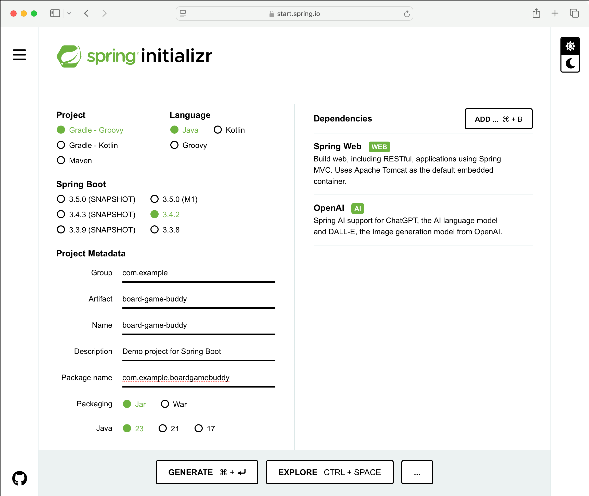

= Spring AI in Action
:chapter: 1
:sectnums:
:figure-caption: Figure {chapter}
:listing-caption: Listing {chapter}
:table-caption: Table {chapter}
:leveloffset: 1
:boot_version: 3.4.2
:spring_version: 6.2.2
:spring_ai_version: 1.0.0-M6
:xrefstyle: short
:bitmap_ext: png

= Getting started with Spring AI

This chapter covers

* Introducing Spring AI
* Initializing a Spring AI project
//* Testing generation results
* Selecting an AI provider and model

Did you feel that?

Over the past year or more, there has been a seismic shift that has reshaped the
landscape of human-computer interaction and that has potential to change virtually
every industry, profession, and way of life. Systems like ChatGPT and Midjourney
have brought Artificial Intelligence out of the realm of science fiction and
academic research and into the public view.

Artificial Intelligence is not exactly new. But Generative AI, the specific branch of
artificial intelligence that uses generative models, known as Large Language Models
(LLMS) to produce text, images, and other content from natural language prompts,
is what has put the notion of thinking machines into the hands of anyone with a
smartphone, tablet, or computer. With generative AI, the average user can create
works of literature, art, or simply answer questions by simply chatting with the
models. Indeed, many tasks that once required special skills can now be performed
by anyone who can type their request into a Generative AI-enabled application.

Software engineering is not entirely immune to the impact of generative AI. Tools
such as GitHub Copilot are used by developers as a virtual pair-programmer when
developing applications. But the real opportunity for developers is in
creating software that leverages Generative AI to afford rich functionality
to the users of their applications. Generative AI enables applications to provide
information that would be difficult or even impossible without the help of an AI
model. With Generative AI, users can ask questions...any question...and give
instructions to the application to do their bidding, all in an intuitive and
powerful way without the constraints of traditionally specific application menus
and forms.

Although there are a handful of very capable frameworks and libraries for working
with Generative AI for languages like Python and Node.js, only recently have
options for Java started to emerge. Among them is Spring AI, a framework
extension for Spring and Spring Boot that enables Generative AI capabilities to
be developed in the de facto standard framework for enterprise Java applications.
This makes it possible for existing applications to adopt Generative AI
capabilities and for Java developers to work with Generative AI in a familiar
framework and programming model.

== Hello, Spring AI!

AI providers such as OpenAI and MistralAI offer access to their respective
collections of LLMs via REST APIs. As long as you have an API key to gain access
to those APIs, you can use virtually any HTTP client to submit prompts to the
models that will generate responses.

While HTTP clients such as Spring's `RestTemplate` and `RestClient`--or even
`curl`, the old command line standby--are capable of making calls to these
LLM-backed APIs, you'll soon find that once your needs move beyond simple
prompts and simple responses, a client abstraction can make the more complex
interactions with an LLM easier.

At the risk of oversimplification, Spring AI is, at its core, a client
abstraction for working with various AI providers. It makes the easy interactions
with LLMs trivial and the more complex uses relatively easy. And it does this
while providing an interface that is consistent across all AI providers and
their models, making the code you write portable whether your application is
backed by OpenAI's GPT-4 model, MistralAI's 7B model, or Google's Gemini Pro model.

As illustrated in figure <<fig_ch1_fig1>>, an application that is built around Spring AI
can submit prompts for generation to an LLM at one of several supported AI providers.
The generated response is then returned to the application to do with whatever it
wishes. Internally, Spring AI handles all of the intricacies of sending the prompt
request and handling the response, so that the application doesn't have to.

[#fig_ch1_fig1, reftext={chapter}.{counter:figure}, caption='{figure-caption}.{counter:figure-number} ']
.Spring AI coordinates interaction with AI providers and models.

The prompt itself includes text in natural language for which the LLM should generate
a response. Common types of prompts include:

* A question to be answered
* A message to determine sentiment (e.g., is the message positive or negative?)
* A document to be summarized
* Some content to be moderated
* Some text to be classified (sentiment analysis, for example)
* A description of an image to be generated

Spring AI can help you achieve incredible Generative AI feats--and you'll do
that throughout the course of this book. But we have to start somewhere. So, let's
begin your Spring AI journey by writing a very simple REST service that leverages
the OpenAI service to answer questions.

=== Initializing the project

Starting a Spring AI application is much the same as starting any other Spring
Boot application. Spring AI comes with Spring Boot starter dependencies and
auto-configuration for many of its components, making it easy to go from zero
to working application with minimal effort.

.Spring AI 1.0.0-M6.
[NOTE]
====
It's important to understand that the version of this book that you are reading
as well as the example code is being written against the latest milestone
release of Spring AI, 1.0.0-M6.

Spring AI has not reached a 1.0.0 Final release yet. Although I anticipate that
Spring AI 1.0.0 Final will be released before the final manuscript of this book
has been written, the only choice to make for MEAP readers and early reviewers
was to pin the examples to 1.0.0-M6. Just know that as Spring AI moves toward
1.0.0 Final, this book and its examples will move forward with it.
====

There are many ways to initialize a Spring Boot project, including taking advantage
of Spring Boot support in IntelliJ IDEA, Spring Tools (for both Eclipse and
VSCode), Netbeans, the Spring Boot CLI, or the Spring CLI. And you are welcome
to use whichever initialization option you prefer. But they all leverage the
same common service under the covers: The Spring Initializr at https://start.spring.io.
If you are using the Initializr directly from the website, you'll start your
first Spring AI project by filling in the blanks and making the choices shown
in figure <<fig_ch1_fig2>>.

[#fig_ch1_fig2, reftext={chapter}.{counter:figure}, caption='{figure-caption}.{counter:figure-number} ']
.Initializing a Spring AI project with the Spring Initializr.
image::../images/ch01/CH01_F02_Walls.{bitmap_ext}[]

Whether you initialize the project from https://start.spring.io or use one of the
other front-ends for the Initializr, the choices you make will be the same. For
this project, we're going to make the following choices:

* Groovy-based Gradle for the project build
* Spring Boot version {boot_version}
* JAR file packaging
* Java 23 (although any version of Java greater than 17 is fine)
* Spring Web (e.g., Spring MVC) and Spring AI's OpenAI starter dependencies

You can fill in the Project Metadata fields however you wish. Throughout this
book, you'll use Spring AI to create an application that can answer questions
about various tabletop games, so in this screenshot it's called Board Game Buddy
(and the Artifact, Name, and Package Name fields are set accordingly). But you
can call it something else if you'd like.

After generating the project and loading it into your IDE, you'll get a project
that includes the `build.gradle` file shown in listing <<ex_ch1_build_gradle>>.

[#ex_ch1_build_gradle, reftext={chapter}.{counter:listing}, caption='{listing-caption}.{counter:listing-number} ']
.The Gradle build file for our project.
----
include::../code/ch01/board-game-buddy/build.gradle[]
----
<1> Spring AI version
<2> Spring AI BOM

Although it wasn't explicitly specified in the Initializr, we're
using Spring AI version {spring_ai_version}. There are many libraries that fall
under the Spring AI umbrella, so the build uses a bill of materials (BOM) to
manage all of the dependencies we might use for Spring AI.

[NOTE]
.Using Spring AI with Spring WebFlux.
====
You may also consider choosing the Spring Reactive Web (e.g., Spring WebFlux)
dependency instead of Spring Web. That choice should also work fine, although
you'll need to explicitly declare a `RestClient.Builder` bean if you're using
Spring WebFlux. (The Spring Web starter's auto-configuration does that for you.)

Spring AI uses Spring's `RestClient` under the covers for making HTTP
requests to various AI services and it obtains that `RestClient` from a
`RestClient.Builder` bean that it expects to be in the Spring application
context. The Spring Web starter dependency comes with auto-configuration to
create the `RestClient.Builder`, but if you chose to use the Spring Reactive
Web starter, you'll need to declare that bean yourself. The following `@Bean`
method will do the trick:

----
@Bean
public RestClient.Builder restClientBuilder() {
    return RestClient.builder();
}
----

You can add that bean declaration in the generated bootstrap main class,
`BoardGameBuddyApplication` or create a separate `@Configuration`-annotated class
and declare it in there.
====

Now that the project has been initialized, let's write some code that uses
Spring AI to answer questions.

=== Submitting prompts

The first Spring AI application you write will be a simple REST API that accepts
questions and responds with answers to those questions. Internally, it will use
Spring AI to submit those questions as prompts to an AI service whose LLM will
generate answers.

The core of the application will be handled by a service class that implements
this `BoardGameService` interface:

----
include::../code/ch01/board-game-buddy/src/main/java/com/example/boardgamebuddy/BoardGameService.java[]
----

The `askQuestion()` method takes a `Question` object as input and produces an
`Answer` in response. The `Question` type is a simple Java `record` that carries
the question submitted by the user:

----
include::../code/ch01/board-game-buddy/src/main/java/com/example/boardgamebuddy/Question.java[]
----

Similarly, the `Answer` is a Java `record` that carries the answer produced by
the LLM:

----
include::../code/ch01/board-game-buddy/src/main/java/com/example/boardgamebuddy/Answer.java[]
----

At the moment, each of these contain a single `String` property, but you'll add
more properties to them both as the project evolves.

The `SpringAiBoardGameService` class, shown in listing <<ex_ch1_SpringAiBoardGameService>>,
implements `BoardGameService` using Spring AI components to interact with LLMs.
This class is where you'll do much of the work throughout the course of this book.

[#ex_ch1_SpringAiBoardGameService, reftext={chapter}.{counter:listing}, caption='{listing-caption}.{counter:listing-number} ']
.The Spring AI implementation of BoardGameService.
----
include::../code/ch01/board-game-buddy/src/main/java/com/example/boardgamebuddy/SpringAiBoardGameService.java[]
----
<1> Inject a ChatClient.Builder
<2> Create a ChatClient
<3> Submitting a question

As you can see, `SpringAiBoardGameService` is injected
with a `ChatClient.Builder` via its constructor, which is then used to create a
`ChatClient`. `ChatClient` is one of a handful of clients provided by Spring AI
for interacting with an AI service. It is useful for the common case of textual
generation where you are submitting text to an AI model and are expecting text
as a response.

The `askQuestion()` method is the service's only method. It takes a `Question`
object and submits it to the LLM using Spring AI's `ChatClient`. Using a
fluent-style interface, you build up the prompt and then submit it and get the
answer.

In the case of the `askQuestion()` method, the prompt is built with ``ChatClient``'s
fluent interface with the following steps:

1. The `prompt()` method is called, indicating that you're defining the prompt.
2. The question is specified on behalf of the user by calling the `user()` method.
As you'll see in the chapter 3, `user()` is a method that defines a message in
the prompt for the "user" role, along with a `system()` method for defining messages
for the "system" role.
3. The `call()` method indicates that you are finished defining the prompt and are
ready to submit the prompt to the LLM.
4. The `content()` method submits the prompt and returns the content of the response
(e.g., the answer) as a `String`.

The `askQuestion()` method wraps up by wrapping the answer text in an `Answer` object
which it then returns to the caller.

Now let's put `SpringAiBoardGameService` to work by exposing it in a REST API.
Listing <<ex_ch1_AskController>> shows `AskController`, a Spring MVC controller to
handle that job.

[#ex_ch1_AskController, reftext={chapter}.{counter:listing}, caption='{listing-caption}.{counter:listing-number} ']
.A controller that handles requests by working with a BoardGameService.
----
include::../code/ch01/board-game-buddy/src/main/java/com/example/boardgamebuddy/AskController.java[]
----
<1> Inject a BoardGameService
<2> Ask the question

`AskController` is a relatively straightforward Spring MVC controller. It handles POST
requests to "/ask" where the request's "question" property will be bound to
the `question` property in the `Question` record. It sends that `Question` to
the injected ``BoardGameService``'s `askQuestion()` and returns the `Answer` it
receives to the client that made the request.

At this point, you're almost ready to fire up the application and try it out.
But there's one more important thing you need to do first for the application to
run.

OpenAI requires that requests include an API key, so you'll need to
obtain your own API key from https://platform.openai.com/api-keys. If you've not
done so already, you'll need to create an account and sign in.

.Paying for Generative AI.
****
Generative AI is a special kind of magic and, as the character Mr. Gold (aka,
Rumplestiltskin) said on the TV show *Once Upon a Time*, "All magic comes with
a price."

Fortunately, the pricing for most LLMs is based on usage and is in fractions of
a penny per 1,000 tokens (where a token is a piece of a word; roughly 3/4 of a
word). Simple prompts and answers only weigh in at a few hundred tokens, so the bill
won't be adding up very quickly. Even so, keep an eye on your usage so that you
won't be hit with a surprise bill.

Putting this in perspective, the U.S. Declaration of Independence contains 1,695
tokens, while _Spring in Action, Sixth Edition_ contains just over 200K tokens.
At the the prices quoted by OpenAI as I'm writing this, sending the entire text
of _Spring in Action, Sixth Edition_ as part of a prompt to the GPT-4o-mini
model would cost roughly 3 cents. (That said it would be impossible to do that
in a single prompt because the context window only allows 128K tokens.)

Optionally, you can run some models locally using Ollama, which is completely
free. You'll see how to do that a little later in this chapter.
****

Once you're signed in, click "Create a new secret key", give it a name, then
click "Create secret key. Take note of the key that you're given, because you
won't be able to retrieve it in its complete form from OpenAI later. I suggest
saving it in a key store such as LastPass or 1Password so that you can retrieve
it later, while still keeping it a secret.

Now that you have your API key, you'll need to tell Spring AI what it is so that
Spring AI can send it in all requests to the API. The most obvious way of doing
that is by setting the `spring.ai.openai.api-key` property in `application.properties`
like this:

----
spring.ai.openai.api-key=sk-BSMKiIVJM1ck3yM0u53p1K3yZZOINYUiCeC
----

As straightforward as that might be, it's not the best idea. When you check your
code into source control, you'll be checking your private API key in along with it.
Instead, I suggest that you set your API key to an environment variable named
`SPRING_AI_OPENAI_API_KEY` (which Spring Boot will treat as equivalent to
`spring.ai.openai.api-key`). For example, on MacOS or Linux systems:

----
export SPRING_AI_OPENAI_API_KEY=sk-BSMKiIVJM1ck3yM0u53p1K3yZZOINYUiCeC
----

Or if you're using Windows:

----
set SPRING_AI_OPENAI_API_KEY=sk-BSMKiIVJM1ck3yM0u53p1K3yZZOINYUiCeC
----

You'll need to set the `SPRING_AI_OPENAI_API_KEY` environment variable on the environments
where you'll be running the application. But the API key won't be potentially
exposed when you check your code into source control.

With the API key specified, now is the time you've been waiting for:
Time to start up the application and give it a try.

=== Trying it out

Just as there are several ways to initialize a Spring Boot project, there are
also several ways to run a Spring Boot application. If you already have a
preference, then feel free to use it. If not, then the Spring Boot Gradle plugin
makes it as easy as running the following at the command line:

----
$ ./gradlew bootRun
----

Once the application starts up, use your favorite HTTP client to send a POST
request to http://localhost:8080/ask with JSON in the body that has the question.
Here's how to submit such a request using the well-known `curl`footnote:[https://curl.se/[]] command:

----
$ curl localhost:8080/ask \
    -H"Content-type: application/json" \
    -d'{"question":"Why is the sky blue?"}'
{"answer":"The sky appears blue because of the way the Earth's atmosphere
scatters sunlight. When sunlight travels through the atmosphere, it collides
with molecules and particles in the air. These collisions cause the sunlight
to scatter in all directions. Blue light has a shorter wavelength and scatters
more easily than other colors, which is why we see the sky as blue during
the day."}
----

Or, if you prefer the HTTPiefootnote:[https://httpie.io/] command line tool,
then the following command will achieve the same results:

----
$ http :8080/ask question="Why is the sky blue?" -b
{
    "answer": "The sky appears blue during the day because of the way the
    Earth's atmosphere scatters sunlight. The shorter blue wavelengths of
    light are scattered in all directions by the gases and particles in the
    atmosphere. This is known as Rayleigh scattering. This scattering causes
    the blue light to dominate our view of the sky, making it appear blue to
    our eyes."
}
----

HTTPie assumes that the hostname is "localhost". It also assumes that both the
request and response bodies are JSON and maps the "question" parameter into a
property named "question" in a JSON document sent in the request body. The "-b"
flag indicates that you only want the body of the request printed, but if you
omit it, the request headers will also be displayed.

Aside from showing you two ways to send a POST request to the application, these
two command line examples also show that the responses received were different.
But the variation isn't because of the choice of HTTP client. In fact, you could
submit the exact same request multiple times with the same or different clients
and get a different response each time.

The reason it varies is because generative AI is non-deterministic. The responses
are probabilistic, providing responses that are statistically likely to follow
the prompts that are submitted.

Now you have a very simple question and answer application that uses Spring AI to generate responses.
There's much more that Spring AI offers and we'll explore it all throughout this book. But
for now, let's take a step back and consider the AI services and models that are
available with Spring AI and how to choose one for your applications.

== Choosing a model

At the outset of the project you created in this chapter, you chose Spring AI's
OpenAI starter. That means that you've been using OpenAI's REST API under the
covers to respond to the questions that were submitted through the application.

What's more, by default Spring AI chooses OpenAI's gpt-4o model, which is
one of OpenAI's most popular models. It's a very capable model that both understands
and can generate responses in natural language and is trained on an enormous set
of data, making it capable of answering most any question you pose to it.

However, Spring AI offers several other AI services to choose from, including:

* **Amazon Bedrock** - An AI service offered through Amazon's cloud platform with
   models such as Claude, Llama 3.1, Mistral, and Titan.
* **Anthropic AI** - An AI service founded by former members of OpenAI, offering
   the Claude family of models.
* **Azure OpenAI** - Essentially the same set of models as OpenAI, but offered
   through Microsoft's Azure computing platform.
* **Google Vertex AI** - An AI service offered through Google's cloud platform,
   including Google's Gemini models.
* **HuggingFace** - Offers a repository with over 300,000 models to choose from.
   Spring AI's integration with HuggingFace works with HuggingFace's cloud-based
   API.
* **IBM WatsonX** - IBM's offering of LLMs through its WatsonX cloud platform.
* **MiniMax** - A Chinese AI service offering several models, including multilingual models.
* **MistralAI** - An AI company founded by former Meta and Google employees that
   offers several very capable LLMs, including the popular Mistral 7B model.
* **Ollama** - An option for running several open-source models free and locally on
   your own hardware, including several popular models offered by some of the
   cloud-based services.

Those services all provide various models suitable for text-based generation. Some
also provide multimodal generation, including images and speech (which we'll explore
in chapter 7). And most also provide an embedding API that can translate text into
a mathematical representation that can be used to determine similarity between two or
more sets of text, which will become important when we cover Retrieval Augmented
Generation (RAG) in chapter 4.

If that list isn't overwhelming enough, you should know that the generative AI
landscape is constantly changing and more services and models are always coming
available, each one trying to outdo those that came before it.

With so many choices, how do you choose which service and model to use? While
there really isn't a definitive way to choose a model, there are a handful of
criteria to consider when choosing a provider and model:

* **Price** - Most of the options, especially the cloud-based options, require
   payment. While many of them are priced very inexpensively, you'll want to
   consider how your choice will impact your budget. But there are also free
   options, including models served by Ollama.
* **Context window** - When processing a prompt and providing a response, the prompt
   and response are broken down into granular pieces called "tokens". How tokens
   are created isn't as important as how many are allowed in the prompt and response.
   Different models have different context windows, ranging from a few thousand tokens
   per interaction to millions of tokens per interaction. These limits aren't
   of great concern when asking simple questions, but as you add conversational
   history and document context to your prompts, you'll want to be sure that your
   prompts don't exceed the model's limits.
* **Training** - The most significant difference between various models is what data
   they are trained on. Some models are trained on much larger datasets than others,
   while some are trained on smaller, but more focused datasets. Moreover, the
   date that a model is trained up to will have an impact on its ability to provide
   responses based on more current data.
* **Capabilities** - Some AI providers and models provide additional capabilities,
   such as the ability to stream responses and provide content from application
   functions. Because such features are not standard across all LLMs and providers,
   you'll want to be sure to consider whether or not you'll need these additional
   capabilities.

Because new models are frequently being added and the prices, context windows, and
capabilities of the models are often changing, I won't dwell on those specifics
in this book. You should refer to each provider's website for the latest available
models and their specifications.

Whatever choice you make, the only significant difference it will make in your
application is in what started dependency you add to your build and how you
configure credentials and other options in your application configuration. The
code you write that uses `ChatClient` or most other Spring AI components will
be the same.

=== Configuring OpenAI models

The example we have built in this chapter uses Spring AI's OpenAI integration.
So you've already seen how to add it to a Spring Boot project. As a reminder,
though, here's the starter dependency to use for integrating with OpenAI:

----
implementation 'org.springframework.ai:spring-ai-openai-spring-boot-starter'
----

As you've seen, this starter comes with auto-configuration that enables a
`ChatClient.Builder`, making it easy to get started by injecting the builder,
using it to create a `ChatClient`, and then calling the `prompt()` method to
build and submit a request.

By default, Spring AI's OpenAI module works with the *GPT-4o* model,
which is a very capable model. But it's not the only model you can choose
and you may want to consider using a different one.

OpenAI updates their models and introduces new models every so often. To see
what current models are available, visit https://platform.openai.com/docs/models
or use the models endpoint:

----
$ http -A bearer -a $SPRING_AI_OPENAI_API_KEY https://api.openai.com/v1/models
----

Among the models that OpenAI offers is the popular GPT-4o-mini model. GPT-4o-mini
is a very capable model that is an order of magnitude less expensive than GPT-4o.
Because it is more budget-friendly than GPT-4o, it's a compelling option, especially
for development purposes.

To use GPT-4o-mini or any of OpenAI's other models, set the
`spring.ai.openai.chat.options.model` property. For example, here's how you
would override the default to use GPT-4o-mini:

----
spring.ai.openai.chat.options.model=gpt-4o-mini
----

As an alternative to using OpenAI models directly through OpenAI's service,
you can also access OpenAI models through Microsoft Azure. You'll need to
sign up for Azure access at https://azure.microsoft.com/ and obtain your API
key through the Azure portal.

Spring AI has a different starter dependency if you're using Azure OpenAI:

----
implementation
    'org.springframework.ai:spring-ai-azure-openai-spring-boot-starter'
----

Likewise, specifying your API Key for Azure OpenAI is slightly different in
that the property includes the word "azure":

----
spring.ai.azure.openai.api-key=sk-BSMKiIVJD0n4ldDuck2p1K3yZZOINYUiCeC
----

Or you can specify it as an environment variable like this:

----
export SPRING_AI_AZURE_OPENAI_API_KEY=BSMKiIVJD0n4ldDuck2p1K3yZZOINYUiCeC
----

It's also important to note that even though Azure OpenAI serves OpenAI models,
it is a separate provider from OpenAI. As such your OpenAI API key will not work
with Azure OpenAI. If you want to use Azure OpenAI, you'll need to sign up for an
account at https://azure.microsoft.com/en-us/products/ai-services/openai-service
and obtain an API key from Microsoft.

To select a non-default model, set the `spring.ai.azure.openai.chat.options.model`.
The following line in your application's application.properties file should do
the trick:

----
spring.ai.azure.openai.chat.options.model=gpt-4
----

As shown here, the `spring.ai.azure.openai.chat.options.model` property is telling
Spring AI to send prompts to the GPT-4 model rather than the default GPT-4o
model.

////
=== Using Mistral models

Another popular alternative to using OpenAI is to use one of MistralAI's
collection of LLMsfootnote:[https://mistral.ai/].

Spring AI supports MistralAI through a dedicated starter dependency. To add
MistralAI to your project, use the following dependency in your build:

----
implementation 'org.springframework.ai:spring-ai-mistral-ai-spring-boot-starter'
----

Like OpenAI, you'll need to create an account with MistralAI, provide payment
information, and obtain an API key. Once you have your API key in hand, you can
configure Spring AI to use it by setting the `spring.ai.mistralai.api-key`
property:

----
spring.ai.mistralai.api-key=bIQei9Wkz05w4ldTh3lUckyR4bb1tb2x
----

Or better, set it as an environment variable where your app will run so that
you don't check your API key into source control:

----
export SPRING_AI_MISTRAL_AI_API_KEY=bIQei9Wkz05w4ldTh3lUckyR4bb1tb2x
----

MistralAI offers several different models to choose from. Using `curl` and your
API key, you can get a list of all of Mistral AI's models like this:

----
$ http -A bearer -a $SPRING_AI_MISTRAL_AI_API_KEY \
  https://api.mistral.ai/v1/models
----

By default, Spring AI will use the Mistral 7B model, which is roughly comparable
to OpenAI's GPT-4o, both in terms of capabilities and in price. But if
you would like to use one of MistralAI's other LLMs, you can do so by specifying
the `spring.ai.mistralai.chat.options.model` property. For example:

----
spring.ai.mistralai.chat.options.model=mistral-large-latest
----

This tells Spring AI that you wish to use MistralAI's largest (and, consequently,
most expensive) model.
////

=== Serving models locally with Ollama

One more very compelling option, especially for development purposes, is to use
Ollamafootnote:[https://ollama.com]. Ollama is an amazing tool that enables you
to run several open-source LLMs locally and for free on your own machine. Some
of the most popular LLMs available for Ollama include Meta's Llama 3.1, Google's
Gemma, Alibaba's Qwen, and even MistalAI's Mistral 7B.

After downloading and installing Ollama on your machine, you'll need to pull
one or more models that you want to use. Pulling models to your local machine
is made easy with the `ollama` command line tool. For instance, to install the
Gemma 2B model locally, you would use the following command line incantation:

----
$ ollama pull gemma:2b
----

Similarly, if you would like to use MistralAI's Mistal 7B model, you would issue
this command:

----
$ ollama pull mistral:7b
----

.LLMs aren't one-size-fits-all.
****
Be aware that the performance of the models you choose will depend on their size
as well as the hardware that is running Ollama. For example, I had no trouble
at all running Gemma 2B on my MacBook Pro that is a few years old, but the
Gemma 7B model was significantly slower and consumed a lot more memory while
generating responses.
****

Refer to Ollama's official list of available modelsfootnote:[https://ollama.com/library]
for information regarding what models are available. To see a list of the models
installed on your machine, use the `ollama` command line:

----
$ ollama list
----

Or, for more details on the models that you have installed, send a GET request to
the Ollama API's /api/tags endpoint:

----
$ http http://localhost:11434/api/tags -b
----

Once you have pulled one or more models and Ollama is running on your machine,
you can start using them in your project using Spring AI's Ollama starter
dependency:

----
implementation 'org.springframework.ai:spring-ai-ollama-spring-boot-starter'
----

Unlike the other AI providers supported by Spring AI, you won't need to obtain
or set an API key to use Ollama. That's because Ollama isn't a cloud-based AI
service like OpenAI or MistralAI. Ollama will be running on your local machine,
so no access credentials are required.

Spring AI defaults to the Mistral 7B model when using Ollama. If you'd like to
use a different model, you'll have to specify which one you want to use with the
`spring.ai.ollama.chat.model` property, as shown here:

----
spring.ai.ollama.chat.model=gemma:2b
----

This configures Spring AI to use the Gemma 2B model from Ollama running on your
local machine.

Although Spring AI supports several AI services and models, this book needs to
make a choice that we'll stick with for most of the examples. Unless otherwise
stated, the examples in this book will be written to work with OpenAI's (or Azure
OpenAI's) gpt-4o-mini model as well as Ollama using the Gemma, Llama 3.1, or Mistral
models. You're welcome and encouraged to try other models, but be aware that the
results and your success may vary.

== Previewing Spring AI's capabilities

In this chapter, you've created a very elementary Spring AI application that sends a
basic textual prompt to an LLM and prints out the textual response. It doesn't
get much simpler than that. But if that's all there were to Spring AI, you
wouldn't bother to read this book (and I wouldn't have bothered to write it). Spring
AI has a lot more to offer than that, as you'll see in the chapters that follow.

For more advanced cases, the prompts you send will be longer and more involved
than one sentence questions. You'll want to provide more detailed instructions
for how the LLM should respond as well as data or other context that the LLM can
draw upon when generating a response. To make complicated prompts easier to work
with, Spring AI offers the option of creating prompt templates that have placeholders
that can be filled with parameter values and context.

Many times working with an LLM are more than a single question and answer.
When interactions become back and forth conversation, it's important that the
conversation's history be kept so that the LLM will remember what was said before.
Spring AI makes it easy to maintain chat history and provide that history as
context when prompts are sent.

All models are trained on information up to a specific date and know nothing
about events that may have happened after that date. Moreover, your project may
require asking about confidential documents that the LLMs were not trained on.
To fill in the gaps, a technique known as Retrieval Augmented Generation (RAG)
can be applied with Spring AI. With RAG, you'll be able to ask questions about
and converse with your own documents.

While RAG is wonderful when working with unstructured documents, there may be
situations where you'll want to integrate generative AI with functionality
provided by your application, such as looking up data from a database or
even taking some action (e.g., placing an order). For those cases, Spring AI
can work with functions (aka, tools) support offered by some of the models from
OpenAI, Mistral, and Google.

Spring AI can do more than just interact with an LLM to answer questions.
Using Spring AI, you'll be able to do more with text such as analyzing
sentiment, moderating content, summarizing documents, and classifying text.

Finally, textual prompts that yield textual responses are only one aspect of Generative AI.
Spring AI can also help you generate images from text, transcribe audio into
text, and many other exciting ways of making your AI-enabled applications shine.

These are the things you'll use Spring AI to do before the final page of this
book. So hang on tight...this is going to be an exciting ride!

== Summary

* Spring AI enables Generative AI capabilities for applications developed with
Spring Boot.
* Spring AI provides a client abstraction with a consistent interface, no matter
what AI service provider or LLM you are using.
* Spring AI integrates with several popular AI service providers, including
OpenAI, Azure OpenAI, MistralAI, Google Vertex, and Amazon Bedrock.
* Spring AI applications can also use locally-run LLMs served through Ollama.
