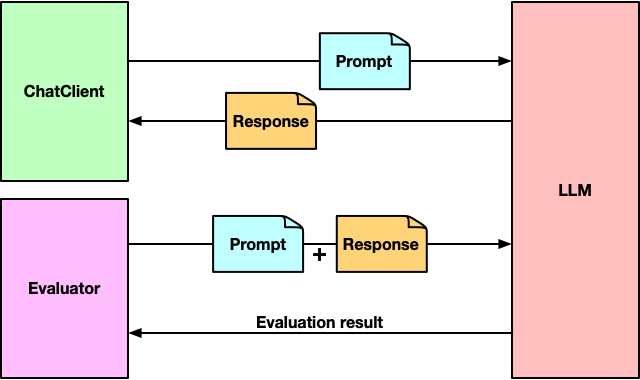

= Spring AI in Action
:chapter: 2
:sectnums:
:figure-caption: Figure {chapter}
:listing-caption: Listing {chapter}
:table-caption: Table {chapter}
:leveloffset: 1
:boot_version: 3.4.2
:spring_version: 6.2.2
:spring_ai_version: 1.0.0-M6
:xrefstyle: short
:bitmap_ext: png
:sectnumoffset: 1

= Evaluating generated responses

This chapter covers

* Getting started with Spring AI evaluators
* Checking for relevancy
* Judging response correctness
* Applying evaluators at runtime

Writing tests against your code is an important practice.
Not only can automated tests ensure that nothing is broken in your application, but they can also provide feedback that informs the design and implementation.
Tests against the generative AI components in an application are no less important than tests for other parts of the application.

There's only one problem.
If you send the same prompt to an LLM multiple times, you're likely to get a different answer each time.
The non-deterministic nature of generative AI means that there can be no "assert equals" approach to testing.

Fortunately, Spring AI provides another way to decide if the generated response is an acceptable response: Evaluators.

An evaluator takes the user text from the prompt that was submitted to the LLM, along with the content from the response and decides if the response content passes some criteria.
Under the covers, an evaluator can be implemented in any way suitable for the kind of evaluation it performs.
But as illustrated in Figure <<fig_ch2_fig1>>, evaluators typically rely on an LLM to judge how fitting the response is to the submitted prompt.

[#fig_ch2_fig1, reftext={chapter}.{counter:figure}, caption='{figure-caption}.{counter:figure-number} ']
.Spring AI evaluators send a prompt and a generated response to the LLM to assess the quality of the response.

Let's see how to use an evaluator to write an integration test against `BoardGameService`, the one component in the Board Game Buddy application that applies generative AI.

== Ensuring relevant answers

The most basic form of evaluation is to determine whether or not the LLM actually answered the question that was posed.
That is to say, was the generated response at least on-topic with regard to the submitted prompt?

For example, if the user asks "Why is the sky blue?" and the LLM responds with "Because of Rayleigh scattering" (or some such response), then the answer is relevant.
On the other hand, suppose that the LLM were to respond with "The moon is approximately 239,900 miles from Earth".
Although correct, that answer isn't relevant to the question regarding the sky's color.

Determining whether or not an answer is relevant to the given question is precisely the kind of evaluation that Spring AI's  `RelevancyEvaluator` does.
To see how `RelevancyEvaluator` works, let's use it to write a test against `BoardGameService`.
The test class in Listing <<ex_ch2_SpringAiBoardGameServiceTests>> is such a test.

[#ex_ch2_SpringAiBoardGameServiceTests, reftext={chapter}.{counter:listing}, caption='{listing-caption}.{counter:listing-number} ']
.A test that verifies that the response from an LLM is relevant to the question.
----
include::../code/ch01/board-game-buddy/src/test/java/com/example/boardgamebuddy/SpringAiBoardGameServiceTests.java[tag=relevancy]
----
<1> Inject BoardGameService
<2> Inject ChatClient.Builder
<3> Ask question
<4> Evaluate response
<5> Assert relevancy

As you examine `SpringAiBoardGameServiceTests`, you'll see that the first several lines of the test perform some setup necessary to perform the evaluation.
The class is annotated with `@SpringBootTest` indicating that this is an integration test and so that a Spring application context, including all of the beans from the application, will be created.
From that application context, a `BoardGameService` and a `ChatClient.Builder` are injected into the test with the help of the `@Autowired` annotation.
The `ChatClient.Builder` is then used in the `setup()` method to create a new `RelevancyEvaluator` that you'll use in the test method.

The first thing that the `evaluateRelevancy()` test method does is create a `Question` object and send it to the `askQuestion()` method on the injected `BoardGameService` to get back an `Answer`.
Then it creates an `EvaluationRequest` from the original user text and the answer, then passes it to the ``RelevancyEvaluator``'s `evaluate()` method.
Internally, the `evaluate()` method sends a prompt to the LLM asking it to judge the relevancy of the answer to the question.

The `evaluate()` method returns an `EvaluationResponse`, from which `isPass()` is called to find out if the evaluation passed or not.
If `isPass()` returns `true`, then the answer has been deemed relevant to the question.
Otherwise, `isPass()` will return `false`, meaning that the answer was not relevant and the assertion will fail.

With this test in place, you can quickly and automatically check that a question posed through the ``SpringAiBoardGameService``'s `askQuestion()` method results in a fitting answer.
But just because the answer is relevant, that doesn't mean that it's correct.
Let's turn our test a notch up by checking that the answer is also correct.

== Testing for factual accuracy

Suppose that when asked why the sky is blue, the LLM were to respond with something like
"The sky is blue because there are a gazillion tiny bubbles filled with blueberry jam floating in the atmosphere."
Although that answer appears to be relevant, it is most certainly not correct.
It might sneak past the ``RelevancyEvaluator``'s scrutiny, but it might not be the answer you should present to your application's users.

Spring AI's `FactCheckingEvaluator` works similarly to `RelevancyEvaluator`, except that instead of asking the LLM to judge relevancy of the answer to the question, it asks the LLM to judge if the answer correctly answers the question.

Before adding a factual accuracy test to `SpringAiBoardGameServiceTests`, you'll need to tweak the `setup()` method to create a `FactCheckingEvaluator` and assign it to an instance variable:

----
include::../code/ch01/board-game-buddy/src/test/java/com/example/boardgamebuddy/SpringAiBoardGameServiceTests.java[tag=correctness]
----

Now let's write the fact-checking test method:

----
include::../code/ch01/board-game-buddy/src/test/java/com/example/boardgamebuddy/SpringAiBoardGameServiceTests.java[tag=correctnessTest]
----

The `evaluateFactualAccuracy()` method is much like the `evaluateRelevancy()` created earlier.
Just as when testing relevancy, the ``EvaluationResponse``'s `isPass()` is used in an assertion, which will cause the test to fail if the generated answer is judged to be incorrect.

If `isPass()` returns `false` and the assertion fails, the failure message explains why it failed.
For instance, suppose that the generated answer was "There are tiny bubbles filled with blueberry jam high in the atmosphere."
In that case, the `FactCheckingEvaluator` would judge the answer incorrect and the assertion would fail.
The resulting failure message might look like this:

----
========================================
The answer "The sky is blue because there are a gazillion tiny bubbles filled
with blueberry jam floating in the atmosphere."
is not considered correct for the question
"Why is the sky blue?".
========================================
----

As you work through this book, you'll make many changes to how the prompt sent to the LLM is formed.
By having tests like those in `evaluateRelevancy()` and `evaluateFactualAccuracy()`, you can be assured that you're still getting back appropriate and correct answers, no matter what changes you may make.

Even so, what might not be obvious is that you might find it useful to apply evaluators outside of tests to make sure that the answers given at runtime are also relevant and correct.
Let's have a look at how to apply evaluators directly in the application code.

== Applying evaluation in application code

Even if the evaluator-based tests are passing when you build your application, at runtime you still could get irrelevant or incorrect responses.
The non-deterministic nature of generative AI allows for the possibility that the tests could get lucky and receive good responses, but then have things go pear-shaped when the application is in production.
Applying evaluators at runtime can help prevent bad answers from being returned to your application's users.

As it turns out, there's nothing about evaluators that limit their use to integration tests.
Listing <<ex_ch2_SelfEvaluatingBoardGameService>> shows how to use `RelevancyEvaluator` along with Spring Retry to avoid returning answers that aren't relevant to the user's question.

[#ex_ch2_SelfEvaluatingBoardGameService, reftext={chapter}.{counter:listing}, caption='{listing-caption}.{counter:listing-number} ']
.Verifying relevancy in runtime code.
----
include::../code/ch01/board-game-buddy/src/main/java/com/example/boardgamebuddy/SelfEvaluatingBoardGameService.java[tag=all]
----
<1> Create RelevancyEvaluator
<2> Declare method as retryable
<3> Recovery method
<4> Throw exception if not relevant

`SelfEvaluatingBoardGameService` is much like `SpringAiBoardGameService`, except that the `askQuestion()` method is annotated with `@Retryable`.
This annotation from Spring Retry indicates that if an `AnswerNotRelevantException` is thrown from the method, then the method should be retried.

Within `askQuestion()`, the `evaluateRelevancy()` method is called to evaluate relevancy.
The `evaluateRelevancy()` method itself used the `RelevancyEvaluator` created in the constructor.
If `isPass()` returns `false`, then `evaluateRelevancy()` will throw an `AnswerNotRelevantException`, which is then thrown from `askQuestion()` triggering a retry.

As for `AnswerNotRelevantException`, it's a simple unchecked exception that looks like this:

----
include::../code/ch01/board-game-buddy/src/main/java/com/example/boardgamebuddy/AnswerNotRelevantException.java[]
----

By default, methods annotated with `@Retryable` are retried up to 3 times.
You can change that by specifying the `maxAttempts` attribute.
For example, to retry up to 5 times, use `@Retryable` like this:

----
@Retryable(retryFor = AnswerNotRelevantException.class, maxAttempts=5)
----

Even though you can increase the number of retries by setting `maxAttempts`, be aware that each retry means sending the prompt to the LLM more times.
It also means that the evaluator will send the evaluation prompt to the LLM over and over again.
This can add to the cost of submitting the prompt because more tokens could be sent before arriving at a relevant answer.
And you might encounter rate limiting if you send the same prompt too many times consecutively.
Keeping the `maxAttempts` value low will avoid such problems.

If after three attempts (or however many attempts specified by `maxAttempts`), a relevant answer still hasn't been generated, then control is passed to the `recover()` method.
The `recover()` method is annotated with `@Recover`, another Spring Retry annotation that acts as the last resort when retries continue to fail.
In the case of `SelfEvaluatingBoardGameService`, the `recover()` method simply returns an `Answer` indicating that it was unable to answer the question.

== Summary

* The non-deterministic nature of generative AI makes it tricky to test.
* Spring AI provides evaluators that can be used to make assertions against generated responses.
* Evaluators work by submitting prompts to an LLM to assess the relevancy and factual accuracy of a response.
* Evaluators can be applied at runtime so that the prompt can be retried in the event that an unsatisfactory response is returned.
