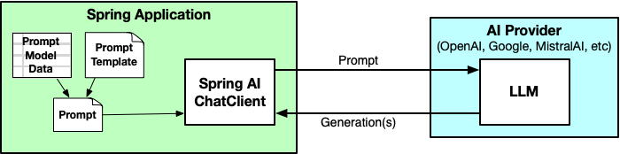
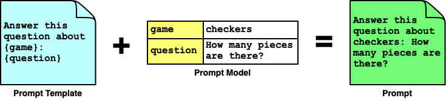
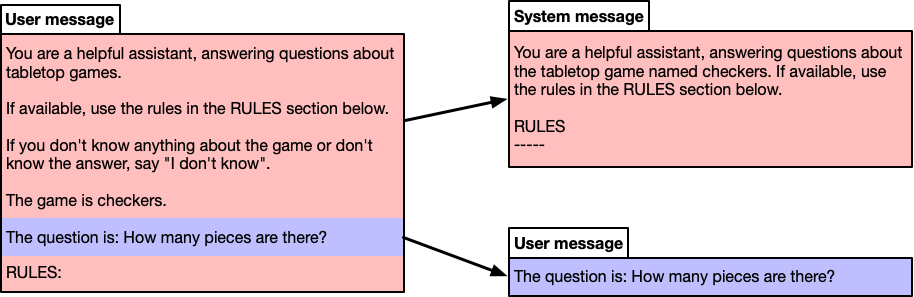
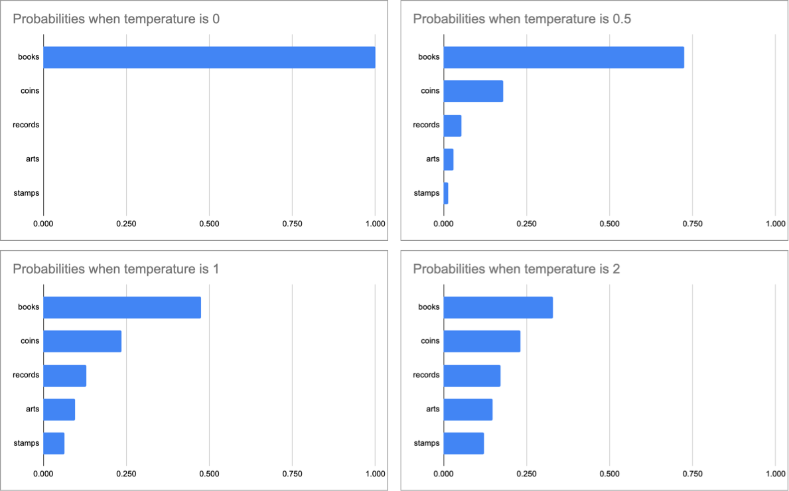

= Spring AI in Action
:chapter: 3
:sectnums:
:figure-caption: Figure {chapter}
:listing-caption: Listing {chapter}
:table-caption: Table {chapter}
:leveloffset: 1
:boot_version: 3.4.2
:spring_version: 6.2.2
:spring_ai_version: 1.0.0-M6
:xrefstyle: short
:bitmap_ext: png
:sectnumoffset: 2

= Submitting prompts for generation

This chapter covers

* Defining prompt templates
* Providing context
* Formatting response output
* Streaming responses
* Accessing response metadata

In the first chapter, you created a very simple Spring AI application that
receives a question in a POST request and submits it directly to an LLM via
the injected `ChatClient`. It worked well, but as your Generative AI requirements
get more advanced, so will the prompts you send to the LLMs. As your prompts get
more sophisticated, a `String`-based prompt may not do.

Also, there's more to a generated response than just a basic `String` response.
There may be useful metadata in the response, including usage data to help you
gauge how much each generation impacts billing. Responses can also stream back
to the client pieces at a time rather than all at once.

In this chapter you're going to take your prompt and response handling to the
next level. Let's start by looking at how to define prompt templates.

== Working with prompt templates

Spring AI offers the ability to create prompts from templates. The templates
will have one or more placeholders placed among static text. As illustrated in
figure <<fig_ch2_fig1>>, these templates can have their placeholders filled with
model data that will vary from invocation to invocation to generate the prompt
sent to the LLM. The model data is filled into placeholders, surrounded by
prompt text to guide the LLM in how it should respond.

[#fig_ch2_fig1, reftext={chapter}.{counter:figure}, caption='{figure-caption}.{counter:figure-number} ']
.Using prompt templates to create prompts from model data.



To demonstrate how prompt templates work, let's start by building out the
example from chapter 1 to answer questions about various tabletop games such as
checkers, Monopoly, or even more modern Euro-style games like Catan or Wingspan.

The first thing to do is capture the title of the game as part of the `Question`
record:

----
include::../code/ch03/board-game-buddy_1/src/main/java/com/example/boardgamebuddy/Question.java[]
----

This new version of `Question` includes a new `gameTitle` property to capture the
game's title. This ensures that there's enough context to answer questions
about a specific game, without requiring that the game be mentioned in the question
itself.

You may have also noticed that both properties are annotated with `@NotBlank`.
Although validation isn't a Spring AI feature, it's a very important and useful
feature of Spring itself. By annotating these properties with `@NotBlank`, you
are stating that both are required and can't be `null` or trimmed to an empty
`String`.

The `@NotBlank` annotations and, in fact, Spring validation support will need to
be added the project's build with the following starter dependency:

----
implementation 'org.springframework.boot:spring-boot-starter-validation'
----

You'll also need to add a `@Valid` annotation to the `Question` parameter in the
controller's `ask()` method to tell Spring to apply validation when handling
requests through that controller:

----
@PostMapping(path="/ask", produces="application/json")
public Answer ask(@RequestBody @Valid Question question) {
  return boardGameService.askQuestion(question);
}
----

Finally, so that the validation error is returned neatly in a JSON response,
the controller advice class in <<ex_ExceptionHandlerAdvice>> makes use of Spring's
support for Problem Details (RFC-7807)footnote:[https://datatracker.ietf.org/doc/html/rfc7807].

[#ex_ExceptionHandlerAdvice, reftext={chapter}.{counter:listing}, caption='{listing-caption}.{counter:listing-number} ']
.Applying Problem Details to handle validation errors neatly in the response.
----
include::../code/ch03/board-game-buddy_1/src/main/java/com/example/boardgamebuddy/ExceptionHandlerAdvice.java[]
----
<1> Apply to all REST controllers
<2> Handle validation exceptions
<3> Add validation failures

Problem Details, in a nutshell, is a specification for structuring errors from
HTTP APIs in a standard way. Spring has had first class Problem Details support
since Spring 6.0.

Now let's turn attention to the response.  As with `Question`, you'll want to
add the title of the game to the `Answer` record so that the client of the API
will have context to know what game that the answer pertains to:

----
include::../code/ch03/board-game-buddy_1/src/main/java/com/example/boardgamebuddy/Answer.java[]
----

Now that both `Question` and `Answer` include the game's name along with their
original payload, you can change the `askQuestion()` method in `SpringAiBoardGameService`
to simply use `String` concatenation like this:

----
@Override
public Answer askQuestion(Question question) {
  String prompt =
      "Answer this question about " + question.gameTitle() +
      ": " + question.question();

  String answerText = chatClient.prompt()
      .user(prompt)
      .call()
      .content();
  return new Answer(question.gameTitle(), answerText);
}
----

Now you can try it out by asking a question about a game and including the name
of the game in the request. For example, using HTTPie, you can ask a question
about the classic game checkers like this:

----
$ http :8080/ask game="checkers" question="How many pieces are there?" -b
{
  "answer": "In checkers, there are a total of 24 pieces-12 for each player.",
  "gameTitle": "checkers"
}
----

Although it works, creating prompts with `String` concatenation is clumsy. Even
with a simple prompt like the one used in the `askQuestion()` method, it makes
the code somewhat awkward and not so easy to read.

=== Defining a prompt template

Instead of using `String` concatenation, let's create a prompt template that
defines the raw, unrendered prompt with placeholders for the variable data in
the prompt. Listing <<ex_ch2_SpringAiBoardGameService>> shows a new `SpringAiBoardGameService`,
modified to use a templated prompt.

[#ex_ch2_SpringAiBoardGameService, reftext={chapter}.{counter:listing}, caption='{listing-caption}.{counter:listing-number} ']
.Using a prompt template to avoid clumsy String concatenation.
----
include::../code/ch03/board-game-buddy_1/src/main/java/com/example/boardgamebuddy/SpringAiBoardGameService.java[tag=stringTemplate,indent=0]
----
<1> The template as a String
<2> Set the prompt template
<3> Inject data into the template
<4> Send the prompt and get response

As you can see, the prompt template named `questionPromptTemplate` is a `String`
that looks a lot like the prompt that was created via concatenation. But its
value is more than just text. It is a StringTemplatefootnote:[https://www.stringtemplate.org/]
with placeholders, "{game}" and "{question}", for each of the prompt's parameters.

This prompt template requires more specification than when the prompt is a simple
`String` value. Therefore, within the `askQuestion()` method, the `user()` method is
called with a lambda rather than just the template itself. More specifically,
this lambda is a `Consumer<UserSpec>` that allows you to customize the message
sent in the request to the LLM.

In this case, the text of the user message (the prompt template in this case) is
specified by calling `text()` on the user specification. The values that will go
into the placeholders are set by calling the `param()` method, called once for
each  parameter. Before the prompt is sent to the LLM, the placeholders will be
filled in with those parameter values to create the complete prompt message.
Figure <<fig_ch2_fig2>> illustrates how this works.

[#fig_ch2_fig2, reftext={chapter}.{counter:figure}, caption='{figure-caption}.{counter:figure-number} ']
.Prompt templates render model data into prompts to be submitted to the LLM.


The remaining code in `askQuestion()` is the same as before. The `call()` method indicates
that the prompt is ready to be sent and the `content()` method returns the
text of the answer.

If you restart the application and try submitting a request to it now, it should
work just as well as it did before, although the answer might vary slightly in
wording due to the nondeterministic nature of Generative AI. Maybe even try
asking questions about other tabletop games to see how it answers.

Now the essence of the prompt is all captured in one place--the static `String`
constant--and it's easier to read and maintain, even if it added a few extra
lines of code to the `askQuestion()` method. And now that it's easier to maintain, let's
apply a little bit of _prompt engineering_ to make the prompt a little better.
Consider the following change to the template `String`:

----
private static final String questionPromptTemplate = """
    You are a helpful assistant, answering questions about tabletop games.
    If you don't know anything about the game or don't know the answer,
    say "I don't know".

    The game is {game}.

    The question is: {question}.
    """;
----

This new prompt template sets more context to the LLM as to its role and our
expectations by telling it that it is a useful assistant and that it is going to
answer questions about tabletop games. It also asks that the LLM admit to not
knowing an answer if its training doesn't know the answer to the question.

Prompt engineering techniques like this can help you get better results from
your prompts.

////
Appendix B will provide a handful of tips and resources on how to
apply prompt engineering as you define your prompts.
////

=== Importing the template as a Resource

Extracting the prompt template `String` into a constant helped tidy up the
`askQuestion()` method and has made it easier to read as well as easier to make
adjustments to the prompt. But you can make it even tidier by extracting the
template into an external file. This keeps the template separate from the Java
source code, while still enabling you to check the template into source code
control.

To do that, first create a new directory named "promptTemplates" in the
project's `src/main/resources` folder. In the newly created directory, create a
file named "questionPromptTemplate.st" with the following contents:

----
include::../code/ch03/board-game-buddy_1/src/main/resources/promptTemplates/questionPromptTemplate.st[]
----

(The name of the directory and template file can be anything you want. You'll
just need to reference them correctly when you inject the template into
`SpringAiBoardGameService`.)

Despite what GitHub might tell you if you check this code in there, the ".st"
extension indicates that this is a StringTemplatefootnote:[https://www.stringtemplate.org/]
file (not a Smalltalk file). As you can see this StringTemplate file contains
the same text as the static `String` constant defined before. But now that the
template is defined in its own file, the details of the prompt template can be
maintained separately from the code that submits the prompt.

With that in mind, now you'll need to change `SpringAiBoardGameService` to reference the
template file. Remove the static `String` constant and replace it with the
following lines:

----
include::../code/ch03/board-game-buddy_1/src/main/java/com/example/boardgamebuddy/SpringAiBoardGameService.java[tag=resourceTemplate,indent=0]
----

The `@Value` annotation uses the "classpath:" prefix to reference the template
file, essentially injecting it into the `Resource` property. Notice that the
`Resource` property has the same name as the former `String` constant. The
`text()` method of the user specification is overloaded to accept either a
`String` or a `Resource`. So by naming the `Resource` as `questionPromptTemplate`,
you won't need to change the `askQuestion()` method to use the new template `Resource`.

Restart the application and try asking questions about games and see that it
still works the same as before. Even though the behavior of the application
hasn't changed, the internal implementation is cleaner and any adjustment you
make to the template can be made separately from the `SpringAiBoardGameService` code.

If you ask a question about checkers, chess, or any other well known game,
there's a good chance that the answer you get will be correct. But suppose
that you ask a question about a game that the LLM wasn't trained on. For
example, try asking a question about the card game Burger
Battlefootnote:[https://www.burgerbattlegame.com/]. Ideally, if it doesn't know
it would just say "I don't know":

----
$ http :8080/ask game="Burger Battle" question="What is the Grave Digger
[CA]card?" -b
{
    "answer": "I don't know.",
    "gameTitle": "Burger Battle"
}
----

But despite the prompt template asking the LLM to say "I don't know" if it doesn't
know, you're just as likely to get a bogus answer:

----
$ http :8080/ask game="Burger Battle" question="What is the Destroy card?" -b
{
  "answer": "In Burger Battle, the Destroy card is a special card that allows
      players to eliminate one ingredient card from an opponent's burger.",
  "gameTitle": "Burger Battle"
}
----

If you've ever played Burger Battle before or if you were to read the rules,
you would know that answer is incorrect. This is an unfortunate, albeit sometimes
humorous quirk of working with LLMs. When they aren't trained on a topic well
enough to answer a given question, they may make up an answer that is completely
false. The tongue in cheek term commonly used to describe this behavior is
"hallucinations".

There are a few ways to avoid hallucinations, including:

* Training your own model
* Fine-tuning an existing model
* Providing additional context in the prompt

While training or fine-tuning a model are arguably the best way to avoid
hallucinations (not to mention that they allow you to create models based on
proprietary information), they are difficult and require skills that are in the
domain of data science, not software development. Moreover, training and
fine-tuning require an immense amount of data to be done properly. And they're
also very time-consuming activities, potentially taking several hours,
days, or even weeks. In the tabletop game example we've been building, adding a
game can't happen immediately upon release of new game.

In contrast, adding some context in a prompt isn't much different than adding
the question itself that happens just-in-time when the prompt is being submitted.
Therefore, it's significantly simpler than training and fine-tuning models.

Let's take a look at how to provide additional context along with
the question in a prompt. This well set the stage for Retrieval Augmented
Generation (RAG), a more advanced way to add context in a prompt that we'll
look at in the next chapter.

== Stuffing the prompt with context

Thinking back on your school days, you may have been given an open-book exam. In
such a situation, you wouldn't need to have committed everything to memory in
order to pass the exam. Even if you hadn't studied, you could flip through the
pages of a book to find the answers you need to pass.

In generative AI, a technique commonly called "stuffing the prompt" is analogous
to giving the LLM an open book exam. Along with the question sent to LLM for
generation, you also provide some additional text for the LLM to draw from.
In this way, the LLM doesn't need to be pre-trained on a subject to be able to
answer questions about that subject.

So that Board Game Buddy can answer questions about accurately about Burger
Battle, a game that the LLM hasn't been trained on, let's give it an open-book
exam. That is, let's add the rules of the game as context in the prompt. The
most straightforward way to do this is to create a text file containing the rules
for the game.

The rules for Burger Battlefootnote:[https://www.dropbox.com/s/3s5b7ygxnyoeys6/BurgerBattleRules.pdf]
are relatively small, but still far too lengthy to list in the pages of this book.
But at very least, in order for the LLM to answer questions about the Destroy
card or other battle cards in the game, create a file with the following
contents:

----
* Burger Bomb: Blow up another player's Burger by sending their ingredients to
the Graveyard.
* Burger Force Field: Your Burger is now protected from all Battle Cards
* Burgerpocalypse: Obliterate all players' ingredients, including your own,
and toss them in the Graveyard.
* Destroy!: Destroy any Battle Card of yours or another players and toss it in
the Graveyard.
* Gonna Eat That?: Steal another player's ingredient and add it to your Burger.
* Grave Digger: Dig through the Graveyard for any needed ingredient and add it
to your Burger.
* I Got Nothin': Toss your hand in the Graveyard and draw 5 new cards
* More Meat!: Make another player's Burger a double decker by adding an extra
Meat to their ingredients list.
* Pickle Plague: Rain vengeance down upon another player by adding Pickles to
their ingredients list.
* Picky Eater: Throw another player's Lettuce, Tomato or Onion in the Graveyard.
* The Old Switcheroo: Trade hands with another player.
* Yours Looks Good!: Trade your Burger and all of your ingredients with another
player, including added Battle Cards.
----

Give this file a home by creating a directory named "gameRules" in the
`src/main/resources` folder and name it "burger_battle.txt".

Next, you'll need to modify the template to have a placeholder for the rules:

----
include::../code/ch03/board-game-buddy_2/src/main/resources/promptTemplates/questionPromptTemplate.st[]
----

Notice that in addition to adding the "{rules}" placeholder, there's also an
instruction in the text to tell the LLM to use the rules if they are available.

Before you can inject the rules into the prompt, you'll need to load them into
a `String`. To help with that, create a service class like the one in listing <<ex_GameRulesService>>.

[#ex_GameRulesService, reftext={chapter}.{counter:listing}, caption='{listing-caption}.{counter:listing-number} ']
.GameRulesService loads game rules into a String.
----
include::../code/ch03/board-game-buddy_2/src/main/java/com/example/boardgamebuddy/GameRulesService.java[]
----
<1> Create a resource path from game name
<2> Load resource into a String
<3> Return empty string on exception

In a nutshell, the `getRulesFor()` object loads the rules for a given game into
a `String` via a `Resource`. Since the path to the resource will vary depending
on the name of the game, it's not possible to use `@Value` to define the `Resource`
(as you did with the prompt template) so `getRulesFor()` relies on a few Spring
utility classes to define the `Resource`.

As it's creating the path to the game's rules, `getRulesFor()` normalizes the
game's title to lowercase and replaces any spaces with underscores. This avoids
any mismatches between the game title and the file if the case or spacing choice
in the given title don't match the name of the file containing the rules. For
example, if "Burger battle" is submitted the game title submitted in the `Question`,
then the game title will be normalized to "burger_battle".

Now you're ready to modify `SpringAiBoardGameService` to add the rules to the prompt. First,
inject `GameRulesService` into `SpringAiBoardGameService`:

----
include::../code/ch03/board-game-buddy_2/src/main/java/com/example/boardgamebuddy/SpringAiBoardGameService.java[tag=injectGameRulesService]
----

Then you'll need to change the `askQuestion()` method to use the `GameRulesService` to
load the rules and add them as a parameter to the user message specification via
another call to the `param()` method:

----
include::../code/ch03/board-game-buddy_2/src/main/java/com/example/boardgamebuddy/SpringAiBoardGameService.java[tag=stuffThePrompt,indent=0]
----

Now you're ready to try it out. Restart the application and then ask about
Burger Battle's "Destroy" card:

----
$ http :8080/ask game="Burger Battle" question="What is the Destroy card?" -b
{
  "answer": "The Destroy card in Burger Battle allows you to destroy any
      Battle Card, whether it belongs to you or another player, and then
      place it in the Graveyard.",
  "gameTitle": "Burger Battle"
}
----

Huzzah! This time the answer is correct and was clearly pulled from the
context given in the prompt.

Just to be sure that it can still answer questions for other games, try it again.
This time, ask a question about chess:

----
$ http :8080/ask game="chess" question="How are knights allowed to move?" -b
{
  "answer": "In chess, knights move in an L-shape: two squares in one
      direction, and then one square perpendicular to that. Knights are the
      only pieces that can jump over other pieces on the board.",
  "gameTitle": "chess"
}
----

Even though the application is unable to provide rules for chess from a loaded
resource, the model is pre-trained to know the rules for chess already.

It's important to understand that more context in the prompt means more input
tokens in the prompt. When asking the chess question, where no additional context
was given, the prompt had 75 tokens. In contrast, even though the Burger Battle
question only included a relatively small snippet of the Burger Battle rules,
the number of prompt tokens was 315; over four times as many tokens as when no
context is given.

At very least, token count impacts the cost of using an LLM. The more tokens
in your prompt (as well as in the response), the more you'll pay. The price per
1,000 tokens for many LLMs, such as GPT-4o, is very small, but it will
add up over time.

Moreover, if you send too many tokens in a prompt, there's a
chance of exceeding the token limits. For GPT-4o, the context window allows
for 128K tokens, far greater than our simple example needs. And while the rules
for most board games will fit easily into 128K tokens, it's easy to imagine
other domains where feeding large documents in the context could exceed the
token limit.

In the next chapter, you'll learn how to apply a technique called Retrieval
Augmented Generation (RAG) to provide relevant context in your prompts without
exceeding the token limit.

But before employing RAG, there are some more things to explore regarding prompting,
including working with prompt roles.

== Assigning prompt roles

Many LLMs, including those from OpenAI, MistralAI, and Anthropic AI support splitting
a prompt into multiple messages, each message belonging to a specific role that
should be assumed for the message. The commonly supported roles include:

* **User** : The message contains a question or statement made by (or on behalf of) the user of an application.
* **System** : The message contains instructions given to the LLM from the application itself.
* **Assistant** : The message contains a response from the LLM.
* **Function** : The message contains instructions for invoking functions to perform some action or fetch additional context information.

We'll focus on user and system messages for now. Assistant messages come into play
when doing a multi-turn conversation between the user and LLM. We'll delve into
conversations in chapter 5. Then, in chapter 6, we'll see how function messages
can make your AI interactions highly dynamic by working with APIs.

[NOTE]
.What if the model doesn't support system messages?
====
Not all LLM APIs support the same selection of message roles. The API for
Google's Gemini, for example, only supports User and Model roles. The User role
has the same meaning as OpenAI and other APIs. The Model role is equivalent to
the Assistant role.

When an API doesn't support the System role, Spring AI simply adds the text of
the message intended for the System role to the User message.
====

Up until now, we've been specifying our prompts via the `user()` method, which
indicates that they have all been user messages, submitted on behalf of a user.
For example, when asking about the number of pieces in checkers with the code
up to this point, Spring AI sends the following JSON in the body of the POST
`request to OpenAI:

----
{
  "messages": [
    {
      "content": "You are a helpful assistant, answering questions about
          tabletop games.\nIf available, use the rules in the RULES section
          below.\nIf you don't know anything about the game or don't know the
          answer,\nsay \"I don't know\".\n\nThe game is checkers.\n\nThe
          question is: How many pieces are there?.\n\nRULES:\n",
      "role": "user"
    }
  ],
  "model": "gpt-4o",
  "stream": false,
  "temperature": 0.7
}
----

Notice that there is only one message whose content is the entire prompt with
"role" set to "user". It has been proven to work, but it can be better.

.Inspecting Spring AI requests and responses.
[NOTE]
====
If you'd like to see what the raw request and response JSON looks like when
submitting prompts with Spring AI, then you'll want to add Logbookfootnote:[https://github.com/zalando/logbook]
to your project's build:

----
implementation 'org.zalando:logbook-spring-boot-starter:3.9.0'
----

This dependency auto-configures some components in Spring that you can use to
instrument Spring's HTTP clients to log the requests sent through those components
as well as the responses that are returned.

Since Spring AI's `ChatClient` uses Spring's `RestClient` under the covers, you'll
need to declare a `RestClientCustomizer` bean to add Logbook's `LogbookClientHttpRequestInterceptor`
as a request interceptor:

----
@Bean
RestClientCustomizer logbookCustomizer(
        LogbookClientHttpRequestInterceptor interceptor) {
  return restClient -> restClient.requestInterceptor(interceptor);
}
----

Logbook logs request and response details at TRACE level, so you'll need to set
the logging level in the application.properties file to emit logging at that level:

----
logging.level.org.zalando.logbook: TRACE
----

By default, Logbook logs the requests and responses in a JSON format that can
make it difficult to read the requests and responses, so you may optionally set
the `logbook.format.style` property to "http" to make it easier to read:

----
logbook.format.style=http
----

Now when Spring AI sends requests and receives responses from various AI APIs,
those requests and responses will be logged for easy inspection. Note, however,
that Spring AI's Gemini module uses Google's own HTTP client library instead of
`RestClient`, so Logbook will not work if you're using Google Gemini as your
LLM of choice.
====

As illustrated in figure <<fig_ch2_fig3>>, the message's content could be broken into two
messages. Most of the text is instructions that are given to the LLM to tell it
how it should respond to the user's question. Therefore, it would be better as
a system message. The only part of the prompt that is from the user is the
question itself.

[#fig_ch2_fig3, reftext={chapter}.{counter:figure}, caption='{figure-caption}.{counter:figure-number} ']
.Splitting the user message into separate system and user messages.


Applying this change to our project, start by creating a new template file
named "systemPromptTemplate.st" that will replace the original "questionPromptTemplate.st"
(which can be deleted, because it won't be used anymore). Here's the new
template to define the system message:

----
include::../code/ch03/board-game-buddy_3/src/main/resources/promptTemplates/systemPromptTemplate.st[]
----

`SpringAiBoardGameService` will need to be tweaked to use this new template instead of the
question template. Replace the existing `Resource` property in `SpringAiBoardGameService`
with this one:

----
include::../code/ch03/board-game-buddy_3/src/main/java/com/example/boardgamebuddy/SpringAiBoardGameService.java[tag=systemPromptTemplate,indent=0]
----

Finally, there are a few changes that you'll need to make to the `askQuestion()` method
to use this new template. Listing <<ex_ch2_SpringAiBoardGameServicer_2>> shows the
new `SpringAiBoardGameService`.

[#ex_ch2_SpringAiBoardGameServicer_2, reftext={chapter}.{counter:listing}, caption='{listing-caption}.{counter:listing-number} ']
.Splitting the prompt into distinct user and system messages.
----
include::../code/ch03/board-game-buddy_3/src/main/java/com/example/boardgamebuddy/SpringAiBoardGameService.java[tag=askMethod,indent=0]
----
<1> Set the system message
<2> Set the user message

Specifically, the prompt template was given via the `text()` method of the system
message specification rather than that of the user message specification. The same
goes for the parameter values destined to fill in the placeholders of the prompt
template.

As for the user message, it is once again simply the text of the question itself.

With these changes in place, restart the application and give it another try. It
should still work as before, but under the covers, the request sent to OpenAI will
have two distinct messages, one for the instructions from the system and another
that is the user's question.

----
{
  "messages": [
    {
      "content": "How many pieces are there?",
      "role": "user"
    },
    {
      "content": "You are a helpful assistant, answering questions about the
          tabletop\ngame named checkers. If available, use the rules in the
          RULES section below.\n\nRULES\n-----\n",
      "role": "system"
    }
  ],
  "model": "gpt-4o",
  "stream": false,
  "temperature": 0.7
}
----

Even though our example so far is probably too simple for roles to make much of
a difference, generally speaking roles help the LLM to generate better responses.
This will become more true as the prompts become more advanced.

So far, we've focused on how to create and send a prompt to the LLM for generation.
Now let's shift our attention to the other side of the conversation and see how
to tell the LLM how we would like the generated response to be returned to us.

== Influencing response generation

Spring AI includes a couple of very useful features to influence how the
response is returned, including:

////
* Chat options can be used to influence how random (or deterministic) and how
 long responses will be, as well as restricting what can be included in a response.
////
* Output conversion can be used to include instructions in a
prompt to tell the LLM how the response should be formatted so that the
textual response can be transformed into a Java object.
* By applying streaming, the result will be returned bit by bit rather than
waiting for the entire response to be sent all at once.

Let's take a look at these useful features, starting with binding the response to a Java object.

////
=== Specifying chat options

As you work with Generative AI, you might find that the responses from an LLM are
not always what you expected. The vast amount of training that goes into creating
the models along with the non-deterministic nature of generation can occasionally
produce less than ideal responses.

Spring AI offers several properties that let you adjust the knobs on how a prompt is handled by the LLM.
You've already seen one such option in chapter 1, when you added the following line in application.properties to override the default model to use "gpt-4o-mini":

----
spring.ai.openai.chat.options.mode=gpt-4o-mini
----

Similar properties exist for all of Spring AI's supported APIs to specify the model to use.
For example, the following line selects the Llama3.2 model when using Ollama:

----
spring.ai.ollama.chat.options.model=llama3.2
----

The key difference between these two lines (aside from the chosen model) is that one is for OpenAI's API and the other is for Ollama's API.
When setting chat options this way, be sure that you set the property appropriate to the API that you'll be using.

Most of the chat options offered by Spring AI can be set with properties like this in application.properties.
But you can also set them as default options when creating a `ChatClient` by calling `defaultOptions()` on the `ChatClient` builder.
For example, to specify "gpt-4o-mini" as the chosen model when creating a `ChatClient`, you can use the following code:

----
ChatOptions chatOptions = ChatOptions.builder()
    .model("gpt-4o-mini")
    .build();

ChatClient chatClient = chatClientBuilder
    .defaultOptions(chatOptions)
    .build();
----

The `defaultOptions()` method accepts a `ChatOptions` object.
You can create a `ChatOptions` and set a number of options using `ChatOptions.builder()`.
In this example, the `model()` method is used to specify the model, but in this section you'll become acquainted with a few other options.

Any chat options set via `defaultOptions()` will override the same options set as configuration properties in application.properties.
But even options set with `defaultOptions()` can be overridden by calling `options()` when creating a prompt.
For example, here's how you could pass in the same `ChatOptions` object at prompt-creation time:

----
String answerText = chatClient.prompt()
    .user(question.question())
    .options(chatOptions)
    .call()
    .content();
----

Again, choosing the model is just one of several chat options that you could specify.
Not all Generative AI APIs support the same set of options, but there are a handful of core options that are common to most APIs.
Let's have a look at a few of these, starting with a set of options that influence how each word (or, more accurately, each token) is chosen when generating a response.

==== Adjusting variability

When a response is generated, it is generated one token at a time.
The original prompt is considered and then the API uses the model to choose the next token that should follow the prompt.
And then the next token...and then the next...and so on until the entire response has been generated.

The way that the next token is chosen is a mix of statistical probability and random selection.
Based on the model's training, a selection of candidates tokens are considered, each with a distinct probability that it is the next token that should be chosen.
The probability is used as a weighting for each candidate and a random selection is made.
All of the tokens have potential of being chosen, but those with the higher probability have a higher chance of being randomly chosen.

For example, suppose that the prompt submitted is "Finish this sentence: I have a large collection of".
To produce a generated response, the model is consulted to find a selection of tokens to complete the sentence.
But since tokens are a little more difficult to think about than words, let's pretend that we're selecting the next word and not the next token.

Let's say that the following five words (and their respective probabilities) are selected as the candidates to complete the sentence:

- "books" - 0.475
- "coins" - 0.236
- "records" - 0.129
- "arts" - 0.096
- "stamps" - 0.064

With this set of words and probabilities, any of those words could be chosen next.
But by weighting the random selection based on each word's probability, "books" is twice as likely to be chosen as "coins".
And it is over 7 times as likely to be chosen as "stamps".
Consequently, if you were to submit the same prompt to the API several times, most of the responses would be completed with "records".
But "coins", "records", "arts", and "stamps" would appear occasionally and with decreasing frequency as you move down the list.

Using chat options such as *temperature*, *top-p*, and *top-k*, you can influence how random the selection is and how likely some tokens are selected over others.

Temperature is a chat option with a range of 0 to 2 that applies a scaling factor to how the probabilities are calculated.
Without digging into the mathematical details of how temperature works, suffice it to say that higher temperatures produce more random results and lower temperatures produce more deterministic results.
This is because as temperature approaches 2, the probabilities for each token tend to even out.
And as temperature approaches 0, the probability for the highest probability token approaches 1 while the other probabilities approach zero.
When temperature is 1, the probabilities are unchanged.

[#fig_id_3_x1, reftext={chapter}.{counter:figure}, caption='{figure-caption}.{counter:figure-number} ']
.When the temperature is higher, probabilities even out resulting in more random results; temperatures exaggerate the differences in probabilities, resulting in more deterministic results.


You can specify temperature globally in application.properties by setting the `temperature` property appropriate to the API you are using.
For example, to set temperature to 0.7 for OpenAI, you can add the following entry in application.properties:

----
spring.ai.openai.chat.options.temperature=0.7
----

Or if you'd prefer to set it programmatically when creating a `ChatClient` or when creating a pronpt, you can set it in `ChatOptions` like this:

----
ChatOptions chatOptions = ChatOptions.builder()
    .temperature(0.7f)
    .build();
----

Whereas temperature scales the probabilities for the candidate tokens, Top-P and Top-K can be used to eliminate all but the tokens with the highest probabilities.
Top-P has a range of 0 to 1 and is used to limit the set of candidate tokens to the smallest set where the sum of probabilities meets or exceeds the value of Top-P.

For example, suppose that Top-P is 0.8.
As illustrated in figure <<fig_ch2_fig4>>, the sum of probabilities for "books", "coins", and "records" is 0.84, making that the smallest set whose sum of probabilities meets or exceeds Top-P.
Consequently, "arts" and "stamps" are eliminated from candidacy.
The probabilities for the remaining tokens are normalized such that they add up to 1 and a weighted random selection is made.

[#fig_id_3_x2, reftext={chapter}.{counter:figure}, caption='{figure-caption}.{counter:figure-number} ']]
.Top-P eliminates tokens from the random selection based on the sum of probabilities of the higher-ranked tokens.


You can specify Top-P by setting the `top-p` property appropriate to your chosen API.
For OpenAI, that means setting the `spring.ai.openai.chat.options.top-p` property:

----
spring.ai.openai.chat.options.top-p=0.8
----

Or you can set it programmatically in `ChatOptions` like this:

----
ChatOptions chatOptions = ChatOptions.builder()
    .topP(0.8f)
    .build();
----

It is generally recommended to specify either temperature or Top-P, but not both.
That said, it is allowed and you could achieve some success using both.

Top-K works very similarly to Top-P, except that it applies simple counting rather than sum of probabilities to decide which tokens remain and which are eliminated from candidacy.

OpenAI does not support specifying Top-K when submitting a prompt.
Therefore, you cannot adjust Top-K when using OpenAI.
But Ollama does support Top-K.
You can set it in application.properties like this:

----
spring.ai.ollama.chat.options.top-k=4
----

Programmatically, Top-K can be set in `ChatOptions` like this:

----
ChatOptions chatOptions = ChatOptions.builder()
    .topK(4)
    .build();
----

Note that if you set Top-K in `ChatOptions` and submit a prompt to OpenAI, you will get an error telling you that OpenAI does not support Top-K.

When applied to the collections example, if Top-K were set to 4 then the first four items--"books", "coins", "records", and "arts"--would remain in the running.
But "stamps" would be eliminated.
As with Top-P, after Top-K has eliminated all but the top so many tokens, probabilities are normalized and a random selection is made.

==== Limiting response length

TODO : Max Length and Stop Sequences

----
spring.ai.openai.chat.options.max-tokens=100
----

TODO

----
spring.ai.ollama.chat.options.max-tokens=100
----

TODO

----
ChatOptions chatOptions = ChatOptions.builder()
    .maxTokens(100)
    .build();
----

TODO: Split this next bit up...

----
spring.ai.openai.chat.options.stop-sequences=scarecrow,scientists
----

TODO

----
spring.ai.ollama.chat.options.stop-sequences=scarecrow,scientists
----

TODO

----
spring.ai.ollama.chat.options.stop=scarecrow,scientists
----

TODO

----
ChatOptions chatOptions = ChatOptions.builder()
    .stopSequences(List.of("scarecrow", "scientists"))
    .build();
----

TODO

==== Applying penalties

TODO : Frequency penalty and Presence Penalty

----
spring.ai.openai.chat.options.presence-penalty=0.6
----

TODO

----
spring.ai.ollama.chat.options.presence-penalty=0.6
----

TODO

----
spring.ai.ollama.chat.options.frequency-penalty=0.6
----

TODO

----
spring.ai.openai.chat.options.frequency-penalty=0.6
----


----
ChatOptions.builder()
    .presencePenalty(0.5f)
    .frequencyPenalty(0.5f)
    .build();
----

==== Generating multiple results

TODO : The `n` options and/or num-results


Not all APIs and/or LLMs apply these options the same, so be

In addition to the chat options covered in this chapter, there are dozens of other
options you could apply to your prompts.


TODO: Maybe segue with a reference to the response-format option.

But for now, let's see how to work with output conversion to receive the
generation response in a Java object.

////

=== Formatting response output

Up to this point, our application has explicitly extracted the textual content
from the response returned by the LLM and used it to create an `Answer` object.
Given the simplicity of the `Answer` record, that's no big feat. But you could
imagine that with more complicated responses, such extract-then-instantiate code
could be a bit more unwieldy.

Fortunately, Spring AI offers output conversion assistance to handle the task of
mapping LLM responses to Java objects.

To demonstrate how output conversion works, let's first see how to ask the
`ChatClient` to return an `Answer` object instead of a `String` response.
To do that, you'll need to modify the `askQuestion()` method to ask for an entity
object. Listing <<ex_ch2_SpringAiBoardGameService_3>> shows the changes you'll make.

[#ex_ch2_SpringAiBoardGameService_3, reftext={chapter}.{counter:listing}, caption='{listing-caption}.{counter:listing-number} ']
.Obtaining an Answer object as the LLM result.
----
include::../code/ch03/board-game-buddy_4/src/main/java/com/example/boardgamebuddy/SpringAiBoardGameService.java[indent=0]
----
<1> Ask for an Answer

The `askQuestion()` method works almost exactly the same as before, except for one almost
unnoticeable change. Rather than call the `content()` method, the `entity()`
method is called, passing in `Answer.class` to specify what the type of the
response should be.

This small change results in two changes to how the prompt is handled:

- Formatting instructions will be sent in the prompt.
- The response will be parsed into an object.

Before the prompt is sent to the LLM, Spring AI will decorate it with formatting
instructions to instruct the model as to what form the response should take. The
format sent in the prompt is derived from the `Answer` record and its properties.
If you were to intercept the request and look closer, you would see that the
formatting instructions look like this:

----
Your response should be in JSON format.
Do not include any explanations, only provide a RFC8259 compliant JSON
response following this format without deviation.
Do not include markdown code blocks in your response.
Here is the JSON Schema instance your output must adhere to:
```{
  "$schema" : "https://json-schema.org/draft/2020-12/schema",
  "type" : "object",
  "properties" : {
    "answer" : {
      "type" : "string"
    },
    "gameTitle" : {
      "type" : "string"
    }
  }
}```
----

Here the format sent tells the LLM precisely how to format the response into a
JSON object, including a JSON schema.

When the response is returned, the JSON object will be converted into the desired
type, an `Answer` in this case.

[NOTE]
.Formatting may not work.
====
Even if Spring AI's output conversion does its part to produce formatting
instructions, it still may not work. Some LLMs refuse to follow the formatting
instructions and will return their answers however they please. OpenAI's GPT
models do a good job of applying the formatting instructions, but other LLMs
(such as Mistral 7b) may not. Unfortunately, if you are using one of the LLMs
that don't honor requested formatting, you won't be able to reliably count on
the results to be converted and bound to an object. If that happens, a
`JsonParseException` will be thrown when Spring AI tries to bind the non-JSON
response to an object.
====

That's it! Now Spring AI's output conversion will handle the job of creating
the `Answer` object. And it will be able to do that because it first created
instructions to tell the LLM how to format the results as a JSON object.

==== Parsing output to a list

Spring AI can also parse the response into a `List<String>`. This could be fitting
when the response is expected to be a list of things, such as the attractions in
a theme park, the teams in a sports league, or the top songs on the Billboard Hot
100.

To demonstrate how to get a list response, let's create a new controller,
such as the one in listing <<ex_ch2_TopSongsController>> that returns the top 10 songs
for a given year.

[#ex_ch2_TopSongsController, reftext={chapter}.{counter:listing}, caption='{listing-caption}.{counter:listing-number} ']
.Controller that returns the top songs for a year.
----
include::../code/ch03/top-songs/src/main/java/com/example/topsongs/TopSongsController.java[]
----
<1> Inject prompt template
<2> Ask for results as a List

To keep things simple the `ChatClient` is used directly in the controller rather
than extracted into a separate service class as you did with `SpringAiBoardGameService`.

As for the prompt template, it is defined in src/main/resources/top-songs-prompt.st
and is injected into the controller as a `Resource`. The template itself looks
like this:

----
include::../code/ch03/top-songs/src/main/resources/top-songs-prompt.st[]
----

Much of what this controller does is similar to the code in `SpringAiBoardGameService`
you've worked with already. What makes it a little different, however, is that
when calling `entity()`, it passes in a new `ParameterizedTypeReference<List<String>>`.
The desired result is `List<String>`, but it's not possible to simply pass in `List`
or `List<String>` to `entity()`. `ParameterizedTypeReference` is a special type
Spring provides as a means of carrying a type into a method such as `entity()`
without losing the generic type due to Java type erasure.

As a consequence of passing in a new `ParameterizedTypeReference<List<String>>`
to `entity()`, the prompt will be given the following formatting instructions:

----
FORMAT: Your response should be a list of comma separated values
eg: `foo, bar, baz`
----

After running the application, you can try this out using HTTPie to find the top
songs like this:

----
$ http :8080/topSongs?year=1981 -b
[
    "Bette Davis Eyes",
    "Endless Love",
    "Lady",
    "(Just Like) Starting Over",
    "Jessie's Girl",
    "Celebration",
    "Kiss On My List",
    "I Love A Rainy Night",
    "9 To 5",
    "Keep On Loving You"
]
----

Excellent! A quick Google search should confirm that these were in fact the top
10 songs for 1981. Of course, the accuracy of the list depends on how well the
LLM you choose was trained--the list above was provided by OpenAI's gpt-4o
model. Accuracy aside, however, what's important is that thanks to list output
conversion the response was formatted into a list of values.

While formatting the response into a Java object or list can be useful,
sometimes a textual response is fine, but you want it returned progressively
as it is being created. Let's see how to use another Spring AI chat client that
streams the results back to the caller.

=== Streaming the response

If you've ever used any of the AI chat clients such as OpenAI's ChatGPT or
Microsoft's Copilot, you've interacted with an LLM in a user-friendly chat-style
interface. You may have also noticed that the response from the LLM stream into
the chat as if the LLM is typing its answer a word at a time.

The key benefit of streaming the response is that it improves the user experience
in a chat application. While simple responses may come back quickly, more complicated
responses may take awhile for the LLM to produce. If the response can be emitted
in the user interface as it is being created, it gives the user assurance that
the application is actually doing something and isn't stuck.

Spring AI supports this streaming style of response when working with `ChatClient`.
Listing <<ex_ch2_StreamingSpringAiBoardGameService>> shows how you only need to make a few minor
modifications to the `askQuestion()` method to get the results back as a stream.

[#ex_ch2_StreamingSpringAiBoardGameService, reftext={chapter}.{counter:listing}, caption='{listing-caption}.{counter:listing-number} ']
.A board game service that streams the response.
----
include::../code/ch03/board-game-buddy_5/src/main/java/com/example/boardgamebuddy/SpringAiBoardGameService.java[tag=streamingAsk,indent=0]
----
<1> Return Flux<String>
<2> Ask for results as a stream

As you can see, the key differences from the former implementations of `askQuestion()` is
that this method returns `Flux<String>` and that instead of invoking the `call()`
method, it calls the `stream()` method.

But wait! What's a `Flux`?

The `Flux` type comes from Project Reactorfootnote:[https://projectreactor.io/], the
library that underlies the reactive programming capabilities across the entire
Spring portfolio of projects. To learn more about Project Reactor, you should
have a look at _Spring in Action_footnote:[https://www.manning.com/books/spring-in-action-sixth-edition] which has had a chapter dedicated to Project
Reactor and working with `Flux` and `Mono` (Reactor's other reactive type) since
the fifth edition.

For now, it's sufficient to understand that `Flux` is a reactive type that
streams zero-to-many pieces of data as they become available. In the case of a
response from an LLM generation, the `Flux` will contain brief pieces of the
generated response, typically one word at a time.

You'll also need to change the `AskController` to return the `Flux` returned
from the `askQuestion()` method. Listing <<ex_ch2_StreamingAskController>> shows the
necessary changes.

[#ex_ch2_StreamingAskController, reftext={chapter}.{counter:listing}, caption='{listing-caption}.{counter:listing-number} ']
.A streaming AskController.
----
include::../code/ch03/board-game-buddy_5/src/main/java/com/example/boardgamebuddy/SpringAiBoardGameService.java[]
----
<1> Produce streamed results
<2> Return Flux<String>

There is one other small change to the `ask()` method. The `@PostMapping`
annotation on the `ask()` method specifies that it produces a streamed response
with the "text/event-stream" MIME type. This MIME type is important because if
it were "application/json" as before, the result would come back all at once,
rather than streamed.

You can try this change out using HTTPie as before. But because the streaming
response tends to come back very quickly, you might not notice it unless the
answer is lengthy. One question that you can ask with a sufficiently long
answer is regarding the battle cards in Burger Battle. For example:

----
$ http :8080/ask game="Burger Battle" \
       question="What battle cards are there?" -b
       data:

       data:Here

       data: is

       data: a

       data: list

       data: of

       data: the

       data: Battle

       data: Cards
...
----

To avoid several pages with one word per line, the response shown here only shows
the first few entries. But clearly, it is streaming a single word at a time rather
than returning the entire answer at once. And although it may not be obvious
from the output above, there's a small delay between each word, as if the LLM is
typing the response.

The unfortunate side effect of the "text/event-stream" MIME type, however, is
that each word is prefixed with "data: ", which demands that a client of this
API be able to handle the response appropriately to extract the actual word from
each entry without the prefix.

To avoid special handling for each word, you could also change the `@PostMapping`
annotation on the `ask()` method to produce "application/ndjson" (aka,
newline-delimited JSON) like this:

----
@PostMapping(path = "/ask", produces = "application/ndjson")
----

In this case, the LLM will still stream back a word at a time. But the word will
not be prefixed with "data: ".

If you were to try this MIME type change with HTTPie, you might think that streaming
is broken. That's because although HTTPie assumes streaming when the response's
MIME type is "text/event-stream", it doesn't make any such assumption for
"application/ndjson". To turn on streaming in that case, you can specify
the `--stream` switch:

----
$ http :8080/ask game="Burger Battle" \
       question="What battle cards are there?" -b --stream --pretty none
In Burger Battle there are several Battle Cards that players can use. Here is
a list of the standard Battle Cards:

1. **Burger Bomb**: Blow up another player's Burger by sending their
ingredients to the Graveyard.
2. **Burger Force Field**: Your Burger is now protected from all Battle Cards.
3. **Burgerpocalypse**: Obliterate all players' ingredients, including your
own, and toss them in the Graveyard.
4. **Destroy!**: Destroy any Battle Card of yours or another player's and toss
it in the Graveyard.
5. **Gonna Eat That?**: Steal another player's ingredient and add it to your
Burger.

...
----

(The `--pretty none` switch disables color formatting which doesn't look good
when the response is plain text.)

Again, the response shown here is truncated for space-saving reasons. And
although a statically printed book page doesn't make it clear, the response
is streamed back with a small delay when using HTTPie. However, even though
the response is still streamed back one word at a time, HTTPie will buffer
the words until an entire line is gathered.

You might be wondering if it is possible to use streaming responses along with
the output conversion you used earlier. While the streaming client can stream back
JSON-formatted text just as well as it can stream plain text, the JSON it streams
back will be broken apart one word or JSON symbol at a time and you won't have
a complete and well-formed JSON document to parse until you have received the
entire response from the LLM.

Therefore, you'd need to collect the streamed response into a complete JSON
string before asking output conversion to do its job, defeating the purpose
of using streaming. In short, it's best if you don't try to mix streaming
with output conversion.

In the course of this chapter, you've seen how to use Spring AI to submit
prompts to an LLM for generation, use prompt templates for fill-in-the-blanks
creation of prompts, stuff the prompt with context, work with prompt roles, and
influence how the response is generated for a prompt. Before wrapping up, let's
take a look at how to inspect response metadata that may be sent back from a
model.

== Working with response metadata

In addition to getting back the generation response, `ChatClient` can also
provide useful metadata regarding the interaction with the LLM. The most useful
of this metadata is usage statistics. Each prompt and each generated response is
ultimately broken down into several tokens. Among other things, these tokens are
used to calculate the cost you'll pay to the AI service. Therefore, knowing how
many tokens are spent for each request are helpful in determining the cost of the
interaction with the LLM.

What you do with the token usage information is up to you. But a very basic
thing you might want to do is simply log the information to the application's logs.
In chapter 9, you'll see how to expose token usage and other metrics using Spring
AI's observability features.

[#ex_ch2_MetadataService, reftext={chapter}.{counter:listing}, caption='{listing-caption}.{counter:listing-number} ']
.Logging token usage.
----
include::../code/ch03/board-game-buddy_6/src/main/java/com/example/boardgamebuddy/SpringAiBoardGameService.java[]
----
<1> Declare a logger
<2> Get a ResponseEntity
<3> Get a ChatResponse
<4> Log usage data

The `askQuestion()` method looks a little different than before. The key difference is
that instead of calling `content()` or `entity()` to get the response, it calls
`responseEntity()`. This method is similar to `entity()` in that it binds the response
to an object of the specified type (`Answer` in this case). But instead of returning
an `Answer` object alone, it returns a `ResponseEntity<ChatResponse, Answer>` that
carries a `ChatResponse` object along with the `Answer`.

The `ChatResponse` object is where to find the metadata. Calling the `getMetadata()`
method pulls the usage metadata from the `ChatResponse`. From there, the `ask()`
method sends it to the `logUsage()` method for logging. Then, `askQuestion()`
finishes up by returning the `Answer` carried in the `ResponseEntity`.

With these changes, fire up the application and make a request to the /ask
endpoint as before. You should notice an entry in the logs that looks something
like this:

----
Token usage: prompt=1618, generation=35, total=1653
----

In the interest of focusing on the outcome, the log entry shown here has been
stripped of all but the log message itself. And the actual token count will vary
depending on what question was posed and the answer given. But as you can see,
the log entry provides useful insight into how many tokens were used (which can
then be used to calculate the cost of the prompt).

Be aware that not all AI services will report usage metrics. For instance,
any prompts sent to an LLM running locally in Ollama will not provide usage
data. Mistral AI is another service that doesn't seem to respond with usage data.
But you can count on getting usage data from OpenAI, Anthropic, and Vertex (and
possibly others).

== Summary

* Prompt templates enable you to define and externalize a generic prompt that is
filled in with specifics before it is submitted for generation.
* Templates also enable providing additional context to the prompt so that
generation is more focused and accurate.
* Context can include instructions to guide how the response should be formatted,
including JSON for binding to Java objects.
* Output conversion can parse generated responses from an LLM into Java objects
and lists.
* Responses are can be streamed back to a client to mimic thinking and typing as
if the LLM is a human typing their response in a chat.
* Useful response metadata, including token usage metrics, may be available in
generation responses.
