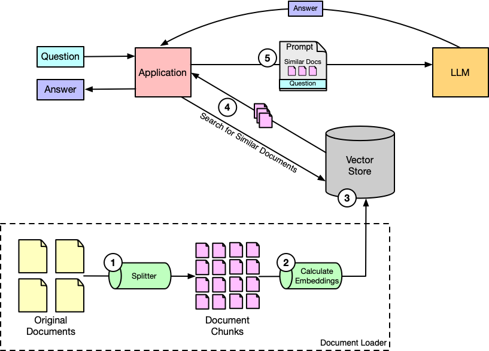
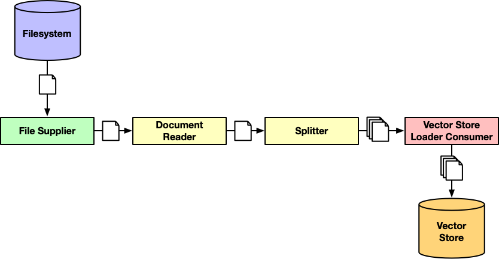
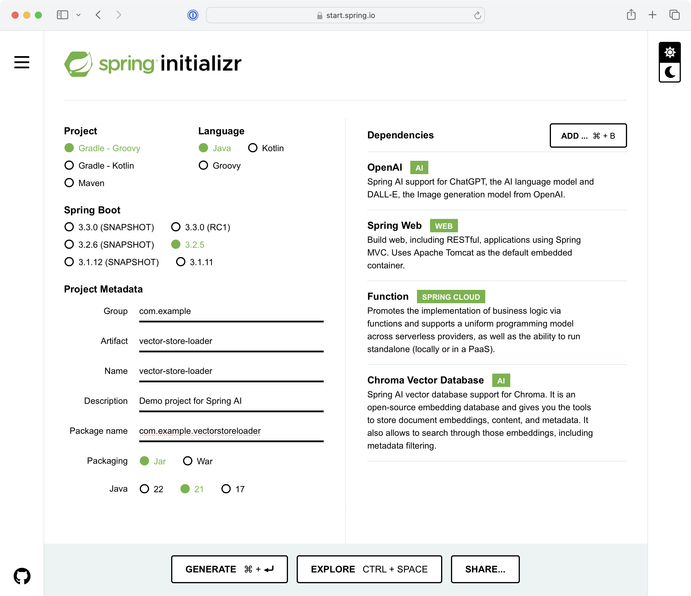

= Spring AI in Action
:chapter: 4
:sectnums:
:figure-caption: Figure {chapter}
:listing-caption: Listing {chapter}
:table-caption: Table {chapter}
:leveloffset: 1
:boot_version: 3.4.2
:spring_version: 6.2.2
:spring_ai_version: 1.0.0-M6
:xrefstyle: short
:bitmap_ext: png
:sectnumoffset: 3

= Talking with your documents

This chapter covers

* Retrieval Augmented Generation (RAG)
* Enabling a vector store
* Creating a document loading pipeline

Thinking back on your school days, do you recall ever being told that the exam
you'd be taking would be an open-book exam? No matter how much you learned or
how hard you could cram for a test, knowing that you'd have the source material
at your fingertips to help you answer the questions on the exam gave you greater
confidence that you'd be able to answer the questions correctly.

Now imagine that instead of just being told you could use your book to look up
the answers, you were told specifically which pages the answer could be found on.
Being equipped with the knowledge of exactly where to look in the book would all but
guarantee success.

LLMs are trained with an immense amount of information, but there are often
questions that their training will not have prepared them for. Being able to
pair a question with a document that includes the answer--or better yet, a
small chunk of a document with the required information--can not only help the
LLM answer questions more accurately, but also virtually eliminate hallucination
that come about when it tries to answer questions that exceed the limits of its
training.

In this chapter, you'll look at Retrieval Augmented Generation (RAG), a way to
provide relevant information to the LLM on-the-fly as you are asking questions.
Let's start by getting to know how RAG works.

== Understanding RAG

In the previous chapter, you were able to "stuff the prompt" with the rules for
the game Burger Battle. By doing so, you provided context--an open-book--on
which the LLM could find answers to your questions about the game.

The rulebook for Burger Battle is relatively small (just over 1,000 tokens),
so it fits easily into a prompt without eating up too much of the prompt's token
window. But some games have more in-depth rules that will take up more of the
context window. And you'll want to be able to answer questions about more games
other than Burger Battle. It would be impractical to fit every rulebook for
several games into a prompt's context, especially when the answer for any
question is probably found on such a small fraction of those documents.

Retrieval Augmented Generation (RAG) is a technique that addresses the problem
of simple prompt stuffing by breaking documents into smaller chunks and ensuring
that only document chunks that are similar to the question being posed documents
make it into the prompt.

Figure <<fig_ch3_fig1>> illustrates how this works.

[#fig_ch3_fig1, reftext={chapter}.{counter:figure}, caption='{figure-caption}.{counter:figure-number} ']
.RAG involves finding documents relevant to the question and adding them as context in the prompt.

Using the numbered cue balls in figure <<fig_ch3_fig1>> as signposts, here's what happens in a
typical RAG system:

1. Documents of any size are loaded and split into smaller documents. The
   splitting strategy employed is up to you, but a common approach is to ensure
   that no document chunk exceeds a certain number of tokens.
2. The contents of each chunk is assigned a set of coordinates in
   multidimensional space based on attributes of the content. These coordinates
   are called _embeddings_.
3. The individual document chunks are written to a vector store. A vector store
   is a kind of database that enables you to search for document chunks based on
   their embeddings.
4. When a question is asked, embeddings are calculated for the question itself
   and the question's embeddings are sent as query parameters to the vector
   store to locate only the document chunks that are closest to the question
   in multidimensional space.
5. The top handful of document chunks that are returned from the vector store
   are what will go into the prompt as context.

If that all sounds complicated to you, that's because it is. But the good news
is that you don't need to worry yourself with how embeddings are calculated or
how the distance between a question and a document in multidimensional space is
determined. Those things are all handled by AI provider embedding models and
vector stores. Spring AI further abstracts how you work with embedding models
and vector stores, making RAG completely pain-free.

You're going to add RAG capabilities to the Board Game Buddy application, enabling
it to answer questions about any game whose rules have been loaded into the
vector store. But before you can do that, you'll need a vector store to write
those rules into.

== Setting up a vector store

Vector search is a way to search for content similar to a query from a data store
by comparing the multi-dimensional vector coordinates of a query with those of the
content itself. Commonly, a measurement called cosine
similarityfootnote:[https://en.wikipedia.org/wiki/Cosine_similarity]
is applied to determine the cosine between the vectors for
the query and the document, then subtracted from 1 to determine the cosine
distance (a value from 0 to 2). Put simply, the smaller the angle between the vectors for the query and the document, the more similar that they are.

Although cosine similarity is interesting from a mathematical point of view, it's
not important to fully understand it to take advantage of it when using a vector
store. The vectors for queries and documents are calculated by APIs or libraries
and the math involved in calculating cosine distance is handled within the
vector store itself. All you need to do is have a vector store handy and use
it.

Spring AI comes with support for several popular vector stores, including...

- Azure AI Search
- Cassandra
- Chroma
- Elasticsearch
- GemFire
- SAP Hana
- Milvus
- MongoDB
- Neo4j
- Pinecone
- PostgreSQL with pgvector extension
- Qdrant
- Redis with RediSearch module
- Weaviate

Ultimately, which vector store you choose for your project will be weighed
according to its capabilities, performance, and price. Your choice will have
little impact to how you develop your Spring AI-enabled application.

Although many of these vector store options are available as cloud-hosted services,
for the purposes of our example, you're going to use a vector store that can be
run using Docker Compose. Several of the vector stores supported by Spring AI
fit that requirement, but you must pick one...so let's go with Qdrant.

Before you can run Qdrant with Docker Compose, you'll need to be sure that you
have Docker installed on your machine. See Docker's documentation at
https://docs.docker.com/engine/install for installation instructions relevent
to your operating system.

Once Docker is installed, the next thing you'll need to do is create a Docker
Compose file to start up Qdrant in Docker. Create a file named compose.yaml, in
the root of the Board Game Buddy project, with the following contents:

----
include::../code/ch04/board-game-buddy_1/compose.yaml[]
----

This YAML tells Docker Compose to start a Qdrant service. The most relevant
bit of information for working with it is the `ports` entry which sets up
port-forwarding such that the service will be  exposed through port 6334 on the
machine it is running on. That's perfect, because later when we use the Qdrant
vector store client in Spring AI, it will default to assume that Qdrant is
listening for requests on localhost, port 6334.

However, if port 6334 is already in use by some other service, you can change
it by changing the first port number in the `ports` entry. For example, to
expose it on port 6334, change the entry to:

----
ports:
  - 6334:6335
----

There are two ways to start Qdrant with Docker Compose:

 - Manually with the `docker compose` command.
 - Using Spring Boot's Docker Compose support.

To start the Qdrant database with `docker compose`, issue this command at the command line:

----
$ docker compose --file compose.yaml up
----

But the easier way to start Qdrant is to let Spring Boot start it for you when the application starts up.
To do that, add the following dependency to the project's build:

----
developmentOnly 'org.springframework.boot:spring-boot-docker-compose'
----

This will cause Spring Boot to spin up the Qdrant database (via the Docker Compose file) when the application starts.
And, Spring Boot will stop the Qdrant container when the application shuts down.

Whichever way you choose, the Qdrant database is now ready to handle all of your document storage and vector search needs.
Now that you have a vector store up and running, it's ready to be put to work to
support RAG interactions in the Board Game Buddy application. Before the
application can answer any questions about game rules, though, you will need to
be able to load those rules into the vector store. Let's see how to create a
document-loading pipeline to fill the vector store with game rules.

== Loading documents

At its core, adding documents into a vector store is very simple. You just need
to read the files, split them into smaller chunks, and then save the chunks to
the vector store. This involves three essential components provided by Spring
AI: A document reader, a text splitter, and the vector store client. The
following code snippet shows the most basic way of loading a document into a
vector store.

----
@Value("file://${HOME}/documents/my-document.txt")
private Resource documentPath;

public void loadDocument(VectorStore vectorStore) {
  DocumentReader reader = new TextReader(documentPath);
  TextSplitter splitter = new TokenTextSplitter();
  vectorStore.accept(splitter.apply(reader.get()));
}
----

In this simple case, a `TextReader` reads the "my-document.txt" file into a
single-entry `List<Document>` which is then passed into a `TokenTextSplitter`,
which breaks the `Document` down into one or more ``Document``s, each carrying
a chunk of the original document. That list of sub-documents is then given to
the given `VectorStore` to be saved.

For simple RAG applications where there's only ever one document that you'll
be asking questions about, that's fine. But in the Board Game Buddy application,
you could be asking questions about any number of games. And you could be adding
new game rules documents to the vector store as your game library grows. Declaring
a single document in a `Resource` that's loaded when the application starts
isn't going to be suitable.

Instead you'll create a document-loading pipeline that can load multiple documents
into the vector store and enable us to add new documents at any time without
restarting the application. The flow of this pipeline is illustrated in figure
<<fig_ch3_fig2>>.

[#fig_ch3_fig2, reftext={chapter}.{counter:figure}, caption='{figure-caption}.{counter:figure-number} ']
.A pipeline to load documents into a vector store.

=== Initializing the loader project

To build this pipeline, you'll use a special mix of Spring libraries, including:

* **Spring AI OpenAI** : This will be used primarily to access OpenAI's
   embedding API. You can optionally use a different AI service instead of
   OpenAI. If you do, then it's important to understand that different embedding
   models aren't cross-compatible. As such, you'll want to be sure that you use
   the same or compatible embedding API in the game rules application.
* **Spring MVC** : You'll need this because Spring AI requires it.
* **Spring AI Qdrant** : This is the client library for the vector store
   that the loader will be writing documents to.
* **Spring AI Tika Document Reader** : This is a Spring AI document reader
   based on Apache Tika and is capable of reading many different types of
   files.
* **Spring Function Catalogfootnote:[https://github.com/spring-cloud/spring-functions-catalog]** :
   Specifically, you'll use the `fileSupplier` function from the Spring Function
   Catalog to watch a directory for new files and send them to a custom consumer
   that writes them to the vector store. The file supplier is what is shown in
   leftmost box in figure <<fig_ch3_fig1>>. The other box is a custom component you'll
   build in this section.
* **Spring Cloud Functionfootnote:[https://spring.io/projects/spring-cloud-function]** :
   This will be used to coordinate the interaction between the file supplier and
   the custom consumer.

The choice of Spring Cloud Function and Spring Function Catalog make it easy to
define a pipeline such as the one in figure <<fig_ch3_fig2>>, but this is not the only
way, nor is it a necessary choice when working with Spring AI. Other options
include using Spring Batchfootnote:[https://spring.io/projects/spring-batch] or
Spring Cloud Data Flow[https://spring.io/projects/spring-cloud-dataflow].

To get started, you'll need to create a new Spring Boot project. If you're using
the Spring Boot Initializr at https://start.spring.io, create the project by
filling out the form and choosing the dependencies shown in figure <<CH04_F03_Walls>>.

[#CH04_F03_Walls, reftext={chapter}.{counter:figure}, caption='{figure-caption}.{counter:figure-number} ']
.Initializing the Vector Store Loader project.

You'll also need a couple of other dependencies that aren't starter dependencies
and thus aren't available from the Initializr. Specifically, you'll need to add
the Spring Function Catalog file supplier dependency as well as the Spring AI
Tika document reader dependency. After creating the project, edit the
build.gradle file and add the following dependency entries in the "dependencies"
block:

----
implementation 'org.springframework.cloud.fn:spring-file-supplier'
implementation 'org.springframework.ai:spring-ai-tika-document-reader'
----

The file supplier dependency is part of the larger Spring Functions Catalog
project and requires that you add the bill of materials (BOM)
footnote:[https://maven.apache.org/guides/introduction/introduction-to-dependency-mechanism.html#bill-of-materials-bom-poms]
for Spring Functions Catalog to the build so that it can be resolved. To add the
BOM, add this entry to the "dependencyManagement" block alongside the Spring AI
and Spring Cloud BOM entries:

----
mavenBom "org.springframework.cloud.fn:" +
        "spring-functions-catalog-bom:" +
        "$springFunctionsCatalogVersion"
----

And, lastly, define the `springFunctionsCatalogVersion` to set the version of
Spring Functions Catalog you'll be using:

----
springFunctionsCatalogVersion = '5.0.0-SNAPSHOT'
----

When you're done, the resulting build.gradle should look a little something like
this:

----
include::../code/ch04/game-rules-loader/build.gradle[]
----

Next, you'll need to set a few essential properties in
src/main/resources/application.properties. Specifically, since the application
has Spring MVC in play for the OpenAI client to work, you'll want to make sure
that that it doesn't start on port 8080 and present a port conflict with the
game rules application. Since this application doesn't expose an API itself,
setting it to 0 will ensure that it starts on some available high number port:

----
server.port=0
----

By default, Spring AI expects that a collection will have already been created
in Qdrant and will not try to create one for you. But for the sake of
convenience while developing the application, setting the
`spring.ai.vectorstore.qdrant.initialize-schema` property to `true` will ensure
that a Qdrant collection will be created and ready to receive documents.

----
spring.ai.vectorstore.qdrant.initialize-schema=true
----

The collection's name will default to "SpringAiCollection", but if you want, you
can specify a custom collection name by setting the
`spring.ai.vectorstore.qdrant.collection-name` property:

----
spring.ai.vectorstore.qdrant.collection-name=GameRules
----

Setting the collection name is completely optional. But if you decide to set a
custom collection name in the loader application, be sure to set the same
property in Board Game Buddy so that both applications will be working with the
same collection of documents.

Also, you'll be using OpenAI's embedding API to calculate the embeddings for
documents as they are loaded into the vector store, so you'll need to provide
your OpenAI API key in the `spring.ai.openai.api-key` property:

----
spring.ai.openai.api-key="${OPENAI_API_KEY}"
----

Just as you did in the Board Game Buddy application, the API key is specified
with a reference to an environment variable named `OPENAI_API_KEY` which holds
the actual key.

With the stage set, now you're ready to declare the high level definition.

=== Defining the loader pipeline

Spring Cloud Function lets you define a function that is composed of
one or more other functions by setting the `spring.cloud.function.definition`
with a pipe-delimiter separating the individual functions that make up the
composed function. For the vector store loader, the following property
defined in src/main/resources/application.properties does the trick:

----
include::../code/ch04/game-rules-loader/src/main/resources/application.properties[tag=composedFunction]
----

In this case, the composed function begins with a `fileSupplier`, an implementation
of `java.util.function.Function` provided by Spring Function Catalog. The
file supplier's job is to watch a directory for files to be written, pick those
files up, and then send them on to the next function in line. The directory that
the `fileSupplier` bean watches is specified in application.properties via the
`file.supplier.directory` property:

----
file.supplier.directory="/var/dropoff"
----

In this case, it's watching the "/var/dropoff" directory for any file to appear.
But you can configure it to be more discerning about what files it reads by
setting the `file.supplier.filename-regex` to select only the files you're
interested in:

----
file.supplier.filename-regex=.*\.(pdf|docx|txt)
----

Here, `file.supplier.filename-regex` is set with a regular expression that tells
the file supplier to only load PDF, MS-Word, or plain-text files and to ignore
anything else.

The next function in line is `documentReader` which is an implementation of
Spring AI's `DocumentReader` interface that takes the file it is given and
reads it into a `Document` object, which it then hands off to the next function
in the composed function.

The `splitter` function in an implementation of Spring AI's `TextSplitter`. It
receives the `Document` and splits it into smaller chunks returned as a list
of `Document` objects.

That list of ``Document``s is then received by the `vectorStoreConsumer`
function which writes the document chunks into the vector store via Spring AI's
`VectorStore` interface.

The `spring.cloud.function.definition` property clearly and succinctly defines
the document loading pipeline. But how are each of the functions defined?

The names of the functions correspond to beans that should be in the Spring
application context. As mentioned, he `fileSupplier` bean is provided by Spring
Function Catalog and auto-configured for you. But you'll need to define the
other beans. Let's see how to do that.

=== Creating the pipeline components

Each of the components in the document-loading pipeline is a `Function` from the
`java.util.function` package, with the exception of the `vectorStoreConsumer`
which is a `Consumer` from that same package. They all take some kind of input
and all of the `Function` components produce some output that is then sent to
the next component in line.

As functions, they can be implemented as lambdas and defined in a `@Bean` method
whose name matches the name of the component in the composite function definition.
To get started, let's define the `documentReader` function as a `@Bean` method.

==== Reading documents

Spring AI comes with a handful of document readers to choose from, all based on
the `DocumentReader` interface. The document readers that come out of the box
in Spring AI are:

- `TextReader` - The simplest reader that is capable of reading plain text files.
- `JsonReader` - A reader that is suitable for reading documents in JSON files.

You get these as part of Spring AI's core module. But you'll be loading the rules
for board games and since the rulebooks for most board games don't come in plain
text or JSON format, you'll need to consider one of Spring AI's other choices.

Board game rulebooks are typically available from the publisher's website or
from sites like Board Game Geekfootnote:[https://boardgamegeek.com/] in PDF
format. Therefore, it might seem logical to use on of Spring AI's PDF document
readers:

- `PagePdfDocumentReader` - A reader that reads PDF files, splitting them into
multiple documents on page breaks.
- `ParagraphPdfDocumentReader` - A reader that reads PDF files, splitting them
into multiple documents per paragraph (where a paragraph is loosely defined as
a section in the document's table of contents).

Neither of these come in the Spring AI's core module, but you can add them to
the project's build with the following dependency entry:

----
implementation 'org.springframework.ai:spring-ai-pdf-document-reader'
----

Both of these document readers read documents and split them into smaller document
chunks. As its name suggests, `PagePdfDocumentReader` splits on page breaks. But
the way that `ParagraphPdfDocumentReader` is not as obvious. It relies on table of
contents metadata being provided in the PDF and splits the document on sections in
the PDF (which may or may not be paragraph-sized).

Aside from its peculiar understanding of what a paragraph is, `ParagraphPdfDocumentReader`
may not be suitable for all PDF documents. If the PDF doesn't include the table
of contents metadata (and many board game rulebooks do not) then it will throw
an exception and will be unable to load the PDF.

You might be thinking that `PagePdfDocumentReader` should be the go-to choice for
Board Game Buddy's document loader. But before you decide on that, consider that
in some cases the rules for a game may be provided to you in some form other than
PDF, such as in a plain text file or as an Microsoft Word document. And, of course,
if you're trying to apply Spring AI to load documents from your organization, those
could come in many forms, including PDF, plain text, Microsoft Word, Microsoft
Excel, Microsoft PowerPoint, or any one of another format that can't be read by
`PagePdfDocumentReader`.

For those times when you need flexibility in what type of document you're loading,
consider Spring AI's `TikaDocumentReader`. This reader is based on Apache
Tikafootnote:[https://tika.apache.org/] and is capable of reading a wide selection
of document types, include those mentioned above and many more.

Because of its flexibility, we'll use `TikaDocumentReader` in the rules loader
for Board Game Buddy. To ensure that `TikaDocumentReader` is available in the
classpath, add the following dependency to the project build:

----
import java.util.function.Function;
import org.springframework.ai.document.Document;
import reactor.core.publisher.Flux;

// ...

implementation 'org.springframework.ai:spring-ai-tika-document-reader'
----

Now you can define the `documentReader` function by creating the following `@Bean`
method:

----
include::../code/ch04/game-rules-loader/src/main/java/com/example/gamerulesloader/GameRulesLoaderApplication.java[indent=0,tag=documentReaderFunction]
----

This function is defined to accept a `Flux<byte[]>` as input and to produce a
`Flux<List<Document>>>` as output. It was necessary to accept `Flux<byte[]>>` as
input because the `fileSupplier` component provided by Spring Function Catalog
produces a `Flux<byte[]>` as its output.

You'll recall from section 3.4.2 that a `Flux` is a reactive type from Project
Reactor. It represents a stream of data that is delivered as it becomes
available. In this case, the `fileSupplier` produces the bytes from a file it has
read and drops them into the `Flux` stream to be sent along to the next function
in line. Later, when another file is read, its bytes will be sent along in the
same `Flux`.

Because the flow of the pipeline represents a long-running stream
of data, it's important that we accept the input as a `Flux` and continue that
stream throughout the entire document-loading pipeline. That's why the function
also returns a `Flux`, albeit a different one that carries a `List<Document>`.

Within the `documentReader` function, the incoming `Flux<byte[]>` is mapped to the
new `Flux<Document>` by calling the `map()` method on the original `Flux`. The
lambda given to the `map()` contains the file's bytes as a `byte` array which
are used to construct a `ByteArrayResource` that is given to
`TikaDocumentReader`. From there, a call to the document reader's `get()` method
returns a `List<Document>`, but since there should only ever be a single `Document`
in that list, the first document is extracted from the list and returned and passed
along to the next function in line in the `Flux<Document>`.

==== Splitting documents

Because a document could be quite large, it's usually important to split it into
smaller chunks so that you're not sending the entire document as context in a
prompt. Spring AI's PDF document readers already split documents, but since we're
using `TikaDocumentReader` and since it doesn't already split documents, you'll
need a document splitter defined in the rules loader pipeline. The `splitter`
function is defined with the following `@Bean` method:

----
include::../code/ch04/game-rules-loader/src/main/java/com/example/gamerulesloader/GameRulesLoaderApplication.java[indent=0,tag=splitterFunction]
----

As with the `documentReader` function, `splitter` is defined as a lambda. It
uses Spring AI's `TokenTextSplitter` to split the incoming `Document`, resulting
in a `List<Document>` that contains split apart chunks of the original document.
That is then passed along on the outgoing `Flux<List<Document>>>` for the next
function to handle.

==== Determining the game's title

Before the document chunks can be written to the vector store, it's important to
set the title of the game as metadata on them so that when the Board Game Buddy
application does a similarity search, it can search for rules for a specific game.
Otherwise, a similarity search could return rules that seem similar to the question
being asked, but for the wrong game.

One way to determine the name of the game is to require that the documents follow
a naming convention such that the game title can be derived from the document
name. But that requirement puts a little too much faith in the ability and
willingness of those providing the documents to adhere to the naming convention.

Here's a crazy idea: What if instead of relying on naming convention to determine
the title of a game, we leverage generative AI to figure it out based on the
content of the document itself? That's what the `titleDeterminer` function in
listing <<ex_ch2_MetadataService>> does.

[#ex_ch2_MetadataService, reftext={chapter}.{counter:listing}, caption='{listing-caption}.{counter:listing-number} ']
.Using Generative AI to determine the title of a game from the game rules.
----
include::../code/ch04/game-rules-loader/src/main/java/com/example/gamerulesloader/GameRulesLoaderApplication.java[indent=0,tag=titleDeterminer]
----
<1> Pull first document chunk
<2> Add chunk to prompt
<3> Set title as metadata

As you can see, `titleDeterminer` is a bit more interesting than the pipeline
functions up to this point. Upon receiving the document chunks from the `splitter`
function, it sends the first chunk in a prompt asking the LLM to figure out the
game's title. The prompt template for determining the game title looks like this:

----
include::../code/ch04/game-rules-loader/src/main/resources/promptTemplates/nameOfTheGame.st[indent=0]
----

The prompt gives clear instructions to try to figure out the name of the game from
the document chunk that is passed in as context. And, if for some reason it can't
determine the name of the game, it's a good practice to provide a fallback. In
this case, the fallback plan is to respond with "UNKNOWN". Otherwise, the title
of the game will be returned in a `GameTitle` object and used to set the game
name as metadata on all of the document chunks in the list and returns the
modified list in a `Flux` for the next step in the pipeline.

`GameTitle` is just a simple Java record that carries the title of the game and
includes a `getNormalizedTitle()` method to normalize the title to lowercase with
underscores for spaces:

----
include::../code/ch04/game-rules-loader/src/main/java/com/example/gamerulesloader/GameTitle.java[]
----

Normalizing the title will make it easier to search for documents relevant to a
specific game later when retrieving the document chunks from the vector store.

==== Writing documents to the vector store

Now that the document has been read, split up into chunks, and the title
of the game has been set as metadata on those chunks, the pipeline's final task
is to write the document chunks to the vector store. The `vectorStoreConsumer`
component is the end of the pipeline and is defined in the following `@Bean`
method:

----
include::../code/ch04/game-rules-loader/src/main/java/com/example/gamerulesloader/GameRulesLoaderApplication.java[indent=0,tag=vectorStoreConsumer]
----

As you can see, `vectorStoreConsumer` is an implementation of `Consumer`, which
means it has no output. But it does accept input in the form of a `Flux<List<Document>>>`.
Because the ``VectorStore``'s `accept()` method doesn't accept a `Flux`, it's at
this point that you must extract the `List<Document>` out of the `Flux` that is
carrying it before passing it to the `accept()` method. That's what the
`doOnNext()` method is for. As a `List<Document>` arrives in the `Flux`, it acts
on it by logging how many documents it is about to write the the vector store.
It then passes them to the `accept()` method before logging that they have been
written to the vector store.

The final thing that happens in the `vectorStoreConsumer` definition is that
`subscribe()` is called on the `Flux`. This is important, because unless the
`Flux` is subscribed to, the stream of data will not flow and nothing will
happen. Think of the entire `Flux` pipeline as a garden hose and the `subscribe()`
method is turning on the spigot.

The pipeline has been defined and all of the components implemented. Now let's
run it and see what happens.

=== Running the pipeline

The pipeline, as defined by the `spring.cloud.function.definition` property in
application.properties, is itself a function that is composed from the various
components you've created. Before any data can flow through the pipeline, you'll
need to run that composed function.

The `go()` method shown here defines an `ApplicationRunner` bean that kicks off
the pipeline by calling `run()` on the composed function.

----
include::../code/ch04/game-rules-loader/src/main/java/com/example/gamerulesloader/GameRulesLoaderApplication.java[indent=0,tag=goApplicationRunner]
----

The `ApplicationRunner` bean is injected with a `FunctionCatalog` from which
functions can be looked up. But since our application only has one composed
function, passing `null` to the `lookup()` function will return the pipeline
function. With that function in hand, the pipeline is kicked off by calling the
`run()` method on the function.

Now you're ready to fire up the application to put it all in motion. From
within the vector store loader project's folder, run the following command:

----
$ ./gradlew bootRun
----

After the application starts up, trying copying the PDF rules for a board game
into the `/tmp/dropoff` directory. If you don't happen to have any PDF rulebooks
handy, you can usually find them for many games at game publisher websites or at
Board Game Geek.

After copying one or more game rules documents to the dropoff directory, you
should see evidence in the logs that the document was picked up, run through
the pipeline, and written to the vector store. Larger documents take more time
to load, so be patient if loading game rules with many pages.

For example, if you had copied the rules for Burger Battle into the `/tmp/dropoff`
directory, you might see the following in the logs (modified to fit the margins
of this page);

----
TextSplitter                 : Splitting up document into 2 chunks.
GameRulesLoaderApplication : Determined game title to be Burger Battle
GameRulesLoaderApplication : Writing 2 documents to vector store.
GameRulesLoaderApplication : 2 documents have been written to vector store.
----

You can verify that the document chunks have been written to Qdrant using HTTPie.
First, using the /api/v1/collections endpoint provided by Qdrant, ask for a list
of document collections so that you will know the collection ID:

----
$ http :8000/api/v1/collections -b
[
    {
        "database": "default_database",
        "id": "36e6b15e-02ea-443e-a190-8474452490bc",
        "metadata": {
            "hnsw:space": "cosine"
        },
        "name": "SpringAiCollection",
        "tenant": "default_tenant"
    }
]
----

The response to this request includes some interesting information such as the
name of the collection (which clearly pertains to the Spring AI-based application)
and the approach to similarity matching employed (cosine distance, in this case).
But the info you'll need next is the value of the "id" field. Copy it and use
it to query for the collection's document count:

----
$ http :8000/api/v1/collections/36e6b15e-02ea-443e-a190-8474452490bc/count -b
2
----

Here, it is shown that after adding the Burger Battle rules, there are two
entries in Qdrant, the same number as the logs said there would be.

You can also use Qdrant's API to query for similar documents if you'd like. But
that gets tedious, requiring that you calculate a set of embeddings before
posting the query request. If you're interested in trying that, then you can
find Qdrant's API documentation at https://api.qdrant.tech/.

It's more fun and useful, however, to make such queries with Spring AI, by
implementing RAG in the Board Game Buddy API. So adding RAG to the Board Game
Buddy application is what you'll do next.

== Implementing RAG

Adding RAG to any application involves first querying the vector store for
documents that are similar to the question being asked and then providing those
documents in the prompt as context.

The first thing you'll need to do is to add the vector store starter dependency
to the Board Game Buddy application. Since you used Qdrant in the vector store
loader, you'll want to add the same Qdrant dependency to the build:

----
include::../code/ch04/board-game-buddy_1/build.gradle[indent=0,tag=qdrantDependency]
----

Next, you'll need to implement the RAG functionality to search for documents
similar to the question being asked.

=== Searching for similar documents

Although `GameRulesService` doesn't yet implement RAG, it is responsible for loading
the rules for a game into the prompt. Currently, it loads the game rules from a
fixed location. But if Board Game Buddy is to be able to answer questions about
many different games, many of which may have lengthy (e.g., token-heavy) rulebooks,
then `GameRulesService` will need to change to query the game rules as document
chunks from the vector store that are similar to the posed question.

Listing <<ex_GameRulesService>> shows how `GameRulesService` needs to be changed to
employ RAG search.

[#ex_GameRulesService, reftext={chapter}.{counter:listing}, caption='{listing-caption}.{counter:listing-number} ']
.Implementing RAG in GameRulesService.
----
include::../code/ch04/board-game-buddy_1/src/main/java/com/example/boardgamebuddy/GameRulesService.java[]
----
<1> Create a SearchRequest
<2> Search for similar documents
<3> Map documents to a String
<4> Normalize game title

This new version of `GameRulesService` is injected with a `VectorStore` (in this
case `QdrantVectorStore`) through its constructor. It will use the `VectorStore`
in the `getRulesFor()` method to search for document that are similar to the
question.

First, however, the `getRulesFor()` method creates the `SearchRequest` that defines
the parameters of the search. The query itself is the question posed by the user.
If that's all you care to search for, you could have stopped right there and the
`SearchRequest` would be defined like this:

----
SearchRequest searchRequest = SearchRequest.builder().query(question).build();
----

But since there could be rules documents for many different games in the vector
store, `getRulesFor()` defines the `SearchRequest` such that it filters based on
metadata where the "gameTitle" entry has a value equal to the normalized game title
(where normalized means snakecase).

The filter is defined using a `FilterExpressionBuilder` which makes easy work of
building a filter through a fluent interface. But you can also specify the filter
as a `String`. For example, the same expression could have been expressed like
this:

----
.withFilterExpression("gameTitle == '" + normalizeGameTitle(gameName) + "'");
----

By default, the similarity search will return up to 4 documents that are the
most similar to the question. But you can refine the number of documents by
setting the top-K value on the request. Top-K specifies how many of the most
similar documents to return. For example, the following code uses the `withTopK()`
method to set the top-K value:

----
SearchRequest searchRequest = SearchRequest.builder()
    .query(question)
    .withTopK(6)
    .withFilterExpression(
        new FilterExpressionBuilder()
            .eq("gameTitle", normalizeGameTitle(gameName)).build())
    .build();
----

As a consequence, the search will return at most 6 similar documents.

Bear in mind that the more document chunks added to the prompt context, the more
tokens you'll use. This not only increases the cost of the request, but also
could potentially exceed the token limit. On the other hand, if you were to
tune top-K to a lower value, you might not receive enough documents for the LLM
to find a correct answer.

While we're on the subject of fine-tuning the search request, you might find it
helpful to specify a threshold for how similar the documents are. Similarity has
a range of 0.0 to 1.0. By default the search request's threshold is 0.0, meaning
that any document, even if it is remotely similar, will be returned. If you
find that similarity search is returning results that are not similar enough to
be useful as context for answering the questions, you can tune the similarity
threshold by calling `withSimilarityThreshold()`. Here's an example of setting
the similarity threshold to 0.5:

----
SearchRequest searchRequest = SearchRequest.builder()
    .query(question)
    .withTopK(6)
    .withSimilarityThreshold(0.5)
    .withFilterExpression(
        new FilterExpressionBuilder()
            .eq("gameTitle", normalizeGameTitle(gameName)).build())
    .build();
----

Although the similarity threshold can be useful in weeding out some results that
don't seem all that relevant, take caution against setting it too high. The higher
it is set, the greater possibility that you will get fewer (or possibly zero)
results back and the LLM will have not have enough context to be able to respond
to the question.

With the `SearchRequest` prepared, the vector store is then queried for similar
documents by calling the `similaritySearch` on the `VectorStore`.

If the search returns no similar documents, then a `String` is returned stating
that no rules for the specified game. But if rules for the game are found, then
The list of similar documents, are converted into a `String` by extracting their
content and joining them together separated by a line break.

In the end, the `String` returned from `getRulesFor()` will contain the text
from all of the similar documents. It will be used by `SpringAiBoardGameService` to populate
the "{rules}" placeholder in the system prompt template. But for it to be
effective, a few small changes are required for `SpringAiBoardGameService` and the system
prompt template.

=== Updating the service

For the most part, `SpringAiBoardGameService` doesn't need to change much to support RAG
interactions. That's because the bulk of the RAG technique is implemented in
the `GameRulesService` class. But because ``GameRulesService``'s `getRulesFor()`
now takes both the game name and the question as parameters, you will need to
change how `getRulesFor()` is called from the ``SpringAiBoardGameService``'s `askQuestion()` method:

----
include::../code/ch04/board-game-buddy_1/src/main/java/com/example/boardgamebuddy/SpringAiBoardGameService.java[indent=0,tag=ask]
----

Nothing else needs to change in `SpringAiBoardGameService` because it was already injecting
the `String` returned from `getRulesFor()` into the "{rules}" placeholder of
the prompt.

The prompt (systemPromptTemplate.st), however, does require a little
work. In it's past form, it was very lenient, allowing the question to be answered
from the LLM's own training if the answer could not be found in the rules text.
But that leaves open a lot of opportunity for wrong answers (aka, "hallucinations")
to be returned. This new version of systemPromptTemplate.st is more strict:

----
include::../code/ch04/board-game-buddy_1/src/main/resources/promptTemplates/systemPromptTemplate.st[]
----

Per the instructions given to the LLM in this prompt template, if the LLM can't
find the answer to the user's question in the given rules, it should respond with
"I don't know".

Now let's try it out. Make sure that the vector store is still running and has
been populated with a few game rules. Then start the application and ask some
questions via the "/ask" endpoint.

For example, if you have loaded the rules for Burger Battle, you could ask about
the "Grave Digger" card using HTTPie like this:

----
$ http :8080/ask question="What is the Grave Digger card?" \
                 game="Burger Battle" -b
{
    "answer": "The Grave Digger card allows a player to dig through the
               Graveyard for any needed ingredient and add it to their
               Burger in the game Burger Battle.",
    "gameTitle": "Burger Battle"
}
----

On the other hand, suppose that you were to ask a question about Carcassonne,
but had not loaded the rules for that game into the vector store. Then you would
get this result:

----
$ http :8080/ask question="How do you score a monastery?" \
                 game="Carcassonne" -b
{
    "answer": "I don't know.",
    "gameTitle": "Carcassonne"
}
----

If later you were to load the rules for Carcassonne and try again, you might get
the following answer:

----
$ http :8080/ask question="How do you score a monastery?" \
                 game="Carcassonne" -b
{
   "answer": "To score a monastery in Carcassonne, it must be completed
              when it is surrounded by tiles. Each of the monastery’s tiles
              (including the one with the monastery itself and the 8
              surrounding tiles) is worth 1 point.",
   "gameTitle": "Carcassonne"
}
----

Note that the actual results may vary depending on which model you are using.
Most models will reply with "I don't know" as instructed by the prompt. Sometimes,
you might get a lengthier answer that essentially means "I don't know". And
some models will completely disregard the instructions and attempt to answer the
question from their own training.

Implementing RAG in `GameRulesService` was fairly straightforward and makes it
clear how the similarity search fits into the question and answer flow. But
Spring AI offers another way to apply RAG that cuts down on some of the code
involved. Let's see how to apply RAG using an advisor, a Spring AI component
that provides much of the common functionality of RAG for you.

== Implementing RAG with an Advisor

As you've seen, much of the work of RAG takes place before the actual prompt is
sent to the LLM. In fact, the way you implemented RAG in the previous section,
the bulk of the RAG work is handled in the `GameRulesService` and the
`getRulesFor()` method is called as the very first thing that the service's
`askQuestion()` method does. The only other RAG-related thing that the `askQuestion()` method
does is to ensure that the "{rules}" parameter is set as the prompt is set.

It doesn't take much imagination to think that perhaps the RAG work could be
extracted in some kind of interceptor that wraps the call to the LLM. Such an
interceptor could start by doing a similarity search to find the documents that
are similar to the question and then inject the documents into the prompt
template before the prompt is sent.

That's precisely what Spring AI's `QuestionAnswerAdvisor` is for. Spring AI
advisors are called before and after interactions with the `ChatClient` and can
add context to a prompt as well as extract information from the response for
later use. The main thing that `QuestionAnswerAdvisor` does is to append some
text to the user prompt template and searching the vector store for documents to
add as context.

[NOTE]
.QuestionAnswerAdvisor isn't the only advisor
====
`QuestionAnswerAdvisor` is only one of a handful of advisors offered by Spring
AI. There are a few other advisors that come in handy when handling chat memory.
We'll see how to use those as we add conversational memory in chapter 5.
====

To see how `QuestionAnswerAdvisor` works, consider the following implementation
of the `askQuestion()` method:

----
@Override
public Answer askQuestion(Question question) {

  String gameNameMatch = String.format("gameTitle == '%s'",
  [CA]question.gameTitle());

  return chatClient.prompt()
      .system(systemSpec -> systemSpec
          .text(promptTemplate)
          .param("gameTitle", question.gameTitle()))
      .user(question.question())
      .advisors(
          new QuestionAnswerAdvisor(vectorStore, SearchRequest.defaults()))
      .call()
      .entity(Answer.class);
}
----

In this version of `askQuestion()`, notice that although the system prompt
is still specified, it is no longer used to provide the document chunks retrieved
from the vector store. Because of that, the system prompt template can be
simplified down to the following:

----
include::../code/ch04/board-game-buddy_2/src/main/resources/promptTemplates/systemPromptTemplate.st[]
----

Instead of providing game rules though this tempalte, the `advisors()` method is
called so that the `QuestionAnswerAdvisor` will be used to search for documents
similar to the question and even append text to the system prompt that includes
the similar documents and instructions to the LLM to use those documents. Essentially,
almost everything you had to do yourself in the previous section is handled under
the covers by `QuestionAnswerAdvisor`.

By default, the text that `QuestionAnswerAdvisor` appends to the prompt is as
follows:

----
Context information is below.
---------------------
{question_answer_context}
---------------------
Given the context and provided history information and not prior knowledge,
reply to the user comment. If the answer is not in the context, inform
the user that you can't answer the question.
----

The "{question_answer_context}" will be replaced by the documents found when
doing the similarity search.

Before `ChatClient` submits the request, it will call on `QuestionAnswerAdvisor`
to handle the RAG work. `QuestionAnswerAdvisor` is created with a reference to
the `VectorStore` so that it can do the similarity search. It's also created
with a default `SearchRequest` that it will build upon with the question as
the search criteria.

But all of that happens internally to `ChatClient` and `QuestionAnswerAdvisor`,
so you won't need to implement it in your code. That means that you won't need
`GameRulesService` or anything like it when using `QuestionAnswerAdvisor`.

As used in the `askQuestion()` method above, there's nothing about `QuestionAnswerAdvisor`
that's specific to a given request. Because of that, you could extract it out of
the `askQuestion()` method and instead set it as a default advisor on the `ChatClient`
so that it will be used for all `ChatClient` requests. What you'd need to do is
explicitly declare a `ChatClient` bean and set the advisor by calling
`defaultAdvisors()`. The configuration class in <<ex_AiConfig>> shows how to do that.

[#ex_AiConfig, reftext={chapter}.{counter:listing}, caption='{listing-caption}.{counter:listing-number} ']
.Configuring a ChatClient bean with a default advisor.
----
include::../code/ch04/board-game-buddy_2/src/main/java/com/example/boardgamebuddy/AiConfig.java[]
----

That's a good start and now you won't need to provide `QuestionAnswerAdvisor`
in `askQuestion()` when handling a request. But there's still something missing.

Listing <<ex_SpringAiBoardGameService_advisor>> shows the new implementation of `SpringAiBoardGameService`
that creates the `QuestionAnswerAdvisor` with a `SearchRequest` that includes
the game title filter.

[#ex_SpringAiBoardGameService_advisor, reftext={chapter}.{counter:listing}, caption='{listing-caption}.{counter:listing-number} ']
.Specifying a filter in the SearchRequest used to create QuestionAnswerAdvisor.
----
include::../code/ch04/board-game-buddy_2/src/main/java/com/example/boardgamebuddy/SpringAiBoardGameService.java[tag=ask]
----
<1> Create filter expression
<2> Set advisor parameter

The `askQuestion()` method no longer creates a `QuestionAnswerAdvisor`, because
that's now specified when the `ChatClient` bean is created. But since the game
title wasn't known at bean creation time, the `askQuestion()` method is
responsible for providing that detail.

The first thing that `askQuestion()` does is use the given game title to form
an expression for filtering documents from the vector store based on the game
title. When it calls `advisors()`, it specifies the expression as a parameter
whose key is provided by the `FILTER_EXPRESSION` constant.

As a consequence of this change, the `QuestionAnswerAdvisor` specified when the
`ChatClient` bean was created now has everything it needs to filter its results
and focus on a specific game.

Whether you explicitly implement RAG as in the case of `GameRulesService` or let
`QuestionAnswerAdvisor` perform the RAG magic for you is largely a matter of how
much control you wish to maintain or delegate to the framework. Although using
`QuestionAnswerAdvisor` can simplify your code, explicitly implementing RAG
gives you more opportunity to customize the RAG flow to suit your needs.

Coming up in the next chapter, we'll look at a few more advisors that Spring AI
has to offer for managing memory in the application, enabling conversational
interactions with LLMs.

////
Before wrapping up this chapter, let's take a critical look at RAG to better
understand its limits and consider ways to overcome them.

== Evaluating RAG limitations

Although RAG is one of the most useful techniques in Generative AI, it's not
perfect or always suitable. It suffers from a few limitations, including:

 - Vector search is a similarity search, which is not necessarily the same as
   relevancy search.
 - RAG is not effective when the desired answer requires searching through
 several documents.
 - RAG is potentially wasteful in terms of token usage.
 - RAG is an answer-only technique; it is not capable of "taking action".
 - RAG is not effective at considering real-time information.

Let's examine each of these RAG constraints one by one.

=== Similarity is not relevancy

In theory, the document chunks provided in prompt context is considered relevant
to the question being asked. In reality, however, when you search a vector store
you are searching for documents that are similar to the question being asked.
Just because a document is similar to the question, it does not necessarily mean
that it's relevant.

For a large number of cases, similarity is close enough to relevancy that RAG
gets away with it. But don't be surprised if the answers you get back from a RAG
flow sound perfectly correct, but do not actually answer your question.

Fortunately, there are several advanced RAG variations that attempt to bring
relevancy back into the pattern. Self-RAGfootnote:[https://arxiv.org/abs/2310.11511]
and Corrective RAGfootnote:[https://arxiv.org/abs/2401.15884] are two RAG
variants that employ a critiquing step that uses the LLM to determine how
relevant the documents returned from the similarity search are. If any documents
are deemed irrelevant, they are either thrown out and not used as context when
answer the question or they are complemented by some external information, such
as from a website.

Another trick that may help vector search provide more relevant documents is to
ask the LLM, during document loading, to generate a list of questions that a
document chunk is capable of answering. Then those questions are stored in the
vector store along with a reference to the document that can answer them. Put
simply, the LLM is used to generate an FAQ for each document in hopes that a
question submitted to the RAG flow matches one of those questions, leading to
the referenced document being used as context.

=== RAG is unable to consider broad context

By definition, the documents added to the prompt's context is limited to only a
few entries. That's best if the answer to the question can be found in only one
or two of those documents. But if the question requires a broad sweep of several
documents, then RAG will fail to adequately answer the question.

For example, let's say that you've loaded the rules for hundreds of games into
the vector store and now you want to ask "How many games are played with dice?"
RAG would struggle to answer that question accurately because while the top
few documents would likely reference games that use dice, it would not likely
be inclusive of all games that are played with dice.

There's no good way to address this limitation aside from maintaining a special
document that keeps a count of how many games are played with dice.

=== RAG may waste tokens

On the other hand, the document context may include more information than is
necessary to answer the question. It's likely that a question could be answered
with only single document (or even a fraction of the document). All other
information in the context is unnecessary, but still counts against the prompt's
token usage.

You could set top-K to a lower value, but then you run the risk of there not
being enough context for questions that require more documents.

=== RAG is answer-only

RAG is great at providing answers to questions. If, however, you wish for the LLM
to take some action--turn on a light, order a pizza, send an email, etc--then
RAG cannot help you.

=== RAG is not real-time

Just as an LLM is incapable of accurately answering questions that require
information that's newer than their training, RAG is also incapable of answering
questions that require documents that are newer than what's in the vector store.

Although it is possible to manage the documents in a vector store to keep them
updated, it's usually not practical to keep those documents fresh up-to-the-moment.
Any questions that require real-time information such as stock prices, sports
scores, and system metrics will be unanswerable with RAG.

Despite it's limitations, RAG is a very useful pattern in Generative AI. But for
a few of those limitations, integrating Spring AI with functions will help you
work with real-time information, consider a broad range of data, and even perform
actions in the course of processing a prompt. Working with functions is what
we'll look at next.
////

== Summary

* Retrieval Augmented Generation (RAG) enables applications to submit prompts
that ask about information that the LLM isn't trained on.
* RAG can also greatly reduce the so-called "hallucinations" that occur when the
model isn't trained on a topic or is over-trained and can't discern the context.
* RAG works by focusing prompt context to a handful of documents that are similar
to the question being asked.
* Spring AI includes integration with over a dozen vector stores for storing and
querying for documents that are similar to the question being asked.
* Using Spring AI's `ChatClient`, you can implement RAG explicitly or take
advantage of `QuestionAnswerAdvisor` to handle the RAG specifics for you.
