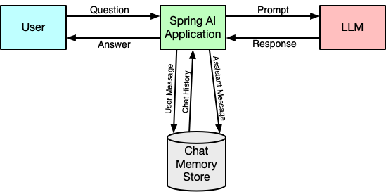

= Spring AI in Action
:chapter: 5
:sectnums:
:figure-caption: Figure {chapter}
:listing-caption: Listing {chapter}
:table-caption: Table {chapter}
:leveloffset: 1
:boot_version: 3.4.2
:spring_version: 6.2.2
:spring_ai_version: 1.0.0-M6
:xrefstyle: short
:bitmap_ext: png
:sectnumoffset: 4

= Enabling conversational memory

This chapter covers

* Maintaining conversational state
* In-memory chat history
* Retaining long-term memory

Have you seen the movie "50 First Dates"? In it, Drew Barrymore's character, Lucy,
lives with a brain injury sustained in a car accident that gives her a type of
short-term memory loss. In the movie, her memory resets to the time just before
her accident every day when she wakes up. She retains no memory of anything that
has happened since the accident after she goes to sleep at night.

In the same movie, there's another character called "10-Second Tom". Tom has a
similar injury (from a hunting accident) in which his memory is reset every 10
seconds. Whereas Lucy's slightly longer memory drives the plot of the movie,
Tom's condition is more comical, with him reintroducing himself by saying "Hi,
I'm Tom" every 10 seconds.

Even though LLMs seem to be incredibly smart and able to answer almost any
question, they have memory problems not unlike those experienced by Lucy and
10-Second Tom. In fact, Lucy's and Tom's memories are vastly superior the an
LLM's memory in that the LLM doesn't retain any memory past the completion of
a prompt. In short, LLMs are stateless services.

This extreme case of short-term memory loss makes it challenging to conduct a
conversation with an LLM. If you were to ask "Why is the sky blue?" and then
follow that question with "Is it ever orange?", the LLM would have no idea what
"it" refers to in the second question, because it has forgotten that you ever
asked a question about the sky before.

Fortunately, Spring AI has a solution to the LLM's extremely short-term memory
problems. And, as it turns out, that solution involves using advisors much like
how Spring AI implements RAG using `QuestionAnswerAdvisor`.

Let's see how it works.

== Making memories in AI

If you were having trouble remembering something, what might you do to help you
remember? Tie a string around your finger? Employ a mnemonic device? Or simply
write it down in a note to your future self to read?

While you can't tie a string around an LLM's finger (chiefly because they don't
have fingers) and mnemonic devices are typically based on human whimsy that is
something that LLMs are decidedly lacking in. But jotting down something in a
note is something that is useful for both humans and LLMs. So that's the trick
Spring AI employs to help an LLM remember a conversation.

When the user asks a question to the LLM in the course of a conversation, the
user message carrying the question is stored in some form of memory (defined in
Spring AI by the `ChatMemory` interface). Then when the answer comes back, the
LLM's response message (called an "assistant" message) is also stored away for
future reference.

The next time the user asks a question, the same thing happens again, but first
the user and assistant messages from past exchanges in the same conversation are
pulled from memory and written into the prompt as context, similar to how documents
are pulled from a vector store and written in the the prompt context in RAG.

Figure <<fig_ch4_fig1>> illustrates this exchange and how user and assistant messages
are stored in memory and the chat history retrieved and used as context in
prompts to the LLM.

[#fig_ch4_fig1, reftext={chapter}.{counter:figure}, caption='{figure-caption}.{counter:figure-number} ']
.Chat memory keeps a record of user and LLM interactions as a reminder for future prompts.

As a result, the conversation is stored as a dialog between the user and
assistant and played back to the LLM on every request. The LLM is reminded of
everything that has been said before, which enables it to continue the
conversation and stay on topic.

Spring AI implements management of conversational memory as advisors. More
specifically, Spring AI provides three different advisors, each with its own
strategy for managing the history of the chat:

- `MessageChatMemoryAdvisor`
- `PromptChatMemoryAdvisor`
- `VectorStoreChatMemoryAdvisor`

Both `MessageChatMemoryAdvisor` and `PromptChatMemoryAdvisor` store the chat
history via some implementation of `ChatMemory`, but they differ in how the
prompt is populated with chat history. `MessageChatMemoryAdvisor` adds the chat
history to the prompt as distinct messages for the user and assistant roles. But
not all models support role-based messages. For those models, `PromptChatMemoryAdvisor`
will inject the chat history into the prompt as one big string injected into a
system message template.

`VectorStoreChatMemoryAdvisor` takes a completely different approach to storing
chat history by storing it in a vector store. By doing this, it can query the
vector store, the same way it would query for document chunks in RAG, finding
the pieces of chat history that are most similar to the question being asked.
Then it places the similar snippets of chat history into the prompt as a string
injected into a system message template, the same as `PromptChatMemoryAdvisor`.

To see how each of these advisors work, let's start with a simple example that
shows how you can use Spring AI's chat memory advisors to add conversational
memory to the Board Game Buddy application.

== Adding conversational memory

When someone is asking questions about the rules of a game, it wouldn't be
uncommon for them to ask one question and then ask one or more followup questions.
For example, when asking about Burger Battle, you might ask a question about one
of the battle cards, followed by a bit of clarification on how it can be used.
For example, consider these two questions:

- "What is the Burger Force Field card?"
- "Does it protect against Burgerpocalypse?"

Even though this exchange is brief, it still demonstrates the importance of
maintaining memory of the conversation. The first question is very specific about
the subject (the Burger Force Field card), while the second question refers to
the subject with a pronoun ("it"). Without the context established in the first
question, the second question doesn't make much sense.

Spring AI's `MessageChatMemoryAdvisor` and `PromptChatMemoryAdvisor` both quite
capable of handling this kind of discussion by storing every question asked
by the user along with every answer provided by the LLM, then replaying the
script to the LLM along with the next question being asked.

Let's see how these advisors are used by adding them as a default advisor when
creating the `ChatClient`.

=== Enabling an in-memory chat advisor

If you're looking forward to writing a lot of code to enable chat memory to the
application, then you are going to be disappointed. On the other hand, if you
like it when a small change yields big results, then you're goind to really enjoy
what happens next.

As it turns out, adding chat memory is a simple matter of adding one method call
when creating the `ChatClient`. Listing <<ex_SpringAiBoardGameService_messageChatMemory>> shows
what's needed to make it work.

[#ex_SpringAiBoardGameService_messageChatMemory, reftext={chapter}.{counter:listing}, caption='{listing-caption}.{counter:listing-number} ']
.Adding message-oriented chat memory as a default advisor.
----
include::../code/ch05/board-game-buddy_1/src/main/java/com/example/boardgamebuddy/AiConfig.java[tag=chatClientBean,indent=0]
----
<1> Define ChatMemory bean
<2> Add default MessageChatMemoryAdvisor

Although there's a lot that goes on behind the scenes with regard to managing
chat memory, that simple call to `defaultAdvisors()` is all that's needed to
enable simple chat memory. It creates a `MessageChatMemoryAdvisor`, using the
`ChatMemory` passed into the `chatClient()` method (which is defined as an
`InMemoryChatMemory` in the `chatMemory()` bean method) and adds the advisor to
the list of default advisors alongside the `QuestionAnswerAdvisor` that you had
added in the previous chapter.

.Order of advisors matters.
[NOTE]
====
Because `QuestionAnswerAdvisor` modifies the original prompt, adding additional
text and context, and because Spring AI's chat memory advisors store the prompt
in history, it makes a difference which advisor you add first via `defaultAdvisors()`
or `advisors()`.

It's a really good idea to list the chat memory advisor before `QuestionAnswerAdvisor`
when registering advisors. Doing so ensures that the prompt stored in chat history
has not yet been augmented by `QuestionAnswerAdvisor`. At very least, it decreases
the size of chat memory. But it will also likely give better results from chat
history.
====

Alternatively, you could choose to specify a `PromptChatMemoryAdvisor` in a very
similar manner:

----
@Bean
ChatClient chatClient(
        ChatClient.Builder chatClientBuilder,
        VectorStore vectorStore,
        ChatMemory chatMemory) {
  return chatClientBuilder
      .defaultAdvisors(
          PromptChatMemoryAdvisor.builder(chatMemory).build(),
          QuestionAnswerAdvisor.builder(vectorStore)
              .searchRequest(SearchRequest.builder().build()).build())
        .build();
}
----

In either case, the main thing to take note of is that when the advisor is
created it is given an instance of `InMemoryChatMemory`, an implementation of
Spring AI's `ChatMemory` interface that stows the chat messages in a `Map`.
Because the chat history is maintained in a `Map` and not written to a database
or otherwise stored outside of the application, it will not survive an application
restart. But for many use cases, including just getting started situations, it
is a fine choice.

Now that you have given the Board Game Buddy application the ability to remember
the conversation, let's try it out. Fire up the application and try asking about
the Burger Force Field card from Burger Battle (assuming that you have loaded
the Burger Battle rules into the vector store):

----
$ http :8080/ask game="Burger Battle" \
                 question="What is the Burger Force Field card?" -b
{
    "answer": "The Burger Force Field card is a Battle Card that protects
               your Burger from all other Battle Cards.",
    "gameTitle": "Burger Battle"
}
----

Great! Now let's ask a followup question that requires some past context from the
chat history:

----
$ http :8080/ask game="Burger Battle" \
                 question="Does it protect against Burgerpocalypse?" -b
{
    "answer": "The Burger Force Field card does not protect against
    Burgerpocalypse.",
    "gameTitle": "Burger Battle"
}
----

Even though the followup question doesn't mention the Burger Force Field card,
it's clear that the answer refers to that card. Chat memory works and it only
took one additional advisor to make it happen!

Now, let's take a peek under the hood to see how the chat memory was communicated
to the LLM in each request.

=== Inspecting the prompt for chat memory

Up to this point, you've used user messages to carry questions and text from the
user and system messages to carry instructions that come from the application
itself. When using one of the chat memory advisors, you're also using assistant
messages that represent the response from the LLM. Chat history is a collection
of user and assistant messages where the user message is a question that was
asked and the assistant message is the answer.

With both `MessageChatMemoryAdvisor` and `PromptChatMemoryAdvisor`, the user and
assistant messages are stored in chat memory the same way. The key difference
between the two advisors, however, is in how those messages from chat memory are
sent to the LLM in a prompt.

==== Examining the MessageChatMemoryAdvisor prompt

In the case of `MessageChatMemoryAdvisor`, the user and assistant messages are
sent as-is in the prompt. For example, if the conversation has just started
there are no messages in chat memory. So if the user asks about the Burger Force
Field card, the prompt JSON sent looks like this (for OpenAI's GPT-4o):

----
{
  "messages" : [ {
    "content" : [ {
      "type" : "text",
      "text" : "What is the Burger Force Field?\nContext information
                is below.\n---------------------\n
                HOW TO PLAY\n\nBURGER BATTLE\n\n2-6 plavers ... "
    } ],
    "role" : "user"
  } ],
  "model" : "gpt-4o",
  "stream" : false,
  "temperature" : 0.7
}
----

Look closely at the "message" property and you can see that there is only one
message. It is a user message that carries both the current question and the RAG
context (truncated here to save space).

After the first question has been asked and answered, the user message with the
question and the assistant message that contains the answer are stored into chat
memory. Then, when the followup question is asked, the prompt JSON looks like
this:

----
{
  "messages" : [ {
    "content" : [ {
      "type" : "text",
      "text" : "What is the Burger Force Field?"
    } ],
    "role" : "user"
  }, {
    "content" : [ {
      "type" : "text",
      "text" : "{\n  \"answer\": \"The Burger Force Field is a Battle
               Card that protects your Burger from all other Battle Cards.
               \",\n  \"gameTitle\": \"Burger Battle\"\n}"
    } ],
    "role" : "assistant"
  }, {
    "content" : [ {
      "type" : "text",
      "text" : "Does it protect against Burgerpocalypse?\nContext information
               is below.\n---------------------\n
               HOW TO PLAY\n\nBURGER BATTLE\n\n2-6 plavers ... "
    } ],
    "role" : "user"
  } ],
  "model" : "gpt-4o",
  "stream" : false,
  "temperature" : 0.7
}
----

The "messages" property has now grown to 3 entries: A user message with the
original question, an assistant message with the answer, and another user
message with the new question and RAG context. For every question asked during
the conversation, the "messages" property would grow by 2 more entries: An
assistant message with the answer for the most recently asked question and a user
message with the newly posed question.

==== Examining the PromptChatMemoryAdvisor prompt

As for `PromptChatMemoryAdvisor`, rather than add user and assistant messages to
the prompt for each turn in the conversation, the entire conversation is
captured as a `String` and injected into a system prompt as context.

To see how this works, let's say that the conversation has just begun and chat
memory is empty. After asking the first question, the prompt looks like this:

----
{
  "messages" : [ {
    "content" : [ {
      "type" : "text",
      "text" : "\nUse the conversation memory from the MEMORY section to
           provide accurate answers.\n\n---------------------\nMEMORY:\n
           ---------------------\n\n"
    } ],
    "role" : "system"
  }, {
    "content" : [ {
      "type" : "text",
      "text" : "What is the Burger Force Field?\nContext information
           is below.\n---------------------\nHOW TO PLAY\n\nBURGER ..."
    } ],
    "role" : "user"
  } ],
  "model" : "gpt-4o",
  "stream" : false,
  "temperature" : 0.7
}
----

Here you see that there are two messages: A system message that tells the LLM
to use conversation memory and a user message that asks the question (along
with RAG context). Because the conversation has just begun, there is no
conversation memory to provide in the system message.

When the followup question is asked, however, now there will be some
conversation memory. The prompt will look like this:

----
{
  "messages" : [ {
    "content" : [ {
      "type" : "text",
      "text" : "\nUse the conversation memory from the MEMORY section to
           provide accurate answers.\n\n---------------------\nMEMORY:\n
           USER:What is the Burger Force Field?\n
           ASSISTANT:{\n  \"answer\": \"The Burger Force Field is a Battle
           Card that protects your Burger from all other Battle Cards.\",\n
           \"gameTitle\": \"Burger Battle\"\n}\n---------------------\n\n"
    } ],
    "role" : "system"
  }, {
    "content" : [ {
      "type" : "text",
      "text" : "Does it protect against Burgerpocalypse?\nContext information
           is below.\n---------------------\nHOW TO PLAY\n\nBURGER BATTLE..."
    } ],
    "role" : "user"
  } ],
  "model" : "gpt-4o",
  "stream" : false,
  "temperature" : 0.7
}
----

There are still only two messages, as before. But the system message now includes
the text from the original user question and the answer from the assistant. The
LLM will use this to answer the new question in the user message.

As was the case with `MessageChatMemoryAdvisor`, the conversation memory will
grow as the conversation proceeds. But instead of adding multiple messages to
the prompt, the text of the system message will grow to include the dialog of
the conversation that has passed.

When only asking a handful of questions, there's not much concern about the
conversation history getting too big. But as the conversation carries on, the
chat memory grows in length. And when sending that chat memory as context in
the prompt, it counts against the usage tokens. That means that as the
conversation goes on, the token cost goes up. And, of course, there's a risk
that the prompt could eventually exceed the context window limit if the
conversation goes on for a very long time.

To avoid the problem of an ever-growing chat history, let's see how to gain some
control over how much of the history is sent in the prompt.

== Configuring chat memory size

Without you doing anything at all, Spring AI already has you covered when it
comes to limiting chat history sent in a prompt. By default, only the most
recent 100 messages are sent from the chat memory. After 50 exchanges between
the user and the assistant, old messages will drop off when new messages are
added, ensuring that the chat memory sent in the prompt will not exceed 100
messages.

You may, however, wish to adjust that limit, either setting it higher for greater
conversational context or setting it lower to avoid greater token usage.
Regardless of your reason for adjusting it, setting the limit is set it on the advice specification.

For example, suppose that you decide to limit the number of messages in chat
memory to 50. The `askQuestion()` method in <<ex_askMethod_limitChatMemory>> does just that.

////
TODO: UPDATE THIS. IT SHOWS THE OLD WAY STILL.
////

[#ex_askMethod_limitChatMemory, reftext={chapter}.{counter:listing}, caption='{listing-caption}.{counter:listing-number} ']
.limitChatMemory
----
import static org.springframework.ai.chat.client.advisor
    .AbstractChatMemoryAdvisor.CHAT_MEMORY_RETRIEVE_SIZE_KEY; // <1>

...

@Override
public Answer askQuestion(Question question, String conversationId) {
  String gameNameMatch = String.format(
          "gameTitle == '%s'",
          normalizeGameTitle(question.gameTitle()));

  return chatClient.prompt()
      .system(systemSpec -> systemSpec
          .text(promptTemplate)
          .param("gameTitle", question.gameTitle()))
      .user(question.question())
      .advisors(advisorSpec -> advisorSpec
          .param(QuestionAnswerAdvisor.FILTER_EXPRESSION, gameNameMatch)
          .param(CHAT_MEMORY_RETRIEVE_SIZE_KEY, 50)) // <2>
      .call()
      .entity(Answer.class);
}
----
<1> Chat size key
<2> Set chat size

In addition to the call to `advisors()` that you added in chapter 4 to handle
RAG context, a new `advisors()` method is called here. This one is given a
`Consumer<AdvisorSpec>`, specified in this case as a lambda. The `AdvisorSpec`
is used to set the chat memory limit of 50 as a parameter to the advisors.
The `CHAT_MEMORY_RETRIEVE_SIZE_KEY` constant that is statically imported
provides the parameter key that the chat memory advisors know as the parameter
that specifies the chat history limit.

Alternatively, you could set the chat history limit when setting the chat
memory advisor as a default advisor. Revisiting the `SpringAiBoardGameService` constructor,
here's how you could do it:

----
public SpringAiBoardGameService(
    ChatClient.Builder chatClientBuilder,
    VectorStore vectorStore,
    ChatMemory chatMemory) {
  this.chatClient = chatClientBuilder
      .defaultAdvisors(
          MessageChatMemoryAdvisor.builder(chatMemory)
              .chatMemoryRetrieveSize(50).build())
      .build();
  this.vectorStore = vectorStore;
}
----

Here the `MessageChatMemoryAdvisor` builder includes a call to `chatMemoryRetrieveSize()` to set the history limit to 50.
When setting the chat history limit this way, there's no need to specify it via an advisor specification when creating and sending a prompt unless you want to override this new default value.

Proving that the chat history limit works is kind of tedious. You'd need to carry
on a lengthy conversation and inspect the prompt to know for sure that it works.
But if you were to ask 25 questions and get 25 answers, then the 26th question
would not be able to use context from the first question, as it would be dropped.
Older conversation entries will be forgotten as new entries are added.
Even so, it's reasonable to think that more recent conversation entries include
enough information to infer what's needed.

The `MessageChatMemoryAdvisor` builder has another useful method, `conversationId()` that specifies the default conversation ID.
What is the conversation ID used for?
Let's see how to set the conversation ID to manage multiple distinct conversations.

== Specifying the conversation ID

Each conversation has an ID associated with it. If you don't specify otherwise,
then the conversation ID will be "default". That's fine if your application only
has one user. But chances are you have many users and you'll want to keep their
conversations distinct from each other. To do that, you'll need to assign a
unique conversation ID.

The conversation ID can be any `String` value that suits you for keeping
conversations separate. It could be a user's username, the session ID, or
perhaps the value of a request header, leaving it up to the client to specify.

Listing <<ex_askMethod_headerConversationId>> shows a modification to the controller's
`ask()` method that extracts the conversation ID from a custom request header
whose name is "X_AI_CONVERSATION_ID".

[#ex_askMethod_headerConversationId, reftext={chapter}.{counter:listing}, caption='{listing-caption}.{counter:listing-number} ']
.Setting the conversation ID from a request header.
----
include::../code/ch05/board-game-buddy_1/src/main/java/com/example/boardgamebuddy/AskController.java[tag=ask_conversationIdHeader,indent=0]
----
<1> Inject conversation ID header
<2> Pass conversation ID to service

Note that "X_AI_CONVERSATION_ID" is a custom header defined for the purposes of
this application. It is not something specific to Spring AI and you are welcome
to name it anything you want.

After receiving the conversation ID from the request header, it passes it along
with the question to ``SpringAiBoardGameService``'s `askQuestion()` method. That
means that `SpringAiBoardGameService` needs to change to accept the conversation
ID and use provide it to keep track of the conversation. First, the `BoardGameService`
will need to change to accept the conversation ID as a parameter:

----
include::../code/ch05/board-game-buddy_1/src/main/java/com/example/boardgamebuddy/BoardGameService.java[]
----

Then you'll need to make the appropriate changes to `SpringAiBoardGameService`.
Listing <<ex_askQuestionMethod_headerConversationId>> shows what is needed to add
conversational capabilities.

[#ex_askQuestionMethod_headerConversationId, reftext={chapter}.{counter:listing}, caption='{listing-caption}.{counter:listing-number} ']
.Setting the conversation ID from a request header.
----
include::../code/ch05/board-game-buddy_1/src/main/java/com/example/boardgamebuddy/SpringAiBoardGameService.java[tag=boardGameServiceAsk_conversationId,indent=0]
----
<1> Set conversation ID

In the previous version of `askQuestion()`, the `advisors()` method was called to specify
that `QuestionAnswerAdvisor` is to be used for performing RAG on the request.
That's still here in this version of `askQuestion()`, but now another `advisors()` method
is also called that accepts a `Consumer<AdvisorSpec>`. In this case, the provided
`AdvisorSpec` is used to set the conversation ID as a parameter to the advisors.
The `CHAT_MEMORY_CONVERSATION_ID_KEY` constant provides the key that is shared
with the internal chat memory advisor implementations so that you don't have to
remember and make sure that they key matches what they expect.

As for the value, calls the `getConversationId()` method which extracts the
conversation ID from the request header whose key name is "X_AI_CONVERSATION_ID",
defaulting to "default" if the header wasn't found in the request.

Now restart the application and try it out. To ensure that the conversation ID
is set, specify the "X_AI_CONVERSATION_ID" header in the request. When using
HTTPie, request headers are specified by giving their name and value, separated
by a colon. Here's how you can submit that initial question within the context
of a conversation whose ID is "conversation_1":

----
$ http :8080/ask game="Burger Battle" \
          question="What is the Burger Force Field card?" \
          X_AI_CONVERSATION_ID:conversation_1 -b
{
   "answer": "The Burger Force Field card is a Battle Card in the Burger
              card game that allows a player's Burger to be protected from
              all other Battle Cards.",
   "gameTitle": "Burger Battle"
}
----

So far, so good. Now ask a followup question:

----
$ http :8080/ask game="Burger Battle" \
         question="Does it protect against Burgerpocalypse?" \
         X_AI_CONVERSATION_ID:conversation_1 -b
{
   "answer": "The Burger Force Field card does not protect against
              Burgerpocalypse as it specifically states that all players'
              ingredients are destroyed, regardless of protection.",
   "gameTitle": "Burger Battle"
}
----

As before, it's clear that the the LLM was able to infer that "it" means
"Burger Force Field card" from the conversation history. As such, it was able to
answer the question without having the Burger Force Field card be explicitly
mentioned.

Now let's trip it up by switching conversations to "conversation_2", but leaving
the subject unclear by using "it":

----
$ http :8080/ask game="Burger Battle" \
          question="How do you remove it?" \
          X_AI_CONVERSATION_ID:conversation_2 -b
{
   "answer": "To remove ingredients from your Burger, you can play Battle
              Cards such as Burger Bomb or Picky Eater, which send
              ingredients to the Graveyard.",
   "gameTitle": "Burger Battle"
----

While it did provide an answer, that answer was just as out of context as the
question itself, talking about how ingredients can be removed from a burger.
Since this request involved a brand new conversation, there was no history to
inform it that you're asking about the Burger Force Field card. It did its best,
but had to infer (incorrectly) what the question was referring to.

As you've seen, adding chat memory to a Spring AI application with either
`MessageChatMemoryAdvisor` or `PromptChatMemoryAdvisor` is incredibly easy.
They are a great start for working enabling conversational history to a Spring
AI application. But are they ready for production use?

The biggest problem with how you've used them so far, however, is that they
rely on `InMemoryChatMemory` which won't survive application restarts or
shared across multiple application instances. And because the chat history is
written to memory, it will continue to eat up application memory over time until
the application has been restarted.

As such, using either of those chat memory advisors with `InMemoryChatMemory` is
not recommended for use in a production setting. Instead, let's see how to add
persistent chat memory to a Spring AI application that can survive application
restarts, be shared across application instances, and not endlessly consume
memory.

== Enabling persistent chat memory

Adding a chat memory advisor to the Board Game Buddy application didn't give the
LLM itself memory. But with the application's help, the LLM now is capable of
engaging in conversation, recalling past exchanges and using them to inform its
next response. It has virtually broken free from the 10-second Tom forgetfulness.

But although it's no longer like 10-second Tom, it is still somewhat like Lucy
from "50 First Dates". Lucy was able to maintain memory throughout the day, but
once she went to sleep at night, all memory of that day was lost and she'd start
over the next day with no recollection of the previous day. Similarly, when using
`InMemoryChatMemory`, the application loses its memory when it stops and restarts
with a blank slate.

Spring AI offers two options to prevent chat memory from being like the memory of
forgetful Lucy:

- Persistent implementations of `ChatMemory`
- `VectorStoreChatMemoryAdvisor`

Let's have a look at each, starting with creating our own implementation of
`ChatMemory` that persists chat memory to a database.

=== Creating a custom ChatMemory implementation

The problem with the lack of long-term memory in `MessageChatMemoryAdvisor` and
`PromptChatMemoryAdvisor` isn't necessarily in the advisors themselves.
Rather it is with the `ChatMemory` implementation that you provided to the builder
when creating the advisor. If you were to instead give it a persistent implementation of
`ChatMemory`, then the conversation could endure application restarts, potentially
going on endlessly and without gobbling up application memory.

Suppose that instead of creating either of those advisors with an in-memory
implementation of `ChatMemory` you were to provide it with one that persists
the chat memory to a database. Unfortunately, Spring AI doesn't provide any
implementations of `ChatMemory` other than `InMemoryChatMemory`. But that
shouldn't stop you from implementing one for yourself.

==== Developing conversation persistence

To see how to create a custom `ChatMemory` implementation, let's try to develop
one based on MongoDB. It will leverage Spring Data MongoDB to make it easier to
implement, so the first thing you'll need to do is to add the Spring Data
MongoDB starter to the project's build. This is the dependency that you'll
need in the build.gradle file:

----
implementation 'org.springframework.boot:spring-boot-starter-data-mongodb'
----

Next, you'll need to create a couple of Java types to persist to MongoDB. The
following `Conversation` record represents a conversation that captures the
chat memory:

----
include::../code/ch05/board-game-buddy_2/src/main/java/com/example/boardgamebuddy/chatmemory/Conversation.java[]
----

There are three things to note about the `Conversation` record:

- It is annotated with `@Document` to indicate that it is a document type to be
 persisted to the MongoDB document database. (Spring Data MongoDB doesn't require
 the `Document` annotation, but it's still good to add it for clarity's sake.)
- The `conversationId` property is annotated with `@Id` to indicate that this is
 the ID that will be used to look up a conversation. As its name suggests, it is
 the same ID that represents a conversation in the chat memory advisors.
- The other property in a `Conversation` is a list of `ConversationMessage`.
 Unfortunately, Spring AI's `Message` can't be easily persisted to MongoDB, so
 `ConversationMessage` is essentially a data object that will carry the essentials
 of a message for persistence purposes.

The `ConversationMessage` type is also a Java record and looks like this:

----
include::../code/ch05/board-game-buddy_2/src/main/java/com/example/boardgamebuddy/chatmemory/ConversationMessage.java[]
----

`ConversationMessage` has two properties: `messageType`, which is a `String`
representation of the type of message, either "user" or "assistant", and
`content` which is the text of the message.

With the persistent types defined, now you can define the repository interface:

----
include::../code/ch05/board-game-buddy_2/src/main/java/com/example/boardgamebuddy/chatmemory/ConversationRepository.java[]
----

Because it extends Spring Data's `CrudRepository`, `ConversationRepository` will
include several methods for creating and querying  ``Conversation``s. What's
more, Spring Data will automatically discover and  create an implementation for
`ConversationRepository` when the application starts up. There no need for you
to write the implementation yourself.

==== Developing a custom chat memory

Now that you have the persistence details settled for the `Conversation` type,
you're ready to create the custom implementation of `ChatMemory`. There are
a handful of methods you'll need to define, so let's take this step by step.
You'll start by defining the outer shell of the `MongoChatMemory` class, as
shown in listing <<ex_MongoChatMemory_shell>>.

[#ex_MongoChatMemory_shell, reftext={chapter}.{counter:listing}, caption='{listing-caption}.{counter:listing-number} ']
.The initial shell of a MongoDB ChatMemory implementation.
----
include::../code/ch05/board-game-buddy_2/src/main/java/com/example/boardgamebuddy/chatmemory/MongoChatMemory.java[tag=MongoChatMemory_shell]
----
<1> Implement ChatMemory
<2> Inject ConversationRepository

As you can see, `MongoChatMemory` is injected with the `ConversationRepository` that
you defined earlier. It will use that to define the methods required by
`ChatMemory`. The `ChatMemory` interface declares four methods, three of which
you'll need to implement in the `MongoChatMemory` class:

----
public interface ChatMemory {

	default void add(String conversationId, Message message) {
		this.add(conversationId, List.of(message));
	}

	void add(String conversationId, List<Message> messages);

	List<Message> get(String conversationId, int lastN);

	void clear(String conversationId);

}
----

The two `add()` methods are used to add a `Message` to chat memory. The first
one is intended to store a single `Message` and has a default implementation that
wraps the `Message` in a `List` and calls the other `add()` method. The other
`add()` method is the one you'll need to define in `MongoChatMemory`.
Listing <<ex_MongoChatMemory_add>> shows what is needed in that implementation.

[#ex_MongoChatMemory_add, reftext={chapter}.{counter:listing}, caption='{listing-caption}.{counter:listing-number} ']
.The add() method saves chat memory to MongoDB.
----
include::../code/ch05/board-game-buddy_2/src/main/java/com/example/boardgamebuddy/chatmemory/MongoChatMemory.java[tag=MongoChatMemory_add]
----
<1> Convert to list of ConversationMessage
<2> Add messages to existing conversation
<3> Save new conversation

The first thing that `add()` does is convert the list of Spring AI `Message` objects
into a list of MongoDB-persistable `ConversationMessage` objects. Then it calls
`findById()` on `ConversationRepository` to see if the conversation already
exists. If so, it appends the new messages to the conversation's existing messages
and saves them in a new `Conversation` object with the same conversation ID.
Otherwise, it creates a new `Conversation` with only the new messages and the
conversation ID.

Next up is the `get()` method, as defined in listing <<ex_MongoChatMemory_get>>.

[#ex_MongoChatMemory_get, reftext={chapter}.{counter:listing}, caption='{listing-caption}.{counter:listing-number} ']
.Fetching chat memory from MongoDB.
----
include::../code/ch05/board-game-buddy_2/src/main/java/com/example/boardgamebuddy/chatmemory/MongoChatMemory.java[tag=MongoChatMemory_get]
----
<1> Fetch converation
<2> Convert message list
<3> Limit list size
<4> Return empty list

The primary thing that this `add()` method does is call `findById()` to fetch the
conversation by its ID. If one is found, then the bulk of this method converts its
messages from a `List<ConversationMessage>` to a `List<Message>`. It then limits
the list to only the most recent entries, as specified by the `lastN` parameter
and returns that list. On the other hand, if no conversation is found for the
given conversation ID, the method returns an empty list.

Finally, you'll need to define the `clear()` method:

----
include::../code/ch05/board-game-buddy_2/src/main/java/com/example/boardgamebuddy/chatmemory/MongoChatMemory.java[tag=MongoChatMemory_clear]
----

The `clear()` method's purpose is to eliminate a conversation, which this
implementation does by calling `deleteById()` on the `ConversationRepository`.

==== Applying the custom chat memory

All that's left to do is to replace the `InMemoryChatMemory` that has been in
play with the new `MongoChatMemory`. Just a small change to the `chatMemory()`
bean method in `AiConfig.java` will do the trick:

----
include::../code/ch05/board-game-buddy_2/src/main/java/com/example/boardgamebuddy/AiConfig.java[tag=mongoChatMemory]
----

The `chatMemory()` method is now injected with a `ConversationRepository`. This is
so that it can create the `MongoChatMemory` object that requires a `ConversationRepository`
in its constructor.

Nothing else needs to change to put the `MongoChatMemory` to work. You created the
advisor with a given `ChatMemory`, which is the interface that's common between
`InMemoryChatMemory` and `MongoChatMemory`. Therefore, it is none the wiser that
the implementation will have changed.

==== Trying it out

Now that the MongoDB chat memory has been implemented, it's time to fire everything
up and give it a spin. You'll need a MongoDB server running, so the easiest thing
to do is to start MongoDB using Docker Compose. Change the compose.yaml file to
include Mongo as a service alongside Qdrant:

----
include::../code/ch05/board-game-buddy_2/compose.yaml[]
----

As you did with the Qdrant Docker Compose file in chapter 4, you can use the `docker compose` command line tool to start up MongoDB or let Spring Boot start it for you when the application starts up.

Fire up the application and try it out, the same as you did when using the in-memory chat memory earlier.

----
$ http :8080/ask game="Burger Battle" \
          question="What is the Burger Force Field card?" \
          X_AI_CONVERSATION_ID:conversation_1 -b
{
   "answer": "The Burger Force Field card is a Battle Card in the Burger
              card game that allows a player's Burger to be protected from
              all other Battle Cards.",
   "gameTitle": "Burger Battle"
}
$ http :8080/ask game="Burger Battle" \
         question="Does it protect against Burgerpocalypse?" \
         X_AI_CONVERSATION_ID:conversation_1 -b
{
   "answer": "The Burger Force Field card does not protect against
              Burgerpocalypse as it specifically states that all players'
              ingredients are destroyed, regardless of protection.",
   "gameTitle": "Burger Battle"
}
----

Although the `ChatMemory` defined in this section persists to MongoDB, you have
the option of choosing any persistence option you can dream up. You could persist
the conversation as JSON to the filesystem or (with the right schema) a
relational database. Or any other data store that suits you best.

Chat memory can also be stored in a vector store such as Qdrant. In fact,
Spring AI comes with a chat memory advisor implementation that does exactly that.
To wrap up this chapter, let's see how it works and what makes it different from
the other chat memory advisors.

=== Storing chat memory in a vector store

Spring AI's `VectorStoreChatMemoryAdvisor` is very similar to `PromptChatMemoryAdvisor`
in how it supplies chat memory as context to the LLM in a system prompt. But with
regard to how it persists chat memory, it's quite different than either of the
other advisors.

The most obvious difference is that it saves the chat memory to a vector store.
But what might not be obvious is that because it writes to a vector store,
embeddings are calculated for the chat memory so that it can be queried upon
with a similarity search. Put simply, `VectorStoreChatMemoryAdvisor` applies the
RAG pattern to chat memory. But instead of storing document chunks like the RAG
you saw in chapter 4, `VectorStoreChatMemoryAdvisor` stores messages from the
chat history.

This means that the chat memory fed to the LLM in the system prompt is more
focused and relevant than if it were just the most recent so many messages.
Rather than simply return the most recent several prompt messages,
`VectorStoreChatMemoryAdvisor` it only returns the messages in chat memory that
are similar to the question being asked.

Despite its more advanced approach to chat memory, `VectorStoreChatMemoryAdvisor`
is just as easy to use as either of the other two chat memory advisors.
Listing <<ex_SpringAiBoardGameService_vectorStoreChatMemory>> shows what's involved.

[#ex_SpringAiBoardGameService_vectorStoreChatMemory, reftext={chapter}.{counter:listing}, caption='{listing-caption}.{counter:listing-number} ']
.Storing long-term memory in a vector store.
----
include::../code/ch05/board-game-buddy_3/src/main/java/com/example/boardgamebuddy/AiConfig.java[tag=chatClientBean,indent=0]
----
<1> Add VectorStoreChatMemoryAdvisor

As was the case with `MessageChatMemoryAdvisor` and `PromptChatMemoryAdvisor`,
`VectorStoreChatMemoryAdvisor` can be specified to the `ChatClient` in a single
line of code. But instead of creating the advisor with an instance of some
`ChatMemory` implementation, `MessageChatMemoryAdvisor` is created with a reference
to the `VectorStore`, which you already have handy in the `ChatClient` bean's
definition because you also needed it when you created `QuestionAnswerAdvisor`
in chapter 4.

That's the only change you'll need to make to use `VectorStoreChatMemoryAdvisor`,
although you can still set parameters with the `CHAT_MEMORY_CONVERSATION_ID_KEY`
and `CHAT_MEMORY_RETRIEVE_SIZE_KEY` keys to specify the conversation ID and
chat memory size. The only minor difference is that when setting
"CHAT_MEMORY_RETRIEVE_SIZE_KEY", that parameter's value is sent in the query to
the vector store as the top-K value to limit the number of responses from the
vector store.

== Summary

* LLMs have zero short-term memory and are unable on their own to carry on
multi-turn conversations
* Applications can help the LLMs "remember" a conversation by taking note of
every line of dialog between a user and the assistant LLM and reminding the LLM
of the chat history on each prompt.
* Spring AI provides three chat memory advisors, each with different strategies
for supporting management of conversational memory.
* Long-term memory that outlasts a session can be achieved with
`VectorStoreChatMemoryAdvisor` or by creating a custom implementation of
`ChatMemory`.
* When coupled with `QuestionAnswerAdvisor`, Spring AI's chat memory advisors
enable conversations with documents.
