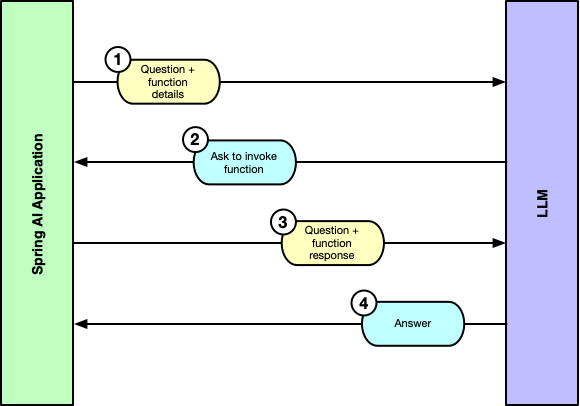

= Spring AI in Action
:chapter: 6
:sectnums:
:figure-caption: Figure {chapter}
:listing-caption: Listing {chapter}
:table-caption: Table {chapter}
:leveloffset: 1
:boot_version: 3.4.2
:spring_version: 6.2.2
:spring_ai_version: 1.0.0-M6
:xrefstyle: short
:bitmap_ext: png
:sectnumoffset: 5

= Activating tool-driven generation

This chapter covers

* Augmenting generation with tools
* Declaratively defining tools
* Using methods and functions as tools
* Providing tool context

When was the last time you visited your doctor? When you were there, did you
think about the types of information that the doctor was working with to assess
your health?

Doctors go through extensive training to get licensed to practice medicine.
During that training they learn the essentials of medicine and physiology. But
new discoveries are made frequently and patients present unusual conditions that
require doctors to consult the latest research and with other medical professionals to be able to best care for their patients. Even so, no amount of training or medical research can tell the doctor how you feel or what your vital signs are. To better understand your specific situation, the doctor has to measure your vital signs in real-time using tools like thermometers, blood pressure cuffs, and stethoscopes.

If you think about it, that's kind of how integration with LLMs works. The LLMs
are trained with vast amounts of information and can answer many questions from
that training. But in order to bring an LLM up-to-speed with information that
they weren't trained on, you can apply RAG as we did in chapter 4. But at some
point there are things that an LLM just can't know without using a set of tools
to ask. Current weather conditions, stock prices, sports scores, and the wait
times for theme park attractions are things that an LLM can't be trained on and
won't be able to learn from RAG. That's where tools come into play.

In this chapter, you're going to see how to use tools (formerly referred to
as "functions") to provide an LLM with real-time information and potentially enable
the LLM to take some action in response to a prompt.

To understand how to apply tools, you'll start off by creating a very simple
example, based on OpenAI's GPT-4o that demonstrates not only how Spring AI
supports tools, but also how tools can overcome some limitations of LLMs.
Then, you'll take what you learned and apply it to provide on-the-fly information
to the LLM when asking questions in Board Game Buddy.

== Getting started with AI tools

Much like RAG, tools are a way
to enable an LLM to answer questions about data that it was never trained on.
Whereas RAG provides information via documents for the LLM, tools provide
data via application logic. What's more, tools can perform tasks, such as
updating some data or invoking an API in addition to providing data. This
effectively enables an LLM to take some action and not just respond with answers.

Not all LLMs support tools, but Spring AI makes it easy to enable tools
interactions with those that do. Many of the models and AI providers supported
by Spring AI support tool calling, including:

- Amazon Bedrock Converse
- Anthropic (Claude)
- Azure OpenAI
- Google Vertex (Gemini)
- Groq
- Mistral
- MiniMax
- Moonshot
- NVIDIA (OpenAI-Proxy)
- Ollama (various models)
- OpenAI
- ZhiPu

Even though each of these AI providers support tools differently in their
respective APIs, Spring AI provides a consistent means of applying tools
when submitting a prompt. Let's see how to create a tools-driven Spring AI
application.

[[section_SimpleFunction]]
=== Developing a tools-enabled application

Specifically, you're going to create a brand new Spring AI application that can
answer questions about the current time in any city around the world. Start by
using the Spring Initializr (either via https://start.spring.io/ or through your
IDE) that includes the "web" starter and the Spring AI OpenAI starter, as you
did in chapter 1 when you started the Board Game Buddy application. You can
name this project anything you like, but the following instructions assume that
you named it "simple-tools".

Once the project has been created and loaded in your IDE, be sure to specify the
OpenAI API key in src/main/resources/application.yml:

----
spring.ai.openai.api-key=${OPENAI_API_KEY}
----

Next, create a relatively simple controller that asks the LLM for the current
time in a given city. Listing <<ex_GetTimeController>> is a good start.

[#ex_GetTimeController, reftext={chapter}.{counter:listing}, caption='{listing-caption}.{counter:listing-number} ']
.Asking an LLM for the current time in a given city.
----
package com.example.simpletools;

import org.springframework.ai.chat.client.ChatClient;
import org.springframework.web.bind.annotation.GetMapping;
import org.springframework.web.bind.annotation.RequestParam;
import org.springframework.web.bind.annotation.RestController;

@RestController
public class GetTimeController {

  private static final String CURRENT_TIME_TEMPLATE =
      "What is the current time in {city}?";  // <1>

  private final ChatClient chatClient;

  public GetTimeController(ChatClient.Builder chatClientBuilder) {
    this.chatClient = chatClientBuilder.build();
  }

  @GetMapping(path="/time", params = "city")
  public String getTime(@RequestParam("city") String city) {
    return chatClient.prompt()
          .user(userSpec -> {
              userSpec
                  .text(CURRENT_TIME_TEMPLATE)
                  .param("city", city);   // <2>
            })
          .call()
          .content();
  }

}
----
<1> Current time prompt template
<2> Inject city into the prompt

Nothing in this controller should be new to you if you've worked through the
examples in the previous chapters. The `getTime()` method handles GET requests
to /time, accepting a "city" parameter. It uses that city as a parameter to the
`CURRENT_TIME_TEMPLATE` specified as the text of the user message that is sent
to the LLM. The last thing that `getTime()` does is return whatever the response
content was from sending that request to the model.

Now you can build it and try it out. Using the Spring Boot Gradle plugin, you
can start the application like this:

----
$ ./gradlew bootRun
----

Once the application starts up submit a request to it, asking for the time for
any city you'd like. For example, here's how you might ask for the current time
in a small town in southeast New Mexico:

----
$ http :8080/time?city=Jal+New+Mexico -b
I'm unable to provide real-time information, including the current time,
as my data is not live. However, you can easily check the current time in
Jal, New Mexico, by using a search engine or checking the time on a world
clock website or app. Jal, New Mexico, is in the Mountain Time Zone (MT),
so you can also convert the time from your local time zone if you know the
difference.
----

Clearly the LLM understood the question and provided a useful, albeit incomplete
answer. As the response indicates, the LLM is incapable of answer any questions
about real-time information. The best it could do is respond with instructions
for how you might figure out the current time for yourself.

Working with real-time information is just the kind of problem that tools
can help with. You'll just need to define a tool that can determine the current
time and provide it to the LLM when submitting the question. To do that, you'll
create a new class with a method that calculates the current time for a given
time zone and then configure the `ChatClient` to let the LLM use it. Listing
<<ex_AiConfig>> shows the new `TimeTools` class.

[#ex_AiConfig, reftext={chapter}.{counter:listing}, caption='{listing-caption}.{counter:listing-number} ']
.Defining a tool as a Java lambda.
----
include::../code/ch06/simple-tools/src/main/java/com/example/simpletools/TimeTools.java[]
----
<1> Declare tool method

`TimeTools` and its `getCurrentTime()` method is simple enough, relying
on `LocalDataTime` to do most of the heavy lifting. The method accepts the timezone
as a `String` parameter and passes it as a
parameter to `LocalDateTime.now()` to get the current time in that timezone.
The resulting time is then converted to a `String` and returned to the caller.

The key to making the `getCurrentTime()` method a tool is that it is annotated with `@Tool`.
In this case, `@Tool` is used to declare that the `getCurrentTime()` method is available as a tool for the LLM to use.
And it specifies its name ("getCurrentTime") and a description to help the LLM understand what it does.

Be aware that you can have as many ``@Tool``-annotated methods as you like in a class and all of them will be made available to the LLM.
The only restriction is that each tool method have a distinct name, as specified by the `name` attribute of `@Tool`.
If the `name` attribute isn't specified, then the tool's name will default to be the method's name.

Also note that as it's doing its work, `getCurrentTime()` logs that is is getting the current time for a specific timezone at INFO level.
This comes in handy as proof that the tool is being called.

You'll also notice that `TimeTools` is annotated with `@Component` to ensure that Spring will automatically create an instance of it in the Spring application context.

Now you have a tool that can get the current time in a given timezone.
All that's left is to tell Spring AI to include that tool in any request that it sends.
To do that, inject `TimeTools` into the controller and from there, pass it to the `defaultTools()` method when building the `ChatClient`.
Listing <<ex_GetTimeController2>> shows the new controller that applies `TimeTools` when making a request to the LLM.

[#ex_GetTimeController2, reftext={chapter}.{counter:listing}, caption='{listing-caption}.{counter:listing-number} ']
.GetTimeController
----
include::../code/ch06/simple-tools/src/main/java/com/example/simpletools/GetTimeController.java[]
----
<1> Inject TimeTools
<2> Include TimeTools in prompt

When a prompt is sent to the LLM, the details of the tools will be included in the prompt, giving the LLM an opportunity to make use of it.
So with these changes in place, restart the application and try it again:

----
$ http :8080/time?city=Jal+New+Mexico -b
The current time in Jal, New Mexico is 9:19 PM on February 19, 2025.
----

This time, the LLM was able to tell you precisely the current time for the specified city.
It worked!

But how did the LLM invoke code in your application?
Let's take a look under the hood to see what's really happening.

=== Digging deeper

You might be wondering if somehow Spring AI took the tool you defined and
exposed it via an endpoint for OpenAI to invoke. While it certainly does appear
that the LLM was able to invoke your tool directly, that's not exactly what
is going on.

Instead, there's a bit of a conversation that takes place between your application
and the model when you ask a question the involves tools. Figure <<fig_ch6_fig1>>
illustrates each turn taken in this conversation.

[#fig_ch6_fig1, reftext={chapter}.{counter:figure}, caption='{figure-caption}.{counter:figure-number} ']
.Tool invocation involves a multi-part conversation between the application and the LLM.

The conversation starts with a user message with an initial question, much like
any prompt sent to the LLM. The JSON sent in the request to OpenAI's GPT-4o
model looks something like this:

----
{
  "messages": [
    {
      "content": "What is the current time in Jal New Mexico?",
      "role": "user"
    }
  ],
  "model": "gpt-4o-mini",
  "stream": false,
  "temperature": 0.7,
  "tools": [
    {
      "type": "function",
      "function": {
        "description": "Get the current time in the specified time zone.",
        "name": "getCurrentTime",
        "parameters": {
          "$schema": "https://json-schema.org/draft/2020-12/schema",
          "additionalProperties": false,
          "type": "object",
          "properties": {
            "timeZone": {
              "type": "string"
            }
          },
          "required": [
            "timeZone"
          ]
        }
      }
    }
  ]
}
----

This request is structured to send to OpenAI's API. If you are using a
different AI provider API, the request structure will vary. Even so, the steps in
the interaction between the application and any AI API when working with tools,
is pretty much the same regardless of which model is being used.

In this initial request you can see that there is one user message that carries
the question being asked. But also, the "tools" property specifies an array of
tools that are available to the LLM to use when answering questions. In this
case, there's only one tool: the `getCurrentTime` tool. The tool is
described in the "description" property, which tells the LLM what the tool is
capable of. And its "parameters" property provides a JSON schema to tell the LLM
what the tool expects as input.

In response to this initial request, the LLM will reply with the following:

----
{
  "id": "chatcmpl-B2sJlOCkIK1PDnJolKLdri3TtVAzo",
  "object": "chat.completion",
  "created": 1740025153,
  "model": "gpt-4o-mini-2024-07-18",
  "choices": [
    {
      "index": 0,
      "message": {
        "role": "assistant",
        "content": null,
        "tool_calls": [
          {
            "id": "call_n64P6pcemoLpheNqMaXRNve8",
            "type": "function",
            "function": {
              "name": "getCurrentTime",
              "arguments": "{\"timeZone\":\"America/Denver\"}"
            }
          }
        ],
        "refusal": null
      },
      "logprobs": null,
      "finish_reason": "tool_calls"
    }
  ],
  "usage": {
    "prompt_tokens": 59,
    "completion_tokens": 19,
    "total_tokens": 78,
    "prompt_tokens_details": {
      "cached_tokens": 0,
      "audio_tokens": 0
    },
    "completion_tokens_details": {
      "reasoning_tokens": 0,
      "audio_tokens": 0,
      "accepted_prediction_tokens": 0,
      "rejected_prediction_tokens": 0
    }
  },
  "service_tier": "default",
  "system_fingerprint": "fp_13eed4fce1"
}
----

The first thing to notice is that the response isn't carrying an answer to the
question. That's because the LLM was unable to answer the question without some
help. Instead, the response includes a message from the "assistant" (e.g., from
the model) asking for the `getCurrentTime` tool to be called. Although the
LLM is unable to determine the time in Jal, New Mexico, it does know that the
`getCurrentTime` tool can and that it needs a timezone.
It also knows that and that Jal is in the "America/Denver" timezone, so that's the timezone it asks to be sent to the `getCurrentTime` tool.

Also note that the "finish_reason" property is set to "tool_calls". Usually,
this property is set to "stop", indicating that the model was able to provide
an answer and that the interaction is finished. But when the finish reason is
"tool_calls", it is saying that the discussion isn't over and that it needs the
application to invoke the tool on its behalf.

The good news is that although the LLM is asking the application to call the
tool, you won't have to explicitly write that code yourself. Spring AI has
you covered. Under the hood, it will invoke the `getCurrentTime` tool and
construct a new request with the result it gets. It will then send that new
request to the LLM for consideration:

----
{
  "messages": [
    {
      "content": "What is the current time in Jal New Mexico?",
      "role": "user"
    },
    {
      "role": "assistant",
      "tool_calls": [
        {
          "id": "call_n64P6pcemoLpheNqMaXRNve8",
          "type": "function",
          "function": {
            "name": "getCurrentTime",
            "arguments": "{\"timeZone\":\"America/Denver\"}"
          }
        }
      ]
    },
    {
      "content": "\"2025-02-19T21:19:13.963458\"",
      "role": "tool",
      "name": "getCurrentTime",
      "tool_call_id": "call_n64P6pcemoLpheNqMaXRNve8"
    }
  ],
  "model": "gpt-4o-mini",
  "stream": false,
  "temperature": 0.7,
  "tools": [
    {
      "type": "function",
      "function": {
        "description": "Get the current time in the specified time zone.",
        "name": "getCurrentTime",
        "parameters": {
          "$schema": "https://json-schema.org/draft/2020-12/schema",
          "additionalProperties": false,
          "type": "object",
          "properties": {
            "timeZone": {
              "type": "string"
            }
          },
          "required": [
            "timeZone"
          ]
        }
      }
    }
  ]
}
----

This new request looks quite similar to the initial request in that it includes
the question in the user message and the tool definition in the "tools"
property. But it also includes the "assistant" message from the original response,
as well as a message with a "tool" role that provides the current time in its
content. These three messages form the conversation that has taken place so far,
with the most recent message--the "tools" message--providing the LLM with
everything it needs to be able to answer the original question.

Now that the question has been asked again, this time with the current time in
the prompt as context, all that's left is for the LLM to produce the answer in a
final response:

----
{
  "id": "chatcmpl-B2sJmwWTsSANYtQfdhitIc1P8L2Rv",
  "object": "chat.completion",
  "created": 1740025154,
  "model": "gpt-4o-mini-2024-07-18",
  "choices": [
    {
      "index": 0,
      "message": {
        "role": "assistant",
        "content": "The current time in Jal, New Mexico is 9:19 PM
                    on February 19, 2025.",
        "refusal": null
      },
      "logprobs": null,
      "finish_reason": "stop"
    }
  ],
  "usage": {
    "prompt_tokens": 103,
    "completion_tokens": 25,
    "total_tokens": 128,
    "prompt_tokens_details": {
      "cached_tokens": 0,
      "audio_tokens": 0
    },
    "completion_tokens_details": {
      "reasoning_tokens": 0,
      "audio_tokens": 0,
      "accepted_prediction_tokens": 0,
      "rejected_prediction_tokens": 0
    }
  },
  "service_tier": "default",
  "system_fingerprint": "fp_13eed4fce1"
}
----

And there it is! In this final response, the "assistant" message includes the
answer to the original question. And, notice that the "finish_reason" is now
"stop", indicating that there's nothing else that needs to be done.

That's the essentials of working with tools in Spring AI. Now let's apply
what you've learned to the Board Game Buddy application as you explore other
ways of using tools in Spring AI.

== Implementing tools

For the Board Game Buddy application, suppose that in addition to answering questions
about the rules of various games, the API also enables users to provide feedback
regarding the complexity level of a game. A game's complexity could be ranked 1-5,
graduated along the following lines:

- 1 : Easy
- 2 : Moderately-Easy
- 3 : Moderate
- 4 : Moderately-Difficult
- 5 : Difficult

Presumably, each game's complexity ranking is supplied by Board Game Buddy users,
but are ultimately held in a database. As such, it's just the kind of data that
can be provided to an LLM via a tool.

Having established the notion of a games complexity, let's see how to build it
into the Board Game Buddy application and ultimately be able to answer questions
regarding the difficulty of a game. But before you can define the tool that
feeds into the Generative AI interaction, you'll need to build the foundational
code that reads the complexity information from a database.

=== Writing the tool's foundations

The game data, such as the game's complexity, is going to be kept in a relational
database. There's no easier way to work with relational data in Spring than to
use Spring Data. More specifically, you can use Spring Data JDBC by adding the
following dependency to the build:

----
include::../code/ch06/board-game-buddy/build.gradle[tag=jdbcDependencies,indent=0]
----

You'll also need to setup a database and add the database's driver dependency to
the build. Almost any relational database will work, but for now let's use the
H2 in-memory database by adding the following dependency to the build:

----
include::../code/ch06/board-game-buddy/build.gradle[tag=dbDependencies,indent=0]
----

This dependency not only triggers Spring Boot auto-configuration to create a
`DataSource` bean needed by Spring Data JDBC, but it also causes auto-configuration
to create the H2 database itself. You'll just need to define the schema by
defining it in a schema.sql file under src/main/resources:

----
include::../code/ch06/board-game-buddy/src/main/resources/schema.sql[]
----

The "Game" table is relatively simple for now, focused on the essential data
needed to keep the complexity for a game. The columns defined are:

- `id` - A database-specific identifier that serves as the primary key.
- `title` - The game's title.
- `slug` - A normalized version of the game title in all lowercase and
 "snakecase". This is the same slug we used in chapter 4 to associate document
 chunks with a game.
- `complexity` - The game's complexity level, a real number value from 1 to 5.

Presumably, this table will be loaded by some other component of the Board Game
Buddy application as users report their assessment of game complexity. But for
now, rather than build that portion of the application, you can just initialize
the database with some test data by using SQL `insert` to add a handful of games
to the Game table. Create the following file named data.sql in the project's
src/main/resources directory:

----
include::../code/ch06/board-game-buddy/src/main/resources/data.sql[]
----

Now let's turn our attention to the Java code that our tool will use to read
that game data. To start, we need a Java object that will hold the data for a
game. This `Game` record type should do the trick:

----
include::../code/ch06/board-game-buddy/src/main/java/com/example/boardgamebuddy/gamedata/Game.java[]
----

Aside from the properties that map one-to-one with the columns in the Game table,
the `Game` record also includes a `complexityEnum()` method that converts the
numerical complexity value into a specific value of a `GameComplexity` enum.
The `GameComplexity` enum is defined like this:

----
include::../code/ch06/board-game-buddy/src/main/java/com/example/boardgamebuddy/gamedata/Game.java[]
----

Next up, you'll need a repository that can read the game data from the database.
This `GameRepository` interface specifies that the repository will provide a
`findBySlug()` method to lookup game data given its slug:

----
include::../code/ch06/board-game-buddy/src/main/java/com/example/boardgamebuddy/gamedata/GameRepository.java[]
----

The `GameRepository` interface also extends Spring Data's `CrudRepository` interface
which provides several other methods for reading and writing game data. But the
most important thing that extending `CrudRepository` does for you is that it
triggers Spring Data's ability to automatically create an implementation for
`GameRepository` at runtime. You won't need to write the implementation yourself.
All you need to do is create the interface and Spring Data will take care of the
rest.

You now have all of the underpinning necessary to create the tool that will
enable the `AskController` to handle questions about game complexity.

=== Defining the tool

In <<section_SimpleFunction>>, you defined the `getCurrentTime()` tool in a component class as a ``@Tool``-annotated method.
Listing <<ex_GameTools>> shows how you can apply the same technique for the game complexity tool by creating a new `GameTools` component.

[#ex_GameTools, reftext={chapter}.{counter:listing}, caption='{listing-caption}.{counter:listing-number} ']
.Declaring a game complexity tool.
----
@Bean
include::../code/ch06/board-game-buddy/src/main/java/com/example/boardgamebuddy/GameTools.java[]
----
<1> Inject GameRepository
<2> Describe parameter
<3> Calculate slug
<4> Fetch game data
<5> Extract game data from optional
<6> Create response

Here, the `getGameComplexity()` method is annotated with `@Tool` much like how you did with the `getCurrentTime()` method before.
The `description` attribute provides a description that will be considered by the LLM to decide if it can be used to answer a question.
The method uses the injected `GameRepository` to lookup the game data.
If the game can't be found, a placeholder `Game` is created for the purposes of communicating that the complexity is unknown.

The tool method accepts its input in the form of a `String` that is the game's title.
Notice that the `gameTitle` parameter is annotated with `@ToolParam`.
This provides a description to help the LLM understand the purpose of the parameter so that it know what needs to be passed in when it requests that the tool be invoked.

After looking up the game's complexity from the `GameRepository`, the tool responds with `GameComplexityResponse`, a Java record that carries the game title and a `GameComplexity` value:

----
include::../code/ch06/board-game-buddy/src/main/java/com/example/boardgamebuddy/gamedata/GameComplexityResponse.java[]
----

All that's left is to put the tool to work by including it in the prompt sent to the LLM.
Let's do that now.

=== Putting the tool to work

There are a couple of options for how you provide the tool to `ChatClient`.
One way is to inject `GameTools` into ``AiConfig``'s `chatClient()` method and pass it to `defaultTools()` when creating the `ChatClient`:

----
include::../code/ch06/board-game-buddy/src/main/java/com/example/boardgamebuddy/AiConfig.java[indent=0,tag=chatClientBean]
----

By providing it to `ChatClient` at build time, you are guaranteeing that any ``@Tool``-annotated methods in `GameTools` will be available in all prompts sent to the LLM from that `ChatClient`.
But you could just as easily choose to provide the tools at prompt time by passing `GameTools` to the `tools()` method when creating and sending the prompt.
In that case, you would inject it into `AskController` and set it in the prompt in the controller's `askQuestion()` method:

----
@Service
public class SpringAiBoardGameService implements BoardGameService {

  private final ChatClient chatClient;
  private final GameTools gameTools;

  public SpringAiBoardGameService(ChatClient chatClient,
      GameTools gameTools) {
    this.chatClient = chatClient;
    this.gameTools = gameTools;
  }

  // ...

  @Override
  public Answer askQuestion(Question question, String conversationId) {

    // ...

    return chatClient.prompt()
        .user(question.question())
        .tools(gameTools)
        // ...
        .call()
        .entity(Answer.class);
  }
}
----

Whether you choose to specify the game complexity tool at prompt creation time in the service's `askQuestion()` method or at `ChatClient` creation time, you are now ready to try it out.
Fire up the application and give it a shot, asking about the complexity for a few of the games in the sample data.
Here are a few examples of what you might see:

----
$ http :8080/ask question="What is the complexity?" \
                 gameTitle="Puerto Rico" -b
{
    "answer": "The complexity of the game is moderate.",
    "game": "Puerto Rico"
}

$ http :8080/ask question="How complex is the game?" \
                 gameTitle="Burger Battle" -b
{
    "answer": "The complexity of the game is easy.",
    "game": "Burger Battle"
}

$ http :8080/ask question="What is the difficulty?" gameTitle="Azul" -b
{
    "answer": "The complexity of the game is moderately easy.",
    "game": "Azul"
}
----

What's more, because you placed a call to the logger's `info()` method in the tool, you can look at the logs and verify that the tool was called and that the LLM didn't just make up the complexity answer.

The Board Game Buddy application is now equipped to answer rules questions about games as well as questions about how difficult they are.
But before wrapping up this chapter, let's look at another option for providing tools in the context of a prompt.

== Enables functions as tools

Early milestone versions of Spring AI referred to "tools" as "functions", but changed to "tools" to align with the terminology of many AI APIs.
Despite the name change, it turns out that functions are a good way to think of how tools work.
Just like Java's `Function` interface, tools typically accept input, perform some work, and produce a return value.
But they can also align with Java's `Supplier` and `Consumer` interfaces as well when inputs or return values aren't required.

As an alternative to annotated bean methods, Spring AI also offers the opportunity to define tools as implementations of `Function`, `Supplier`, or `Consumer`.
Listing <<ex_GameTools_Function>> shows how you might reimplement the `GameTools` class and its `getGameComplexity()` method as an implementation of Java's `Function` interface.

[#ex_GameTools_Function, reftext={chapter}.{counter:listing}, caption='{listing-caption}.{counter:listing-number} ']
.Defining the tool as a Java Function implementation.
----
include::../code/ch06/board-game-buddy_2/src/main/java/com/example/boardgamebuddy/gamedata/GameTools.java[]
----
<1> Describe the function
<2> Implement Function
<3> Apply method

The bulk of this version of `GameTools` is largely the same as the one you created in Listing <<ex_GameTools>>.
However, `GameTools` now implements `Function` and the core logic of looking up game complexity is in the `apply()` method (the one method required by `Function`).
The class is annotated with `@Description` to provide a description of what the tool does and `@Component` to ensure that it is discovered and an instance created as a bean in the Spring application context.

Just like the `getGameComplexity()` method from before, the `apply()` method returns `GameComplexityResponse`.
But instead of accepting a simple `String` with the game title, the `apply()` method takes a `GameComplexityRequest` object.
That's because ``Function``-based tools cannot accept ``String``s or native Java types.
Therefore, the game's title had to be wrapped in a custom type.
`GameComplexityRequest` is defined as a Java `record` like this:

----
include::../code/ch06/board-game-buddy_2/src/main/java/com/example/boardgamebuddy/gamedata/GameComplexityRequest.java[]
----

Here, the `GameComplexityRequest` itself is annotated with `@Description` to provide a description of the type.
This serves the same purpose as ``@ToolParam``'s `description` attribute in Listing <<ex_GameTools>>.

All that's left to do is register the tool with the `ChatClient`.
But rather than pass an instance of the ``Function``-based `GameTools` to `defaultTools()` or `tools()`, you simply pass the name of the Spring bean.
Since `GameTools` is annotated with `@Component` and its class name is `GameTools`, the bean name should be "gameTools"--that is, the class name with the first letter in lowercase.
Knowing this, you can register the tool by calling `defaultTools()` when creating the `ChatClient` like this:

----
include::../code/ch06/board-game-buddy_2/src/main/java/com/example/boardgamebuddy/AiConfig.java[indent=0,tag=chatClientBean_defTools]
----

If you prefer or need to specify the tool at prompt time, you can pass it to `tools()` like this:

----
@Override
public Answer askQuestion(Question question, String conversationId) {
  return chatClient.prompt()

      ...

      .tools("gameTools")
      .call()
      .entity(Answer.class);
}
----

Either way, you should be able to fire up the application and ask questions about game complexity using this new ``Function``-based tool.

== Summary

* By applying tools, LLMs can answer questions about data that is provided in real-time.
* Spring AI includes details about available tools when sending prompts to an LLM.
* LLMs do not invoke tools directly, but instead respond to a prompt by asking the application to call one or more tools and then send a followup prompt that provides the tool results as additional context.
* Spring AI provides a consistent programming model for working with tools regardless of the model and API being used.
* Tools can be defined as ``@Tool``-annotated methods or as implementations of Java's `Function`, `Supplier`, and `Consumer` interfaces.
