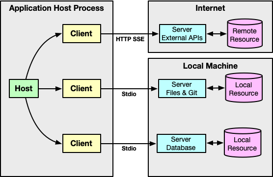
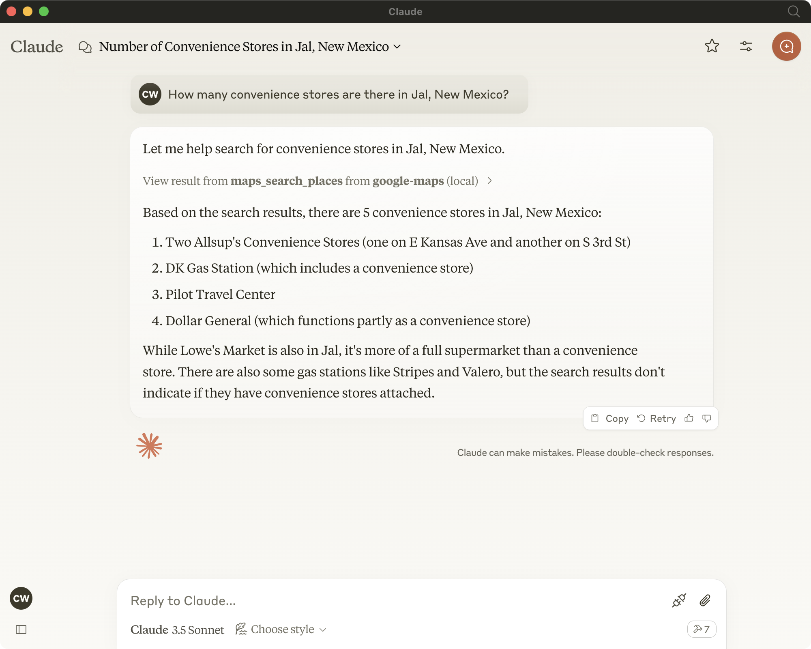
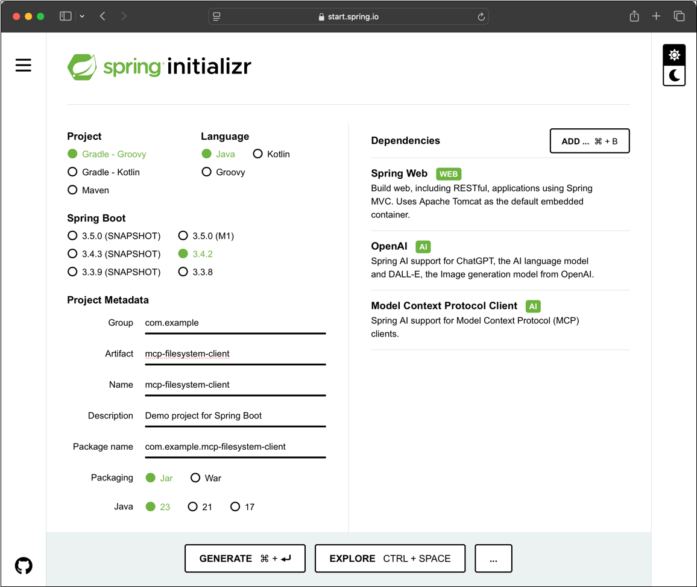
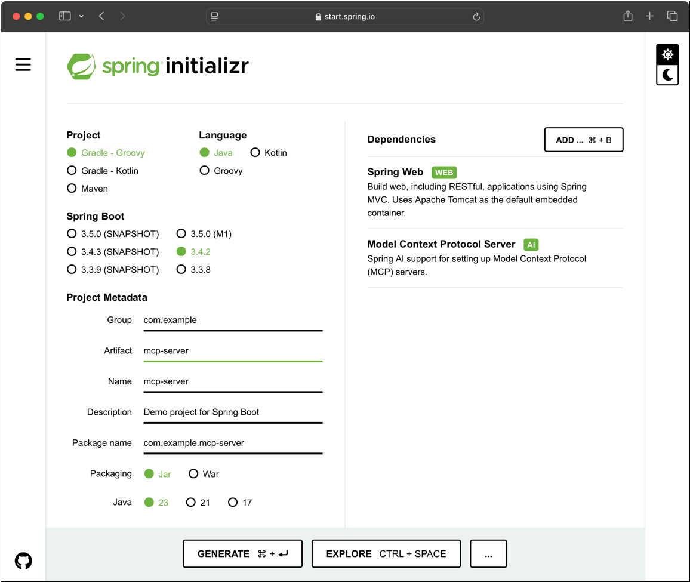
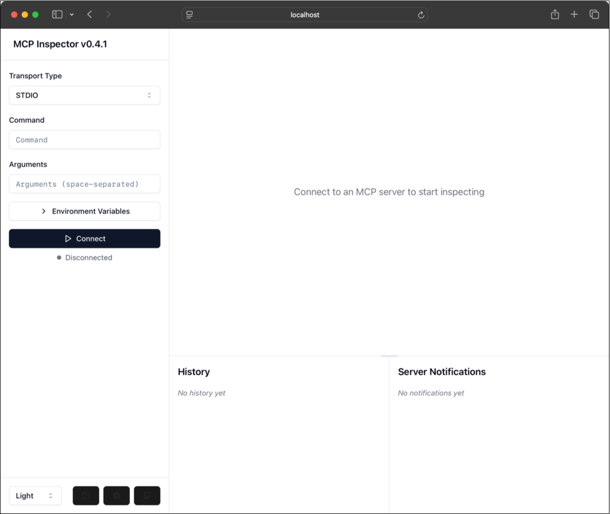
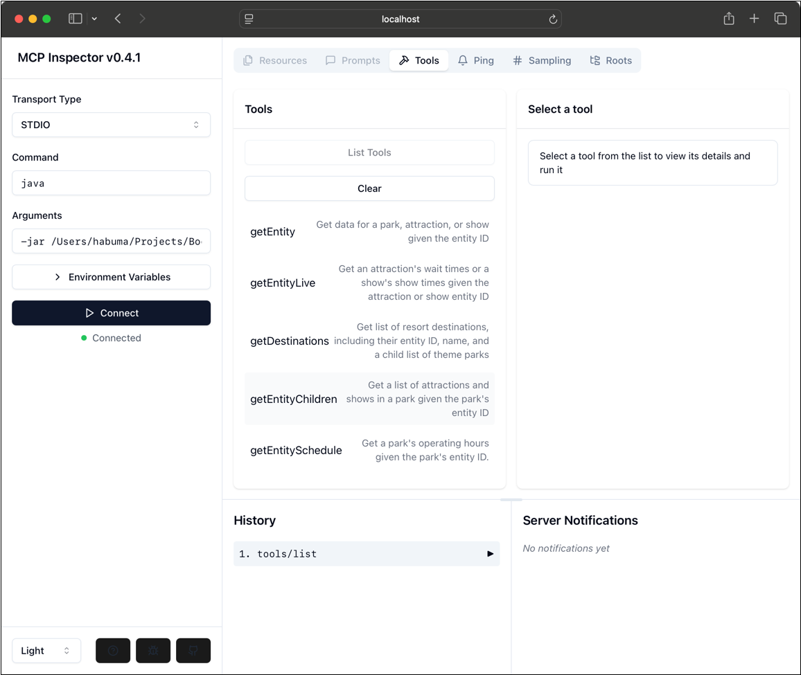
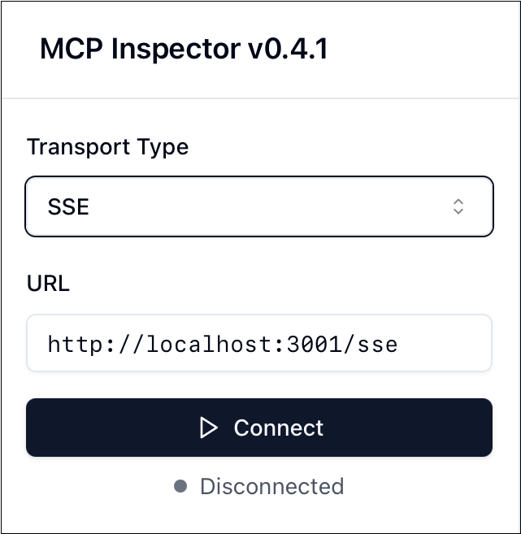
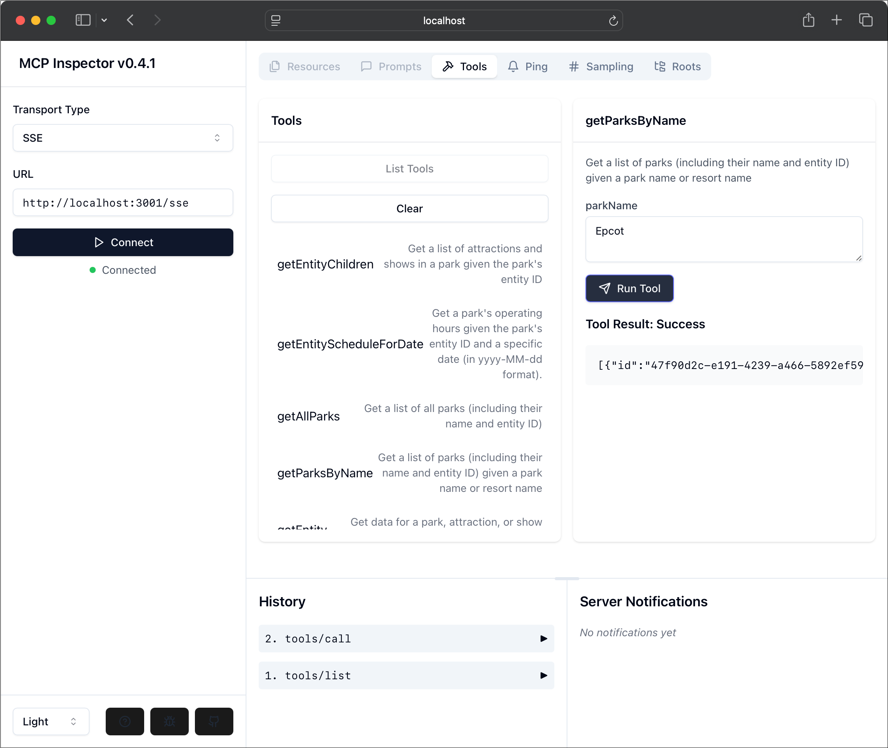

= Spring AI in Action
:chapter: 7
:sectnums:
:figure-caption: Figure {chapter}
:listing-caption: Listing {chapter}
:table-caption: Table {chapter}
:leveloffset: 1
:boot_version: 3.4.0
:spring_version: 6.2.0
:spring_ai_version: 1.0.0-M5
:xrefstyle: short
:bitmap_ext: png
:sectnumoffset: 6

= Applying Model Context Protocol (MCP)

This chapter covers

* Using tools from a predefined MCP Server
* Creating a custom MCP Server
* Optimizing an MCP Server
* Enabling MCP's STDIO and HTTP+SSE transports

In the movie _Wreck it Ralph_, the character Fix-It Felix, Jr. carries an incredibly powerful hammer.
With this one tool, Fix-It Felix, Jr. is able to repair anything that's broken, by just hitting it once.
Got a cracked wall? Hit it with a hammer.
Bent streetlights? Hit it with a hammer.
Broken window? Defying all logic and everything you know about glass and hammers, hit it with a hammer and it will be fixed.
Fix-It Felix, Jr.'s hammer is rivaled only by Thor's Mjolnir as the most amazing hammer that has ever been wielded.

But in the real world, real hammers can't be used to fix everything.
A hammer is the perfect tool for driving nails, but I don't recommend using it to fix a window.
In the real world, there are many tools, each with its own best use case.
And while Fix-It Felix, Jr. always had his hammer at the ready in his hand, it's more convenient to keep a set of many tools in a toolbox that you can carry around to where it's needed.

In the previous chapter, you saw how employ tools in a Spring AI application, coding them as part of the application itself.
In this chapter, we'll see how to apply Model Context Protocol (MCP), a way to collect sets of associated tools so that they can be shared and used in any AI application that may make use of them.

== Introducing Model Context Protocol

MCP is a relatively new specification proposed by Anthropic (the makers of the Claude family of models) in late 2024.
Despite the fact that it was defined by Anthropic, it can be used with any LLM and API that supports tools, including the OpenAI models that we've been using so far.

The two core components of MCP are MCP Servers and MCP Clients.
An MCP Server has access to some resource such as a database, filesystem, or API and exposes access to that resource via one or more tools.
Meanwhile, an MCP Client running within an application communicates with the MCP Server, fetching a list of its tools, making those tools available in a prompt's context, and invoking those tools on behalf of the LLM.
Figure <<fig_ch7_fig1>> illustrates the relationship between MCP Servers and MCP Clients, as defined in the specification.

[#fig_ch7_fig1, reftext={chapter}.{counter:figure}, caption='{figure-caption}.{counter:figure-number} ']
.Interactions between MCP Servers and MCP Clients.

MCP Servers can make their tools available via two transport protocols: Standard Input Output (STDIO) and HTTP with Server-Sent Events (HTTP+SSE).
Per the MCP specification, an MCP Server should provide the STDIO transport if possible, but may choose whether or not to implement the HTTP+SSE transport.

Even though MCP is a relatively new specification in the world of Generative AI, it is already creating a significant impact.
Upon releasing MCP into open-source, Anthropic provided 19 reference MCP Server implementationsfootnote:[https://github.com/modelcontextprotocol/servers/], including MCP Servers that enable integration with things like PostgreSQL, GitHub, and Google Maps.
Since then, several hundred more MCP Servers have been created by the community covering a broad range of tools.
You can find an ever growing registry of MCP Servers at https://www.pulsemcp.com/.

Many of the available MCP Servers include instructions for configuring them in the Claude Desktopfootnote:[https://claude.ai/download] application.
If you have Claude Desktop installed, you can edit the application configuration to add MCP Server configuration.
Open settings in the application and choose the "Developer" tab, then "Edit Config" to open the configuration in an editor.
Paste in the MCP Server's configuration, then restart the application to try it out.

Let's say that you want to try out the Google Maps MCP Serverfootnote:[https://github.com/modelcontextprotocol/servers/tree/HEAD/src/google-maps].
The README file shows instructions for running it with either Docker or NPX.
If you paste in either of the configurations (and add your Google Maps API Key), you should be able to ask location-specific questions after restarting Claude Desktop.

For example, suppose that you're curious about how many convenience stores there are in the tiny town of Jal, New Mexico.
Figure <<fig_ch7_fig2>> shows the results you might get if you ask this burning question in Claude Desktop.

[#fig_ch7_fig2, reftext={chapter}.{counter:figure}, caption='{figure-caption}.{counter:figure-number} ']
.Using the Google Maps MCP Server in Claude Desktop.

Extending Claude Desktop's abilities with MCP is fun and useful.
But the real power of MCP comes when you mix it into your own applications.
To enable that, Spring AI provides support for working with existing MCP Servers as well as creating your own.
Let's see how to use MCP Clients to integrate external tools made available by MCP Servers.

== Working with MCP clients

As you begin exploring how MCP works with Spring AI, it's easiest to start by integrating functionality from an existing MCP Server by defining an MCP Client that is configured to connect to that server.
One of the easiest MCP Servers to get started with is the Filesystem MCP Server, one of the 19 reference MCP Servers from Anthropicfootnote:[https://github.com/modelcontextprotocol/servers/tree/HEAD/src/filesystem].
Although it is a relatively simple MCP Server, it shows off the potential of what MCP can be used for.

Let's put the Filesystem MCP Server to work by creating a new Spring Boot project.
Although it is a relatively simple MCP Server, it reveals the potential of what MCP can be used for.
Just as you began with the Board Game Buddy application, this new project will depend on the Spring Web and OpenAI dependencies.
It will also require the Model Context Protocol Client dependency.
Figure <<fig_ch7_fig3>> shows how you might initialize the project with the Spring Initializr.

[#fig_ch7_fig3, reftext={chapter}.{counter:figure}, caption='{figure-caption}.{counter:figure-number} ']
.Initializing a new project for working with Model Context Protocol in Spring.

With the project initialized, you are now ready to configure the MCP Client to reference the Filesystem MCP Server.
There are two options for configuring MCP Servers in an MCP Client:

 * In Spring configuration (e.g., application.properties or application.yml)
 * In Claude Desktop-compatible JSON configuration

Which you choose is largely a matter of preference.
Many of the available MCP Servers offer Claude Desktop configuration JSON in their README files, making that option a simple matter copy-n-paste to bring those servers into a Spring AI application.
On the other hand, Spring-style configuration is no different than how you might configure any configuration property in a Spring Boot application, so it may feel more natural if you've worked with Spring Boot for awhile.
A little later in <<section_HTTPSSE>> when you work with MCP's HTTP+SSE transport, you'll find that Claude Desktop configuration is not an option and you can only use Spring-style configuration.

Let's first see how to configure the MCP Client with Spring Boot configuration properties.
You can choose to configure them in either application.properties or application.yml, but MCP Client configuration is easiest to read in YAML.
Listing <<ex_McpClientConfig>> shows what the configuration for the Filesystem MCP server looks like in the application.yml file.

[#ex_McpClientConfig, reftext={chapter}.{counter:listing}, caption='{listing-caption}.{counter:listing-number} ']
.An MCP-enabled controller for answering questions.
----
include::../code/ch07/mcp-filesystem-client/src/main/resources/application.yml[tag=mcpConfig]
----
<1> MCP Client name
<2> MCP Server command
<3> Arguments

All MCP Client configuration is rooted in the `spring.ai.mcp.client` base property.
After that comes the `stdio` property, which indicates that you'll be configuring the MCP Client to communicate with the server using the STDIO transport.
Under `stdio` you can configure one or more MCP Clients.

In this case, you're configuring one MCP Client, whose name is "filesystem".
The command to run the server is specified in the `command` subproperty, followed by the `args` subproperty which provides command line arguments to the MCP Server command.
When the application starts up, Spring AI will start the MCP Server by running the given command and its arguments and communicate with the server via standard input and output.

The configuration in Listing <<ex_McpClientConfig>> was derived from the configuration described in the README for the Filesystem MCP Server under the "Usage with Claude Desktop" heading.
Although the actual path given to it is different, it should be clear how to map the configuration intended for the Claude Desktop to Spring configuration properties.
But it could be even easier if Spring AI supported Claude Desktop style configuration.
Fortunately, it does!

If you'd rather use JSON configuration in the format for Claude Desktop, you can replace what's shown in Listing <<ex_McpClientConfig>> with a single property that references a JSON configuration file:

----
include::../code/ch07/mcp-filesystem-client/src/main/resources/application.yml[tag=claudeConfig]
          servers-configuration: classpath:mcp-servers.json
----

The `spring.ai.mcp.client.stdio.servers-configuration` property is given a URI to a Claude Desktop configuration file.
In this case, it's a "classpath:" URI indicating that the configuration is at the root of the application's classpath in a file named "mcp-servers.json".
That JSON file closely resembles the JSON configuration in the Filesystem MCP Server's README (with a different filesystem path):

----
include::../code/ch07/mcp-filesystem-client/src/main/resources/mcp-servers.json[]
----

Another option to consider is that if you have already configured one or more MCP Servers in Claude Desktop, you could point your Spring AI application at the Claude Desktop configuration to use those MCP Servers.
For example, here's how you would reference Claude Desktop's configuration on a Mac:

----
include::../code/ch07/mcp-filesystem-client/src/main/resources/application.yml[tag=claudeConfig]
          servers-configuration: "file://${HOME}/Library/Application [ca]
            Support/Claude/claude_desktop_config.json"
----

No matter which style you choose to configure MCP Clients, Spring AI will automatically start up the referenced server(s) when the application starts.
All you need to do is to enable the `ChatClient` to use the tools that the server(s) make available.
You can do with by calling `defaultTools()` when creating the `ChatClient` or by calling `tools()` when submitting a prompt.

To see how to do this, you'll now create the main controller class of this new project.
It'll be a controller much like Board Game Buddy's `AskController` that uses a `ChatClient` to answer questions.
But just to keep it distinct from Board Game Buddy's `AskController` and avoid confusion, let's name it `McpAskController`.
This new controller is shown in Listing <<ex_McpAskController>>.

[#ex_McpAskController, reftext={chapter}.{counter:listing}, caption='{listing-caption}.{counter:listing-number} ']
.An MCP-enabled controller for answering questions.
----
include::../code/ch07/mcp-filesystem-client/src/main/java/com/example/mcpfilesystemclient/McpAskController.java[]
----
<1> Inject MCP tool callback provider
<2> Configure default tools

`McpAskController` isn't much different than the `AskController` you created in chapter 1.
It works directly with `ChatClient` (instead of an injected `BoardGameService`) and the `Question` and `Answer` records are defined as inner types.
But the most significant difference is in the constructor where the `ChatClient` is being built.
The constructor is injected with an instance of  `ToolCallbackProvider` which is passed to the `ChatClient` builder's `defaultTools()` method to inform the `ChatClient` of all of the tools made available by the MCP Server.
Because of this, any of those tools could be leveraged by the LLM--no different than the "gameComplexityFunction" you created earlier--to answer questions from the user.

That's all there is to configuring an MCP Client.
Let's try it out to see what happens.

Start up the application and maybe create a few files in the working directory that you specified to the MCP transport.
Then, using HTTPie, ask it to list the files in that directory.
For example:

----
$ http :8080/ask question="List all files" -b
{
    "answer": "[FILE] testfile.txt\n[FILE] someOtherFile.txt"
}
----

Awesome! It was able to see two files in that directory (prefixed with "[FILE]").
And while that's pretty cool, what's even more amazing is that it's not just capable of read-only operations against the working directory.
You can also write to it. For example:

----
$ http :8080/ask question="Create a file named penguins.txt and write \
a joke about penguins as its content" -b
{
    "answer": "File penguins.txt created with a joke about penguins."
}
----

It says that it wrote the file.
You can verify that by opening the file using whatever file reader you choose.
Or, just ask the application to read it to you:

----
$ http :8080/ask question="Read the file named penguins.txt" -b
{
    "answer": "Why don't you ever see penguins in the UK?\n\nBecause they're
               afraid of Wales!"
}
----

The Filesystem MCP Server demonstrates very well how to use an MCP Server with Spring AI to enable external functionality in your AI applications.
But it is just one of 19 MCP Servers made available by Anthropic and one of several hundred that are available from other MCP developers.
There's a treasure trove of functionality provided by those MCP Servers just waiting for you to integrate it into your Spring AI applications.

But you may be wondering if you can create your own MCP Server.
If so, then you're in luck!
Spring AI also makes it possible to create your own MCP Server in Java.
Let's see how to create an MCP Server providing some custom functionality.

== Creating your own MCP Server

Although there are several MCP Servers available that provide tools to integrate with several common APIs and functionality, there's always room for more.
Spring AI's MCP Server support makes it possible to create and share tools that can do virtually anything you can imagine and that Java code can perform.

To see how to build an MCP Server with Spring AI, let's build an MCP Server for an API that's as much fun as it is useful.
ThemeParks.wiki APIfootnote:[https://themeparks.wiki/api] is an incredible API created by Jamie Holding that provides near-realtime data about theme parks all over the world.
You can make request to it to learn about park hours, attraction wait times, and show schedules, among other things.
It exposes six endpoints, all reachable via HTTP GET requests:

 - `/destinations` - Returns a list of resort destinations (such as "Walt Disney World" or "Universal Orlando Resort") and the parks that are in those resorts (such as "EPCOT" or "Universal Islands of Adventure").
 - `/entity/{entityId}` - Returns details about a specific entity (e.g., resort, theme park, attraction, show, etc) given its ID.
 - `/entity/{entityId}/children` - Returns a list of children for a specified entity. For example, the children of a theme park would be attractions and shows.
 - `/entity/{entityId}/live` - Returns live data for the children of a specified entity. Live data includes attraction wait times and show times.
 - `/entity/{entityId}/schedule` - Returns operating hours for a specified entity over several days. Primarily for theme park entities.
 - `/entity/{entityId}/schedule/{year}/{month}` - Returns operating hours for a specified entity for a specified date. Primarily for theme park entities.

If these API endpoints are made available as tools, then your application could answer questions about theme parks, attractions, shows, and park hours using similar Spring AI code that you've used already to answer questions about board games.
So let's build an MCP Server that exposes the capabilities of ThemeParks.wiki API as tools.

=== Building the server

To create a custom MCP Server, you'll start by creating a brand new Spring Boot application.
As you're choosing dependencies in the Initializr, you'll need the Spring Web dependency as well as the Model Context Protocol Server dependency.
You won't need OpenAI or any other LLM-specific dependency, as this server won't be interacting with an LLM.
Figure <<fig_ch7_fig4>> shows how you might initialize the application.

[#fig_ch7_fig4, reftext={chapter}.{counter:figure}, caption='{figure-caption}.{counter:figure-number} ']
.Initializing a project to create a custom MCP Server

With the project initialized, you can begin creating the MCP Server by creating a client service to send requests to the ThemeParks.wiki API.

=== Creating the MCP Server tools

All of the ThemeParks.wiki API's endpoints are accessed by HTTP GET requests, making them relatively simple to work with using Spring's `RestClient`.
The methods in Listing <<ex_SimpleThemeParkService>> map one-to-one with ThemeParks.wiki API's endpoints to fetch the data pertaining to parks, attractions, and shows.
Those methods will be be the underpinnings of the tools exposed in our MCP Server.

[#ex_SimpleThemeParkService, reftext={chapter}.{counter:listing}, caption='{listing-caption}.{counter:listing-number} ']
.ThemeParkApiTools provides methods to send requests to the ThemeParks.wiki API.
----
include::../code/ch07/themeparks-mcp-stdio/mcp-server/src/main/java/com/example/mcpserver/ThemeParkApiTools.java[]
----
<1> Inject RestClient builder
<2> API endpoint methods
<3> Send requests

.Using an OpenAPI API Server.
[NOTE]
====
It's worth acknowledging that the code in Listing <<ex_SimpleThemeParkService>> could have been replaced with an OpenAPI MCP Server (such as any of the ones at https://www.pulsemcp.com/servers?q=openapi).
The ThemeParks.wiki API provides an OpenAPI specification at https://api.themeparks.wiki/docs/v1.yaml.
So why not just use that instead of implementing an MCP Server with explicit requests to the API?

Indeed, that would work (although you'd need to convert the YAML OpenAPI specification to JSON, because none of the OpenAPI MCP Server seem to work with YAML specifications).
But as you'll soon learn, not all APIs are designed to provide the optimal experience when their endpoints are directly exposed as tools.
In those situations, a custom implementation offers opportunities to compensate for the API's design.
====

``ThemeParkApiTools``'s constructor accepts a `RestClient.Builder` that it uses to create a `RestClient` with a base URL pointing to ThemeParks.wiki API.
The `private` `sendRequestTo()` method uses that `RestClient` to make requests to the API on behalf of the other methods in the class.
And, as you can see there is one method for each of the endpoints in the API.
These methods rely on several Java `record` types that the responses from the API are bound to.
The `record` types are very basic as shown in Listing <<ex_DomainTypes>>:

[#ex_DomainTypes, reftext={chapter}.{counter:listing}, caption='{listing-caption}.{counter:listing-number} ']
.Java records used by ThemeParkApiTools to bind API responses to.
----
include::../code/ch07/themeparks-mcp-stdio/mcp-server/src/main/java/com/example/mcpserver/domain/Destination.java[tag=mainRecord]

include::../code/ch07/themeparks-mcp-stdio/mcp-server/src/main/java/com/example/mcpserver/domain/DestinationList.java[tag=mainRecord]

include::../code/ch07/themeparks-mcp-stdio/mcp-server/src/main/java/com/example/mcpserver/domain/Entity.java[tag=mainRecord]

include::../code/ch07/themeparks-mcp-stdio/mcp-server/src/main/java/com/example/mcpserver/domain/EntityLive.java[tag=mainRecord]

include::../code/ch07/themeparks-mcp-stdio/mcp-server/src/main/java/com/example/mcpserver/domain/EntityLiveItem.java[tag=mainRecord]

include::../code/ch07/themeparks-mcp-stdio/mcp-server/src/main/java/com/example/mcpserver/domain/EntityParent.java[tag=mainRecord]

include::../code/ch07/themeparks-mcp-stdio/mcp-server/src/main/java/com/example/mcpserver/domain/EntitySchedule.java[tag=mainRecord]

include::../code/ch07/themeparks-mcp-stdio/mcp-server/src/main/java/com/example/mcpserver/domain/EntityScheduleItem.java[tag=mainRecord]

include::../code/ch07/themeparks-mcp-stdio/mcp-server/src/main/java/com/example/mcpserver/domain/ShowTime.java[tag=mainRecord]
----

Notice that each of the public methods in `ThemeParkApiTools` is annotated with `@Tool`, indicating that those methods will be ultimately exposed as tools in the MCP Server.
This is similar to how you used `@Tool` in the previous chapter.
But here, rather than use those tool methods directly in a request to an LLM, these tools will be exposed in the MCP Server for a client to consume and use when it builds LLM prompts.
All that you need to do is configure the MCP Server to expose those tools.
Let's see how to do that.

=== Configuring the MCP Server

Turning `ThemeParkApiTools` into an MCP Server is a relatively simple matter of configuring a single bean in the Spring application context.
Listing <<ex_McpServerConfig>> shows how to configure an MCP Server to offer ``ThemeParkApiTools``'s methods as tools.

[#ex_McpServerConfig, reftext={chapter}.{counter:listing}, caption='{listing-caption}.{counter:listing-number} ']
.Configuring an MCP Server to expose methods from ThemeParkApiTools as tools.
----
include::../code/ch07/themeparks-mcp-stdio/mcp-server/src/main/java/com/example/mcpserver/McpServerConfig.java[]
----
<1> Create tool callbacks

The `toolCallbacks()` method creates a bean of type `List<ToolCallback>`, one entry for each tool exposed by the MCP Server.
The list is created by passing the `ThemeParkApiTools` instance into `ToolCallbacks.from()` which returns an array of `ToolCallback`.
That array has one entry for each of the ``@Tool``-annotated methods in `ThemeParkApiTools`.
A simple call to `List.of()` converts the array to a `List` and you're good to go.

Spring AI auto-configuration takes it from there and creates all other components to make the MCP Server work.
As such, your MCP Server is almost ready to be built and tested.
But there are a couple of small details to be sorted out first.

==== Disabling non-MCP output

When an MCP Server communicates with a client over the STDIO transport, it does so via standard input and output.
If anything ends up being written to standard output, it will be considered to be communication from the server to the client.
Any logging or other output that isn't part of the MCP protocol will confuse the client and cause the MCP communication to break down.

Therefore, you'll need to disable logging to standard output as well as Spring Boot's ASCII art banner.

----
spring.main.banner-mode=off
logging.level.root=ERROR
----

This particular configuration takes a rather heavy hand by disabling all logging.
Alternatively, you could also choose to ensure that all logging goes to log files or some other log sink.
But for now, disabling all logging will be sufficient.

Because the Spring Web dependency is in the build (so that `RestClient` is available), the application will start a Tomcat server on port 8080 by default.
But using the STDIO transport doesn't require that Tomcat run and that port could clash with another application running on that port.
The easiest way to deal with this is to set the `spring.main.web-application-type` to "none".
This will disable Tomcat entirely, keeping it from trying to claim any port.

----
spring.main.web-application-type=none
----

Your MCP server is now ready!
Let's build it with Gradle at the command line:

----
$ ./gradlew build
----

If everything goes well, there should be an executable JAR file named "mcp-server.jar" in the build/libs directory.
But you won't run this JAR yourself.
Instead, it will be run by the MCP Client in your Spring AI application.
You'll develop that application in <<section_MCPClient>>.
But first, let's kick the tires on the server using the MCP Inspector.

=== Inspecting the MCP Server

The MCP Inspectorfootnote:[https://modelcontextprotocol.io/docs/tools/inspector] is a useful tool for testing an MCP Server without going so far as to setup a full MCP Client.
It's an easy way to verify, at a surface level, that an MCP Server is exposing the tools you think it should expose.

Assuming that you have `npx` installed on your machine, you can start the MCP Inspector with the following command line:

----
$ npx @modelcontextprotocol/inspector
----

This will start the MCP Inspector listening on port 5173.
Open http://localhost:5173 in your favorite web browser and you should see something like what's shown in Figure <<fig_ch7_fig5>>.

[#fig_ch7_fig5, reftext={chapter}.{counter:figure}, caption='{figure-caption}.{counter:figure-number} ']
.Launching the MCP Inspector.

To test the MCP Server, you'll enter "java" in the field labeled "Command" since it is the `java` command that will be used to run the MCP Server's executable JAR.
Then in the "Arguments" field, enter "-jar" followed by a space and then the absolute path to the executable JAR file.
For example, if you're on a Mac and your username is "habuma", it might be something like "/Users/habuma/mcp-server/build/libs/mcp-server-0.0.1-SNAPSHOT.jar".
Adjust accordingly to match the path on your machine.

When you press the "Connect" button, the right side of the screen should change to show details of your MCP Server.
Initially, it should land on the "Tools" tab because your MCP server doesn't provide any resources or templates.
Click on the "List Tools" button to see the tools offered by the MCP Server.
You should see something like what's shown in Figure <<fig_ch7_fig6>>.

[#fig_ch7_fig6, reftext={chapter}.{counter:figure}, caption='{figure-caption}.{counter:figure-number} ']
.Viewing MCP Server tools the MCP Inspector.

As you can see, the MCP Server offers six tools, one for each of the methods in `ThemeParkApiTools` (you may need to scroll the list to see them all).
If you click on one of the tools, enter any of the required parameters in the form that will appear on the far right, and then click "Run Tool", you should see the response from that tool.

Poking at the MCP Server with the inspector is a great way to ensure that the server exposes the tools as you expect.
But ultimately, MCP Servers are intended to be invoked by applications at the request of an LLM.
Let's put the MCP Server to work in the context of an AI application, as it is meant to be.

[[section_MCPClient]]
=== Using the server in a client application

Earlier in this chapter you created a Spring AI application that configured an MCP Client to exercise the Filesystem MCP Server.
For purposes of working with the Theme Parks MCP Server, you can either create a new Spring AI application in much the same way or, if you prefer, you can use the original project and just make a few modifications.

The first change you'll make is to the MCP Client configuration.
If you're using Spring configuration property configuration, your application.yaml file should look something like this:

----
spring:
  ai:
    mcp:
      client:
        stdio:
          connections:
            themeparks:
              command: ${JAVA_HOME}/bin/java
              args:
              - '-jar'
              - '${MCP_SERVER_PATH}/build/libs/mcp-server-0.0.1-SNAPSHOT.jar'
----

Note that this assumes that you have `JAVA_HOME` and `MCP_SERVER_PATH` environment variables set to point to the installation of Java on your machine and the location of the MCP Server project.
Otherwise, you'll need to provide the complete absolute paths for those things.

Optionally, if you're using the Claude Desktop configuration to configure the MCP Client, you can use the following JSON:

----
{
  "mcpServers": {
    "filesystem": {
      "command": "/Users/habuma/.sdkman/candidates/java/current/bin/java",
      "args": [
        "-jar",
        "/Users/habuma/Projects/BookProjects/walls10/code/ch07/    
          [CA]themeparks-mcp-stdio/mcp-server/build/libs/             
          [CA]mcp-server-0.0.1-SNAPSHOT.jar"
      ]
    }
  }
}
----

Note that in the case of Claude Desktop configuration, you won't be able to reference environment variables and will have to provide the entire path.
Adjust the paths shown here to fit your machine's setup.

Next, you'll need to add a system prompt to guide the LLM in how it should respond to questions, as well as how it should handle any date-specific questions.
The following prompt template (in src/main/resources/prompts/systemPrompt.st) should do the trick:

----
include::../code/ch07/themeparks-mcp-stdio/mcp-client/src/main/resources/prompts/systemPrompt.st[]
----

The second paragraph in the prompt is important, because the LLM itself has no notion of what the current date is.
This system prompt will inform the LLM of the current date, so long as the `{todaysDate}` placeholder is provided.
The changes to `McpAskController` in Listing <<ex_AskController_SystemPrompt>> make sure that happens.

[#ex_AskController_SystemPrompt, reftext={chapter}.{counter:listing}, caption='{listing-caption}.{counter:listing-number} ']
.Providing a system prompt to provide the current date.
----
include::../code/ch07/themeparks-mcp-stdio/mcp-client/src/main/java/com/example/mcpclient/McpAskController.java[tag=useSystemTemplate]
----
<1> Inject prompt template
<2> Get current date
<3> Set system prompt

The system prompt template is injected into a `Resource` using `@Value` as you've done before.
It is then provided in the request as the prompt is built via `.system()` along with the current date (formatted to "MM-dd-yyyy" format).
Formatting the current date this way will make it easier to filter the results coming from the ThemeParks.wiki API.

With those changes made, fire up the app and try asking some question.
For example, you might want to know what time Knott's Berry Farm opens tomorrow.
Here's what you might get when you ask via the `/ask` endpoint:

----
$ http -b :8080/ask \
  question="What time does Knott's Berry Farm open tomorrow?"
{
    "answer": "Knott's Berry Farm will open at 11:00 AM tomorrow."
}
----

Or, perhaps you're curious about how long the wait is for Big Thunder Mountain Railroad in Disneyland:

----
$ http -b :8080/ask \
  question="What is the wait time for Disneyland's Big Thunder?"
{
    "answer": "The current wait time for Disneyland's Big Thunder Mountain
               Railroad is 30 minutes."
}
----

Outstanding!
Your custom MCP Server works and you now have an application that lets you ask anything you need to know about the world's most popular theme parks and their attractions.
But it's far from perfect.
In fact, it wouldn't be surprising at all if it were slow to reply or if you got an error when asking questions.
That's because the ThemeParks.wiki API wasn't designed with MCP in mind.

Let's investigate the reasons why it's not working perfectly and make some changes to the MCP Server so that it provides more optimal results.

== Optimizing the MCP Server

The initial GitHub commit to ThemeParks.wiki API was November 19, 2014.
Compare that to the initial commit to the MCP Specification on September 24, 2024
Given a nearly 10 year difference, it should come as no surprise that ThemeParks.wiki API was not designed with MCP in mind.
Because of that, the API's design is less than ideal when its endpoints are exposed one-to-one as tools in an MCP Server.

There are three primary issues with using ThemeParks.wiki API this way:

 - All endpoints except the destinations endpoint require an entity ID in the URL path.
 When answering questions about theme parks, the LLM will likely first request the destinations endpoint to find the park's entity ID and then request one of the other endpoints to get the data.
 But the destinations endpoint's root concept is resort areas, with theme parks being subordinate concepts.
 This makes it harder for the LLM to find the entity ID it needs.
 - For almost all endpoints, the JSON returned is enormous.
 The destinations endpoint, for instance, returns well over 800 lines of JSON, including every resort area and every theme park that the API knows about.
 This is not only a lot of data for the LLM to look through to find an entity ID, but it also adds a great deal of text to the context sent in the prompt, increasing token usage.
 Such high token usage can lead to a bigger bill from the AI API provider and could result in tokens-per-minute (TPM) rate limit issues, which are manifested as errors in the application.
 - It may not always be obvious to the LLM which tool will provide the data it needs to answer a question.
 Consequently, the LLM may fumble about, trying different tools until it finds what it needs, further inflating the token usage.

To put some numbers to this problem, let's say that you ask "What time does Epcot open tomorrow?"
If you log token usage (as shown in section 3.5), you will see how many tokens are being spent.
Table <<table_tokenUsage_before>> shows the results from three attempts to find out what time Epcot opens.

[#table_tokenUsage_before, reftext={chapter}.{counter:table}, caption='{table-caption}.{counter:table-number} ']
.Token usage measured across three attempts to find park hours.
|===
|Prompt Tokens | Generation Tokens | Total Tokens

| 22,672
| 57
| 22,729

| 96,562
| 118
| 96,680

| 46,717
| 81
| 46,798
|===

As you can see, token usage varies with each try.
That's because the LLM is making different decisions each time.
In all cases, however, what's clear is that a lot of prompt tokens are being spent as the LLM invokes the tools and sifts through large amounts of JSON to find the data it needs.

What these numbers don't show is that if you're using GPT-4o, only one of those attempts would've succeeded.
That's because GPT-4o has a 30,000 tokens-per-minute limit and two of the three attempts blew well past that limit.
GPT-4o-mini has a much larger 120,000 tokens-per-minute limit, which would avoid the rate limiting issue.
However, that wouldn't address the underlying issue, which is how inefficient the ThemeParks.wiki API is when its endpoints are used as-is as MCP Server tools.

In an ideal situation, the API would be designed in such a way that it is MCP Server-friendly.
It's important that the API provide endpoints that map to real AI use-cases.
It shouldn't just fetch data, but fetch the right data for the questions that may be asked.
But since we can't optimize the API itself, let's see how we can adjust the MCP Server implementation to be more efficient.

=== Refining the API client

While there may be several opportunities to optimize the results from the API, let's focus attention on solutions to reduce token consumption when asking about park hours.
Specifically, here's what's needed:

 - The destinations endpoint is used to lookup the entity ID for a park.
 But the JSON returned includes every resort area and park in the API.
 Filtering the data down to the theme park being asked about will dramatically reduce the data sent as context in each prompt.
 - Having two separate tools for retrieving schedule information can lead to the LLM being confused as to which one it should us.
 Therefore, eliminating one of the two schedule tools should eliminate that confusion.
 The tool that returns the schedule for a given year and month is the most useful, so you'll remove the other one.
 - Finally, to avoid sending an entire month's worth of schedule data, filter the schedule data to focus on the data asked about.

Let's start by removing one of the `getEntitySchedule()` methods.

==== Refining the schedule tool methods

Given that the most common use case is to answer questions about a park's operating hours for a specific date, it makes the most sense to get rid of the one that only accepts an entity ID as a parameter.
As for the other one, you'll make some changes to it to filter the results to a specific date.
The new `getEntitySchedule()` method in Listing <<ex_ScheduleTool>> shows the changes needed.

[#ex_ScheduleTool, reftext={chapter}.{counter:listing}, caption='{listing-caption}.{counter:listing-number} ']
.Filtering schedule data to a specific date.
----
include::../code/ch07/themeparks-mcp-stdio/mcp-server-optimized/src/main/java/com/example/mcpserver/ThemeParkApiTools.java[tag=getEntityScheduleForDate,indent=0]
----
<1> Split data parameter
<2> Request schedule for year and month
<3> Filter results
<4> Return filtered schedule

The first thing to notice is that this new `getEntitySchedule()` method accepts a date in "yyyy-MM-dd" format instead of a year and month.
Although the year and month are still needed to make the request to the ThemeParks.wiki API, those can be obtained by splitting the date `String` apart.
After receiving a response from the API, the results are filtered based on the given date and used to create a new `EntitySchedule` object that is returned from the method.
As a result, `getEntitySchedule()` will now return a much smaller amount of schedule data than it did before.

Now that the schedule tool has been reworked to return a more focused response, let's turn our attention to the destinations tool.

==== Reworking the destinations/parks method

Actually, you're going to remove the `getDestinations()` method and replace it with two separate parks-oriented methods.
Under the covers, those methods will make a request to the destinations endpoint in the API.
But instead of simply returning the response as-is, the new methods will invert the data, making parks the primary concept.
And one of the methods will try to filter the long list of parks down to a specific park in an effort to reduce the JSON that will ultimately be sent to the LLM.

Listing <<ex_ParksTools>> shows these two new tool methods, plus a couple of private helper methods that support their functionality.

[#ex_ParksTools, reftext={chapter}.{counter:listing}, caption='{listing-caption}.{counter:listing-number} ']
.Replacing the destinations tool with two separate parks tools.
----
include::../code/ch07/themeparks-mcp-stdio/mcp-server-optimized/src/main/java/com/example/mcpserver/ThemeParkApiTools.java[tag=getParksMethods,indent=0]
----
<1> Get all parks
<2> Get parks by name
<3> Shared parks client method
<4> Invert destinations and parks

Both the `getAllParks()` method and the `getParksByName()` method rely on the private `getParkStream()` method to fetch data.
`getParkStream()` uses `RestClient` to make the request to the API to fetch a list of all destinations.
Then, it performs some stream operations to invert the data so that parks are the primary concept and filter down to parks matching the given filter predicate.

The `Park` type that it returns in a `Stream<Park>` is just a Java `record` that looks like this:

----
include::../code/ch07/themeparks-mcp-stdio/mcp-server-optimized/src/main/java/com/example/mcpserver/domain/Park.java[]
----

In the case of `getAllParks()`, the filter given to `getParkStream()` is set to return `true`, so that all parks are returned.
With `getParksByName()`, the filter tries to match the `parkName` parameter to the park name or resort name from the stream.

The match performed is somewhat naive in that it only checks that the given name is a substring (after removing non-alphanumeric characters).
A smarter fuzzy match might do better, but what this crude attempt is a good start.
In fact, LLMs are usually pretty good at doing fuzzy matching against data in the prompt context.
But that would require sending the entire JSON response in a prompt, which is what we're trying to avoid doing.

Ideally, ``getParksByName()``'s crude way of filtering the results would find a match and a small focused set of JSON would be sent in the prompt context.
But if that fails, then the LLM could ask that `getAllParks()` be called and then it would get a crack at finding the relevant park.

There are probably other improvements that could be made that will make our MCP Server more efficient.
But the changes made thus far hit on some of the most concerning issues, so let's give them a spin to see how much better they do.

==== Measuring the results from optimization

After rebuilding the MCP Server and running the client again, try asking the same question about Epcot's opening time again.
Asking "What time does Epcot open tomorrow?" three times yields the results shown in table <<table_tokenUsage_after>>.

[#table_tokenUsage_after, reftext={chapter}.{counter:table}, caption='{table-caption}.{counter:table-number} ']
.Token usage measured across three attempts to find park hours after optimization.
|===
|Prompt Tokens | Generation Tokens | Total Tokens

| 1,658
| 90
| 1,748

| 1,658
| 97
| 1,755

| 1,658
| 97
| 1,755
|===

Wow! It's undeniable that the adjustments made to `ThemeParkApiTools` made a difference.
Not only is the prompt token count consistent across all three runs--because the LLM didn't need to do any trial and error to get to the data it needed--but also the token usage is significantly lower than before.
In fact, comparing these numbers to those in table <<table_tokenUsage_before>>, you see a 92% to 98% improvement.
And because these token counts are well below any rate limits imposed by the API, there's no longer any worries about being hit with TPM rate limits.

The key takeaway is that while it's simple and tempting to simply expose an API's endpoints one-to-one as MCP Server tools, it may not yield the best results.
If you can, optimize the API.
But if you can't optimize the API, then optimize the results from the API in the MCP Server implementation.

Now that our MCP Server is more efficient, let's take a step back and see how to take advantage of the HTTP+SSE transport in our MCP Server.

[[section_HTTPSSE]]
== Working with the HTTP+SSE transport

The STDIO transport is a commonly used way to integrate an MCP Server into an application.
It's relatively simple in that it doesn't require a separate deployable application.
The client application starts the MCP Server as a sort of sidecar application and communication is performed over standard input and output, as if the client is typing its requests to the server.

However, when the STDIO transport is used, the client and the server are essentially coupled at deployment time.
Although they may be running adjacent to each other in separate processes, the client is still responsible for starting the server.
As you've seen, because all communication takes place over standard input and output, it limits how logging can be done in the server.
What's more, debugging the server as it is invoked by the client is incredibly difficult.

In contrast, when the HTTP+SSE transport is used, there is a more conventional client and server arrangement.
The client and server can be deployed, managed, and scaled independently of each other.
Communication is conducted over HTTP, so the server can be running anywhere that is reachable from the client, even on a separate host machine.
And the server can emit logging messages in whatever way is best, without concern for messing up MCP communication.

Using the HTTP+SSE protocol in Spring AI is a relatively simple matter of swapping out the transport beans in the client and server.
Let's see how to do that, starting with enabling HTTP+SSE in our MCP Server.

=== Configuring an HTTP+SSE in the MCP Server

Choosing to deploy your MCP Server using the HTTP+SSE transport is a simple matter of using a different starter dependency.
As a reminder, when you chose the Model Context Protocol Server starter from the Initializr when creating the original MCP Server, the build ended up with the following dependency:

----
implementation
    'org.springframework.ai:spring-ai-mcp-server-spring-boot-starter'
----

To turn the MCP Server into one that communicates over HTTP+SSE, you'll replace that starter dependency with one of two separate dependencies.
If you'd prefer a non-reactive implementation (or don't care either way), you can add the HTTP+SSE transport dependency that's based on Spring MVC:

----
implementation
    'org.springframework.ai:spring-ai-mcp-server-webmvc-spring-boot-starter'
----

This implementation will serve requests over an embedded Tomcat server and is implemented with Spring's tried and true MVC web framework.

You can also add these starters from the Spring Intiializr by selecting the "Model Context Protocol Server" dependency.
The Initializr will decide which one to add to the build based on whether you have also chosen the "Spring Web" or "Spring Reactive Web" starter.

But if you'd prefer that the MCP Server's tools be served on a reactive foundation, you can add the Spring WebFlux implementation to the build:

----
implementation
    'org.springframework.ai:spring-ai-mcp-server-webflux-spring-boot-starter'
----

If you choose the WebFlux HTTP+SSE transport dependency, then the MCP Server's requests will be served on a Netty server.
The key benefit here is a more efficient use of a few request-handling threads, as compared pulling request threads from a pool.

With the new starter dependency in place, the underlying auto-configuration will take care of everything needed to make this MCP Server communicate over HTTP+SSE transport.
There's not much else required.

However, there is one small thing you must do before you can put the MCP Server into service.
When the MCP Server used the STDIO transport, you disabled the Spring Boot banner, turned off logging, and chose to set the web application type to "none" to disable the server.
With HTTP+SSE you should turn all of that back on by removing those properties from application.properties.
And, although it's completely optional, you can choose to set `server.port` to 3001 by adding this line:

----
server.port=3001
----

The choice of port 3001 is convenient because that's the port that the MCP Inspector defaults to when working with HTTP+SSE servers.

Now let's fire up the MCP Server and kick the tires on it with MCP Inspector.

=== Inspecting the MCP Server

The client application is no longer responsible for starting the MCP Server for you.
This means that you'll need to run it yourself.
Using Gradle, you can do this with the Spring Boot build plugin:

----
$ ./gradle bootRun
----

After a few moments, the application should start up and be listening for HTTP requests on port 3001.
If you turned logging back on you'll be able to confirm this in the logs.

At this point, the MCP Server is ready to be used by any client configured with an HTTP+SSE client transport that points to it.
In a moment, you'll see how to modify the client application to do this.
But first, let's use the MCP Inspector to see if the server is working.

Assuming that the MCP Inspector is still running from earlier, open it up in your web browser by going to http://localhost:5173.
In the left side of the MCP Inspector, select "SSE" as the transport.
You'll notice that the URL is already set to "http://localhost:3001/sse".
If you chose port 3001 when configuring the HTTP+SSE transport in the previous section, then this is precisely the URL you need.
Before you click the "Connect" button, compare what you see with Figure <<fig_ch7_fig7>> to make sure you've made the right selections.

[#fig_ch7_fig7, reftext={chapter}.{counter:figure}, caption='{figure-caption}.{counter:figure-number} ']
.Setting up the MCP Inspector to inspect the HTTP+SSE enabled MCP Server.

If everything is right, then when you click "Connect", the right side of the inspector will be enabled.
Click the "List Tools" button to see all of the tools exposed by the MCP Server.
Then you may select any of the tools, provide the parameters, and then click "Run Tool" to invoke the tool.
Figure <<fig_ch7_fig8>> shows what you might see if you choose to invoke the "getParksByName" tool with "Epcot" as the park name.

[#fig_ch7_fig8, reftext={chapter}.{counter:figure}, caption='{figure-caption}.{counter:figure-number} ']
.Invoking the "getParksByName" tool.

So far, so good.
The MCP Inspector had no trouble connecting to the MCP Server and invoking a tool.
Now let's put the MCP Server to work from the client application.

=== Configuring the client to use an HTTP+SSE server

Configuring an MCP Client to use HTTP+SSE is almost as easy as it was to convert the MCP Server from STDIO to HTTP+SSE.
In fact, you don't even need to change the MCP Client starter dependency in the build if you're fine with using the standard client.
But if you want to use a reactive client, you can optionally replace the MCP Client starter dependency with the following starter:

----
implementation
    'org.springframework.ai:spring-ai-mcp-client-webflux-spring-boot-starter'
----

Either way, you'll need to edit the MCP Client configuration.
Unlike the STDIO transport, you can't configure the client using Claude Desktop configuration and must configure it using Spring configuration properties.
But with HTTP+SSE, the configuration is much simpler, only requiring a URL to the MCP Server.

For example, if your MCP Server is running on localhost and listening on port 3001, the following entry in your application.yml file will configure the MCP Client to connect to the server:

----
spring:
  ai:
    mcp:
      client:
        sse:
          connections:
            themeparks:
              url: http://localhost:3001
----

Here, the root configuration property is `spring.ai.mcp.client.sse.connections`.
Under that the name "themeparks" is the name of the MCP Client connection (and can be anything you want it to be).
Finally, the `url` property specifies the URL to the MCP Server.

Now you're ready to start up the client application and try out the newly configured HTTP+SSE transport.
Make sure that the server is running, then start the client.
Once it starts up, you can ask it a question, such as the time that Universal Studios Hollywood opens tomorrow:

----
$ http :8080/ask \
  question="What time does Universal Studios Hollywood open tomorrow?" -b
{
    "answer": "Universal Studios Hollywood opens at 10:00 AM tomorrow."
}
----

Awesome!
Everything seems to work and you are now able to ask questions about theme park operating hours.
But more importantly, you're able to develop, evolve, deploy, and manage the MCP Server independently from the client.

== Summary

* Model Context Protocol (MCP) is a specification proposed by Anthropic to
standardize how to create reusable modules of tools for GenAI.
* Spring AI also provides both client and server side support for working with
MCP.
* There are already over 1,000 MCP Servers available publicly that you can use
in a Spring AI application to enable functionality beyond what an LLM is capable
of on its own.
* When creating a custom MCP Server that relies on an API, it's important that
the API's results be optimal to avoid unnecessary token spend. Otherwise, your
MCP Server implementation may need to manipulate the results to produce smaller
and more focused context data.
* Spring AI's MCP supports both STDIO and HTTP+SEE transports for communication
between a client and server.
