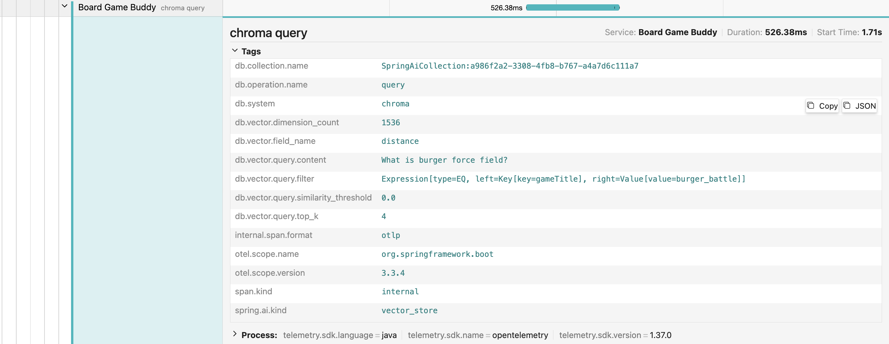

= Spring AI in Action
:chapter: 9
:sectnums:
:figure-caption: Figure {chapter}
:listing-caption: Listing {chapter}
:table-caption: Table {chapter}
:leveloffset: 1
:boot_version: 3.4.2
:spring_version: 6.2.2
:spring_ai_version: 1.0.0-M6
:xrefstyle: short
:bitmap_ext: png
:sectnumoffset: 8

= Observing AI operations

This chapter covers

* Spring AI observability metrics
* Viewing observations in Prometheus and Grafana
* Tracing Generative AI operations

In chapter 6, I asked you to think about your last visit to see the doctor.
Think about that visit once again.

I'll bet that while you were there, the doctor or a nurse took all kinds of measurements, such as your temperature, blood pressure, and heart rate.
They may have even taken blood and tested it for a variety of conditions.
In some situations, you may have been given a CT scan to get an even deeper view into how your body and systems are functioning.
The measurements and tests gave them a high-level view into your overall health and likely informed their thoughts on how best to treat you.

Your applications can be thought of similarly to your health.
Just as a doctor uses your vital statistics and test results to better understand your overall health, you can better understand the health and behavior of your application by observing various metrics that the application produces.
Building observability and tracing into your application can give you valuable insights and clarity into the inner-working of the application.

In this chapter, you'll learn about how to enable observability in your Spring AI applications and get to know the metrics Spring AI publishes.
You'll also see how to build visual representations of those metrics using observability platforms such as Prometheus and Grafana.
Then you'll see how to peer even deeper into the inner-workings of your application, taking advantage of tracing data published by Spring AI.

[[section_metricsEndpoint]]
== Enabling the Actuator metrics

Spring Boot's Actuator is the key to enabling observability in any Spring application.
Among the many things that the Actuator offers is the metrics endpoint which exposes a number of insights about your application.
Spring AI exposes several measurements via the metrics endpoint to help you gauge things like token usage, AI operation (e.g., requests to an AI API) counts, and the time spent on those operations.

To make those metrics available in Board Game Buddy, you must first add the Actuator starter dependency to the build:

----
implementation 'org.springframework.boot:spring-boot-starter-actuator'
----

The Actuator makes several endpoints available for peeking into the inner workings of a running application.
But by default, the only endpoint available by default is the health endpoint, which communicates the health of an application with respect to other applications and services that it interacts with (such as databases and message brokers).
In order to track and view AI metrics, you'll need to enable to metrics endpoint by adding the following line to application.properties:

----
management.endpoints.web.exposure.include=health,metrics
----

As you can see, this line lists both the health and metrics endpoints.
That way the health endpoint remains enabled while also enabling the metrics endpoint.

Even though you've only added a single dependency to the application build and a single property to the configuration, that's all that you need to do to track AI metrics in Board Game Buddy.
Spring AI takes care of the rest, counting the tokens and measuring the timing of various AI operations.
So there's nothing more you need to do other than fire up the application and view the results.

After starting the application, make at least one request to the `/ask` endpoint so that some metrics will be gathered and ready for you to view.
For example, suppose that you start up the application and then make one request to ask about the ingredients for a burger using HTTPie at the command line like this:

----
$ http :8080/ask gameTitle="Burger Battle" \
                 question="What ingredients are on the Classic?"
----

In the course of processing that request, several things take place, including:

- The question is submitted to the vector store via `QuestionAnswerAdvisor` to fetch similar documents.
- If using `VectorStoreChatMemoryAdvisor`, the question is submitted to the vector store to fetch related conversation history.
- The prompt is submitted to OpenAI for generation.
- The response is sent to the vector store via `VectorStoreChatMemoryAdvisor` to add to the conversation history for future requests.

All of these actions will be reflected in the metrics endpoint in various ways.
To see these metrics, make a quest to http://localhost:8080/actuator/metrics.
You'll get back JSON with a list of metrics names, many of which have little or nothing to do with Spring AI.
But the response will include several metrics names that are specific to Spring AI, including those in the following JSON response from the metrics endpoint:

- `db.vector.client.operation` - The count and duration of operations against vector stores.
- `db.vector.client.operation.active` - The count and duration of currently active operations against vector stores.
- `gen_ai.client.operation` - The count and duration of operations against Generative AI APIs. Includes, chat, image, and embedding operations.
- `gen_ai.client.operation.active` - The count and duration of currently active operations against Generative AI APIs. Includes, chat, image, and embedding operations.
- `gen_ai.client.token.usage` - The count of tokens, both prompt and generation, that have been used.
- `spring.ai.advisor` - The count and duration of prompts that have been handled by Spring AI advisors.
- `spring.ai.advisor.active` - The count and duration of currently active prompts that have been handled by Spring AI advisors.
- `spring.ai.chat.client` - The count and duration of operations flowing through Spring AI's `ChatClient`.
- `spring.ai.chat.client.active` - The count and duration of currently active operations flowing through Spring AI's `ChatClient`.

The metrics whose name ends with the ".active" suffix all represent the current state of the application at the time the request to the metrics endpoint is made.
These give you a real-time glimpse into how active the application is with regard to AI operations.
This kind of information could prove valuable in a production setting, but will typically be zero in a development environment unless you are running a great deal of load against your development application.

The other metrics whose name does not end with ".active" provide aggregate counts and averages for their respective measurements since the application started.

Let's have a look at each of these metrics to see what information they expose about the inner-workings of how prompts are handled in Spring AI.

=== Inspecting vector store operations

The metrics endpoint is intended to be consumed by dashboard applications such as Codecentric's Spring Boot Adminfootnote:[https://github.com/codecentric/spring-boot-admin] or Ostarafootnote:[https://ostara.dev/].
Those applications present the information from the Actuator's endpoints in a more human-friendly form.
Nevertheless, it is still possible for you to navigate the metrics endpoint directly using any HTTP client such as HTTPie or `curl`.
Simply append the name of the metric that you're interested in to the end of the metrics endpoint URL and issue a GET request to see the information provided by the given metric.

For the `db.vector.client.operation` metric, that means issing a GET request to `/actuator/metrics/gen_ai.client.token.usage`.
This will expose metrics pertaining to operations against the vector database.
Here's what such a request might look like using HTTPie (the JSON response has been reformatted to conserve space):

----
$ http :8080/actuator/metrics/db.vector.client.operation -b
{
  "name": "db.vector.client.operation",
  "baseUnit": "seconds",
  "measurements": [
    { "statistic": "COUNT", "value": 4.0 },
    { "statistic": "TOTAL_TIME", "value": 1.872260833 },
    { "statistic": "MAX", "value": 0.638242833 }
  ],
  "availableTags": [
    { "tag": "db.system", "values": [ "qdrant" ] },
    { "tag": "spring.ai.kind", "values": [ "vector_store" ] },
    { "tag": "error", "values": [ "none" ] },
    { "tag": "db.operation.name", "values": [ "add", "query" ] }
  ]
}
----

Aside from the "name" property (which just repeats the metric's name) and the "baseUnit" property (which says that the time metrics are expressed in seconds granularity), there are two main sections in the response.
The "measurements" property tells you some key statistics about operations against the vector store, while the "availableTags" tells you what tags you can use to pivot the data on.

Inside of "measurements" there are three pieces of data:

 - `"COUNT"` - The number of vector store operations that have been performed.
 - `"TOTAL_TIME"` - The total duration (in seconds) of all vector store operations.
 - `"MAX"` -  The maximum time spent on any one vector store operation.

In this sample of metrics (which was taken shortly after the application had started and only one question had been asked), there have been 4 operations against the vector store, the maximum time of one of those operations was just over half of a second, and the total time spent on all four operations was just shy of 2 seconds.

The "availableTags" property also provides a little insight into what vector operations took place.
Table <<table_vectorStoreKeys>> describes the tags available when inspecting vector store metrics.

[#table_vectorStoreKeys, reftext={chapter}.{counter:table}, caption='{table-caption}.{counter:table-number} ']
.Tags for the `db.vector.client.operation`(`.active`) metric.
[cols="2,5"]
|===
|Tag |Description

|`db.operation.name` |The operation against the vector store. One of "add", "delete", or "query".
|`db.system` |The type of vector store (eg, "qdrant", "pg_vector", "pinecone", etc)
|`spring.ai.kind` |The Spring AI component recording this metric. Always "vector_store" for the `db.vector.client.operation` / `db.vector.client.operation.active` metrics.
|===

Looking at the tags in the JSON response, you can see that add and query operations were performed against the Qdrant vector store and there were no errors.
But "availableTags" provides more than just some general information about what took place.
You can use those tags to filter down the results.

For example, although you know there were 4 operations (including add and query operations), you might want to know how many of those operations were "add" operations.
To drill down into that specific type of operation, you can specify the `tag` attribute in the URL.
The value of `tag` takes the form "{tag name}:{value}".
In the case of asking for metrics concerning "add" operations, `tag` should be "db.operation.name:add".
Here's the request for metrics again, this time asking only for metrics concerning "add" operations against a vector store:

----
$ http :8080/actuator/metrics/db.vector.client.operation?tag=db.operation.
[CA]name:add -b
{
  "name": "db.vector.client.operation",
  "baseUnit": "seconds",
  "measurements": [
    { "statistic": "COUNT", "value": 2.0 },
    { "statistic": "TOTAL_TIME", "value": 0.89572275 },
    { "statistic": "MAX", "value": 0.0 }
  ],
  "availableTags": [
    { "tag": "db.system", "values": [ "qdrant" ] },
    { "tag": "spring.ai.kind", "values": [ "vector_store" ] },
    { "tag": "error", "values": [ "none" ] }
  ]
}
----

Now you know that 2 of the operations were add operations and that they took a total of 0.89572275 seconds.
By process of elimination you can assume that the other two operations were query operations.
Or you can issue the request by changing the value of the `tag` parameter to "db.operation.name:query".

NOTE: You might be wondering why asking a question resulted in any add operations against the vector database.
You'll see where those add operations came from in <<section_Tracing>> when you see how to trace a request through the application.

Now that you've seen how to inspect statistics regarding vector store operations, let's have a look at the statistics gathered for operations against the AI API.

=== Examining AI model interaction

The `gen_ai.client.operation` metric (and its corresponding `gen_ai.client.operation.active` metric) provide insights into the operations that are performed against the AI API.
As with `db.vector.client.operation` (or any other metric), append the metric name to the Actuator's metrics endpoint URL and issue a GET request:

----
$ http :8080/actuator/metrics/gen_ai.client.operation -b
{
  "name": "gen_ai.client.operation",
  "baseUnit": "seconds",
  "measurements": [
    { "statistic": "COUNT", "value": 6.0 },
    { "statistic": "TOTAL_TIME", "value": 3.6568530829999997 },
    { "statistic": "MAX", "value": 1.111941542 }
  ],
  "availableTags": [
    { "tag": "gen_ai.operation.name", "values": [ "chat", "embedding" ] },
    { "tag": "gen_ai.response.model",
      "values": [ "gpt-4o-mini-2024-07-18", "text-embedding-ada-002"] },
    { "tag": "gen_ai.request.model",
      "values": [ "gpt-4o-mini", "text-embedding-ada-002" ] },
    { "tag": "error", "values": [ "none" ] },
    { "tag": "gen_ai.system", "values": [ "openai" ] }
  ]
}
----

As you can see, the measurements provided by the `gen_ai.client.operation` metric are the same as for `db.vector.client.operation`.
Here it's clear that there have been 6 operations against the AI API, taking a total of 3.6568530829999997 seconds with a maximum time of 1.111941542 seconds for one of the operations.
The "availableTags" property has several tags that give some insight into how those operations were spent.
Table <<table_genAiOperationTags>> explains each of the tags.

[#table_genAiOperationTags, reftext={chapter}.{counter:table}, caption='{table-caption}.{counter:table-number} ']
.Available tags for the `gen_ai.client.operation`(`.active`) metric.
[cols="1,2"]
|===
|Tag |Description

|`gen_ai.operation.name` |The operation name. One of "chat", "embedding" or "image".
|`gen_ai.system` |The AI provider API (eg., "openai", "ollama", "anthropic", etc)
|`gen_ai.request.model` |The name of the model. (eg, "gpt-4o-mini", "text-embedding-ada-002")
|`gen_ai.response.model` |The model actually used and returned in the generation response. (eg., "gpt-4o-mini-2024-07-18") Not available when `gen_ai.operation.name` is "image".
|===

It's clear that all of the operations were performed against the OpenAI API.
But the "gen_ai.operation.name" tag indicates that some were chat operations and the rest were embedding operations.
(Had we asked our application to generate some images, the `gen_ai.operation.name` tag would also include an "image" entry.)
This makes sense, as the embeddings are calculated for the submitted question so that they can be used to query to vector store before sending the question to the LLM.

The "gen_ai.request.model" and "gen_ai.response.model" both indicate what models were used.
The difference between these two is that the models listed in "gen_ai.request.model" are those that were specified in the request sent to the LLM, while those in "gen_ai.response.model" are the models returned in the response.
In this case the embedding model is the same between the request and response, but "gpt-4o-mini-2024-07-18" from the response gives a more specific version of the "gpt-4o-mini" model that was requested.

Using these tags, you could dive in and find out how many of the operations were chat operations versus embedding operations.
For example, the following request to the metrics endpoint asks for the statistics regarding "embedding" operations:

----
$ http :8080/actuator/metrics/gen_ai.client.operation?tag=gen_ai.operation.
[CA]name:embedding -b
{
  "name": "gen_ai.client.operation",
  "baseUnit": "seconds",
  "measurements": [
    { "statistic": "COUNT", "value": 5.0 },
    { "statistic": "TOTAL_TIME", "value": 2.544911541 },
    { "statistic": "MAX", "value": 0.0 }
  ],
  "availableTags": [
    { "tag": "gen_ai.response.model",
      "values": [ "text-embedding-ada-002" ] },
    { "tag": "gen_ai.request.model",
      "values": [ "text-embedding-ada-002" ] },
    { "tag": "error", "values": [ "none" ] },
    { "tag": "gen_ai.system", "values": [ "openai" ] }
  ]
}
----

From this, you now know that 5 of the 6 operations against OpenAI's API were embedding requests, taking a total of roughly 2.5 seconds.
It may seem a bit odd that so many embedding requests were performed for a single question.
In <<section_Tracing>>, when tracing through the application, you'll find out why.
But for now, let's see how to track token usage.

=== Counting token usage

Tokens are an important metric to track because they are the unit on which most AI API providers calculate billing.
The more tokens you use, the more you'll have to pay.
It's important to understand how many tokens your application is using as well as which models those tokens are being spent on so that you can gauge how much your application costs to run and possibly seek ways to conserve token usage to keep spending as low as possible.

The `gen_ai.client.token.usage` metric provides only a single statistic: The number of tokens that your application has spent.
Here's an example of what a request for the `gen_ai.client.token.usage` metrics might look like:

----
$ http :8080/actuator/metrics/gen_ai.client.token.usage -b
{
  "name": "gen_ai.client.token.usage",
  "description": "Measures number of input and output tokens used",
  "measurements": [ { "statistic": "COUNT", "value": 3624.0 } ],
  "availableTags": [
    { "tag": "gen_ai.operation.name", "values": [ "chat", "embedding" ] },
    { "tag": "gen_ai.response.model",
      "values": [ "gpt-4o-mini-2024-07-18", "text-embedding-ada-002" ]},
    { "tag": "gen_ai.request.model",
      "values": [ "gpt-4o-mini", "text-embedding-ada-002" ] },
    { "tag": "gen_ai.token.type", "values": [ "output", "input", "total"] },
    { "tag": "gen_ai.system", "values": [ "openai" ] }
  ]
}
----

So far, the application has spent 3,624 tokens.
Given that tokens typically cost less than a penny per thousand tokens, the bill doesn't look to be too large at this point.
But tokens are priced differently depending on whether they are prompt tokens versus generation tokens.
And they are also priced differently for chat operations than for embedding operations.
So it's important to dig deeper and break down the token count so that it can be itemized for the token type and model (or operation) that they were spent on.
Table <<table_tokenCount>> describe the available tags for the `gen_ai.client.token.usage` metric, which you'll use to filter the response down to specific token types and models.

[#table_tokenCount, reftext={chapter}.{counter:table}, caption='{table-caption}.{counter:table-number} ']
.Available tags for the `gen_ai.client.token.usage` metrics.
[cols="1,2"]
|===
|Key |Description

|`gen_ai.operation.name` |The operation being performed. "chat", "embedding" or "image"
|`gen_ai.system` |The AI provider (ex., "openai")
|`gen_ai.request.model` |The model specified in the prompt (ex, "gpt-4o-mini", "text-embedding-ada-002", etc)
|`gen_ai.response.model` |The model actually used and returned in the response (ex, gpt-4o-mini-2024-07-18")
|`gen_ai.token.type` |The type of token. One of "input", "output", or "total"
|===

The most curious of these tags is the `gen_ai.token.type` tag.
Using this tag, you can find out how many tokens are prompt tokens ("input") or generation tokens ("output").
Or you can ask it for the total number of tokens regardless of type.
As you'll see, the total number of tokens might be a bit surprising.

First, let's ask for the number of prompt tokens by using the `gen_ai.token.type` tag:

----
$ http :8080/actuator/metrics/gen_ai.client.token.usage?tag=gen_ai.token.
[CA]type:input -b
{
  "name": "gen_ai.client.token.usage",
  "description": "Measures number of input and output tokens used",
  "measurements": [ { "statistic": "COUNT", "value": 1773.0 } ],
  "availableTags": [
    { "tag": "gen_ai.operation.name",
      "values": [ "chat", "embedding" ] },
    { "tag": "gen_ai.response.model",
      "values": [ "gpt-4o-mini-2024-07-18", "text-embedding-ada-002" ] },
    { "tag": "gen_ai.request.model",
      "values": [ "gpt-4o-mini", "text-embedding-ada-002" ] },
    { "tag": "gen_ai.system", "values": [ "openai" ] }
  ]
}
----

From this you can see that 1,773 tokens prompt tokens, roughly half of the token count from the previous request, have been spent.
When you request the count of generation tokens by setting `gen_ai.token.type` to "output", you might expect to see the other half:

----
$ http :8080/actuator/metrics/gen_ai.client.token.usage?tag=gen_ai.token.
[CA]type:output -b
{
  "name": "gen_ai.client.token.usage",
  "description": "Measures number of input and output tokens used",
  "measurements": [ { "statistic": "COUNT", "value": 39.0 } ],
  "availableTags": [
    { "tag": "gen_ai.operation.name", "values": [ "chat", "embedding" ] },
    { "tag": "gen_ai.response.model",
      "values": [ "gpt-4o-mini-2024-07-18", "text-embedding-ada-002" ] },
    { "tag": "gen_ai.request.model",
      "values": [ "gpt-4o-mini", "text-embedding-ada-002" ] },
    { "tag": "gen_ai.system", "values": [ "openai" ] }
  ]
}
----

This shows that 39 generation tokens have been used.
But wait!
That doesn't add up.
1,773 plus 39 isn't 3,624.
The sum of those two token counts is 1,812--exactly half of the token count from before.
What's going on?

This is indeed a peculiar situation, but it makes sense when you consider how the Actuator's metrics endpoint came up with that number.
In addition to "input" and "output" tokens, the `gen_ai.token.type` tag also offers "total" to get the total number of tokens.
When you ask for the total number of tokens, you get your first clue as to what's going on:

----
$ http :8080/actuator/metrics/gen_ai.client.token.usage?tag=gen_ai.token.
[CA]type:total -b
{
  "name": "gen_ai.client.token.usage",
  "description": "Measures number of input and output tokens used",
  "measurements": [ { "statistic": "COUNT", "value": 1812.0 } ],
  "availableTags": [
    { "tag": "gen_ai.operation.name", "values": [ "chat", "embedding" ] },
    { "tag": "gen_ai.response.model",
      "values": [ "gpt-4o-mini-2024-07-18", "text-embedding-ada-002" ] },
    { "tag": "gen_ai.request.model",
      "values": [ "gpt-4o-mini", "text-embedding-ada-002" ] },
    { "tag": "gen_ai.system", "values": [ "openai" ] }
  ]
}
----

This reports that the total number of tokens is 1,812, which works out to be the sum of the input and output token counts.
But the "total" value for `gen_ai.token.type` doesn't carry any special meaning.
It is effectively being treated as a third token type.
Therefore, when the Actuator adds up the token counts for "input", "output", *and* "total", the grand sum is 3,624--double what the actual total is.
Because of this, you should never trust the count you get from the `gen_ai.client.token.usage` metric without also specifying the `gen_ai.token.type` tag.

Now you have a way of knowing how many prompt and generation tokens were spent.
But what models were they spent on?
Adding another tag to the request will refine the answer further.
For example, let's find out how many input tokens were spent on the GPT-4o-mini model:

----
$ http ":8080/actuator/metrics/gen_ai.client.token.usage\
?tag=gen_ai.token.type:input&tag=gen_ai.request.model:gpt-4o-mini" -b
{
  "name": "gen_ai.client.token.usage",
  "description": "Measures number of input and output tokens used",
  "measurements": [ { "statistic": "COUNT", "value": 1713.0 } ],
  "availableTags": [
    { "tag": "gen_ai.operation.name", "values": [ "chat", "embedding" ] },
    { "tag": "gen_ai.response.model",
      "values": [ "gpt-4o-mini-2024-07-18", "text-embedding-ada-002" ] },
    { "tag": "gen_ai.system", "values": [ "openai" ] }
  ]
}
----

This tells you that 1,713 input tokens were spent on requests to the GPT-4o-mini model.
At the time this is being written, the price for GPT-4o-mini is $0.000150 per 1,000 input tokens.
Thus, less than a penny has been spent on input tokens so far.

Now let's count the number of output tokens spent on GPT-4o-mini:

----
$ http ":8080/actuator/metrics/gen_ai.client.token.usage\
?tag=gen_ai.token.type:output&tag=gen_ai.request.model:gpt-4o-mini" -b
{
  "name": "gen_ai.client.token.usage",
  "description": "Measures number of input and output tokens used",
  "measurements": [ { "statistic": "COUNT", "value": 39.0 } ],
  "availableTags": [
    { "tag": "gen_ai.operation.name", "values": [ "chat", "embedding" ] },
    { "tag": "gen_ai.response.model",
      "values": [ "gpt-4o-mini-2024-07-18", "text-embedding-ada-002" ] },
    { "tag": "gen_ai.system", "values": [ "openai" ] }
  ]
}
----

Output tokens cost $0.000600 per 1,000 tokens.
Even though they cost 4 times as much as input token, so far you've only used 39 of them.
Therefore, your bill is still less than a penny.

Of course, in a real world application with more usage, these token counts will stack up a lot higher.
And so will the total cost.
By checking in on the `gen_ai.client.token.usage` metric, you can estimate what the bill will be.

Next up, let's see how to gauge the operations performed against Spring AI's `ChatClient`.

=== Observing ChatClient operations

The final set of metrics exposed by Spring AI are from Spring AI itself.
These include counts and times for operations performed by `ChatClient` as well as counts and times going through advisors such as `QuestionAnswerAdvisor` and the chat memory advisors.

For operations performed by `ChatClient`, you'll use the `spring.ai.chat.client` metric.
Here's what a request for `spring.ai.chat.client` might look like:

----
$ http :8080/actuator/metrics/spring.ai.chat.client -b
{
  "name": "spring.ai.chat.client",
  "baseUnit": "seconds",
  "measurements": [
    { "statistic": "COUNT", "value": 1.0 },
    { "statistic": "TOTAL_TIME", "value": 4.066869084 },
    { "statistic": "MAX", "value": 0.0 }
  ],
  "availableTags": [
    { "tag": "gen_ai.operation.name", "values": [ "framework" ] },
    { "tag": "spring.ai.kind", "values": [ "chat_client" ] },
    { "tag": "error", "values": [ "none" ] },
    { "tag": "spring.ai.chat.client.stream", "values": [ "false" ] },
    { "tag": "gen_ai.system", "values": [ "spring_ai" ] }
  ]
}
----

Here, you can see that only 1 operation has gone through `ChatClient` at this point and it took just over 4 seconds.

You can also see that there are also a few available tags on which you can filter the results.
These tags are listed in table <<table_chatClientAvailableTags>>.

[#table_chatClientAvailableTags, reftext={chapter}.{counter:table}, caption='{table-caption}.{counter:table-number} ']
.Available tags for the `spring.ai.chat.client` / `spring.ai.chat.client.active` metrics.
[cols="3,4"]
|===
|Key |Description

|`gen_ai.operation.name`	|The operation name. Always "framework"
|`gen_ai.system`	|Always "spring_ai"
|`spring.ai.chat.client.stream`	|Whether the interaction was streaming or not. (ex., "true" or "false")
|`spring.ai.kind`	|The Spring AI component that recorded the metric. Always "chat_client" for the `spring.ai.chat.client` and `spring.ai.chat.client.active` metrics.
|===

As you can see, most of the tags are always the same value for the `spring.ai.chat.client` metric.
This limits their usefulness for filtering the metrics, because filtering on any of them would provide the same response as not filtering.
But the `spring.ai.chat.client.stream` tag could be helpful to differentiate streaming requests from non-streaming requests.

In this example, there's only one operation and it was non-streaming.
But let's say that a few more operations, both streaming and non-streaming had gone through `ChatClient`.
Here's what `spring.ai.chat.client` might tell you:

----
$ http :8080/actuator/metrics/spring.ai.chat.client -b
{
  "name": "spring.ai.chat.client",
  "baseUnit": "seconds",
  "measurements": [
    { "statistic": "COUNT", "value": 23.0 },
    { "statistic": "TOTAL_TIME", "value": 44.165867042 },
    { "statistic": "MAX", "value": 0.0 }
  ],
  "availableTags": [
    { "tag": "gen_ai.operation.name", "values": [ "framework" ] },
    { "tag": "spring.ai.kind", "values": [ "chat_client" ] },
    { "tag": "error", "values": [ "none" ] },
    { "tag": "spring.ai.chat.client.stream", "values": [ "false", "true" ] },
    { "tag": "gen_ai.system", "values": [ "spring_ai" ] }
  ]
}
----

Out of these 23 operations, some number of them are streaming and some are not.
To find out how many of them are streaming operations, you can filter using the `spring.ai.chat.client.stream` tag like this:

----
$ http :8080/actuator/metrics/spring.ai.chat.client\
?spring.ai.chat.client.stream:true -b
{
  "name": "spring.ai.chat.client",
  "baseUnit": "seconds",
  "measurements": [
    { "statistic": "COUNT", "value": 11.0 },
    { "statistic": "TOTAL_TIME", "value": 21.118562023 },
    { "statistic": "MAX", "value": 0.0 }
  ],
  "availableTags": [
    { "tag": "gen_ai.operation.name", "values": [ "framework" ] },
    { "tag": "spring.ai.kind", "values": [ "chat_client" ] },
    { "tag": "error", "values": [ "none" ] },
    { "tag": "gen_ai.system", "values": [ "spring_ai" ] }
  ]
}
----

This tells you that 11 of the operations were streaming operations.
And by elimination, that must mean that the other 12 were non-streaming.

Now let's have a look at what part the advisors played by requesting the `spring.ai.advisor` metric:

----
$ http :8080/actuator/metrics/spring.ai.advisor -b
{
  "name": "spring.ai.advisor",
  "baseUnit": "seconds",
  "measurements": [
    { "statistic": "COUNT", "value": 3.0 },
    { "statistic": "TOTAL_TIME", "value": 6.906179708 },
    { "statistic": "MAX", "value": 0.0 }
  ],
  "availableTags": [
    { "tag": "spring.ai.advisor.type", "values": [ "AROUND" ] },
    { "tag": "spring.ai.kind", "values": [ "advisor" ] },
    { "tag": "error", "values": [ "none" ]}
  ]
}
----

Here it's clear that 3 advisor operations were performed for a total of nearly 7 seconds.

Table <<table_AdvisorTags>> describe the tags that are available for filtering advisor metrics.

[#table_AdvisorTags, reftext={chapter}.{counter:table}, caption='{table-caption}.{counter:table-number} ']
.Available tags for the `spring.ai.advisor` / `spring.ai.advisor.active` metrics.
[cols="3,5"]
|===
|Key |Description

|`spring.ai.advisor.type`	|The type of advisor. One of "BEFORE", "AFTER", or "AROUND")
|`spring.ai.kind`	|The Spring AI component recording this metric. Always "advisor" for the `spring.ai.advisor` and `spring.ai.advisor.active` metrics.
|===

Although the `spring.ai.kind` tag is always "advisor" when requesting the `spring.ai.advisors` metric (which makes it useless for filtering), it's clear that all 3 operations were for "AROUND" advisors.
Spring AI provides for 3 kinds of advisors:

 - Before - Advisors that only intercept a prompt before it is sent to the LLM.
 - After - Advisors that only intercept the generation from an LLM.
 - Around - Advisors that intercept both the prompt and generation.

Even so, all of the out-of-the-box advisors that come with Spring AI are around advisors.
Even though the `spring.ai.advisor.type` tag could be used to filter on advisor types, it won't help much if all advisors are all the same type.

What would be useful, however, is to filter the operations based on what specific advisors they went through.
Unfortunately, Spring AI doesn't provide the advisor name as a tag that you can filter on.
Therefore, there's no point in trying to filter the advisor metrics.

Up to this point, you've viewed and navigated the metrics using HTTPie (or whatever HTTP client you prefer).
But even though you can view the metrics this way, it isn't practical or expected that you'd view them by manipulating the URL and viewing the resulting JSON.
It's much better if you can use an observability tool that renders the metrics in a user-friendly graph.
Aside from providing a clearer visual picture, observability tools can also give you the context of history as it relates to the metrics, so that you can see how they change over time.

Fortunately, the metrics endpoint utilizes Micrometerfootnote:[https://micrometer.io/] under the covers.
Micrometer is a vendor-neutral observability facade that makes it possible to view metrics from Spring Boot's Actuator in one of several popular observability systems.

Let's see how to take advantage of Micrometer to view Spring AI metrics in the popular open-source Prometheus monitoring and alerting toolkit.

== Viewing metrics in Prometheus

Prometheusfootnote:[https://prometheus.io/] is a popular open-source monitoring and alerting toolkit that integrates well with Spring via Spring Boot's Actuator and Micrometer support.
Metrics from Spring and application components are collected at specified intervals and stored in a time-series database that can be queried to provide visualization of what's going on inside an application.
And, as you'll see in <<section_Grafana>>, it integrates well with Grafana for creating rich dashboards.

In order to view Spring AI metrics (or metrics exposed by Spring) in Prometheus, you'll start by adding the Prometheus Micrometer dependency to the application build:

----
implementation 'io.micrometer:micrometer-registry-prometheus'
----

This dependency adds a new Prometheus-specific endpoint to the Spring Boot Actuator.
Prometheus will periodically scrape this endpoint to consume the metrics that are published through Micrometer, including those published by Spring AI.

The Prometheus endpoint isn't exposed by default.
You'll need to enable that endpoint by adding it to the `management.endpoints.web.exposure.include` property the same as you did for the "metrics" endpoint:

----
management.endpoints.web.exposure.include=health,metrics,prometheus
----

Now that the application itself is Prometheus-enabled, you'll need a Prometheus instance running somewhere.
In a production setting, Prometheus will typically be provided by the platform your app is running on or will otherwise be already available.
But for development purposes (and for the purposes of the Board Game Buddy application), you'll start Prometheus via Docker Compose by adding a service to the project's `compose.yaml` file.
Adding the following lines of YAML to the `compose.yaml` file ought to do the trick:

----
services:

  # ...

  prometheus:
    image: prom/prometheus
    container_name: prometheus
    volumes:
      - "./prometheus-config.yml:/etc/prometheus/prometheus.yml"
    networks:
      - net
    ports:
      - 9090:9090

networks:
  net:
    driver: bridge
----

Among other things, this configuration will start up Prometheus to listen on port 9090.
It also mounts a file named `prometheus-config.yml` on the running contain at the path `/etc/prometheus/prometheus.yml`.
This file will specify the details on how Prometheus should scrape for its data.
Create a file named `prometheus-config.yml` at the root of the Board Game Buddy project that looks like this:

----
include::../code/ch09/board-game-buddy/prometheus-config.yml[]
----

This configuration tells Prometheus to scrape the data from the `/actuator/prometheus` endpoint of the application.
And it should do so every 15 seconds.

Everything is now in place for viewing metrics in Prometheus.
Start Board Game Buddy and submit a few questions to the `/ask` endpoint so that some metrics will have been collected.
Then you can open your web browser to http://localhost:9090 to open the Prometheus application.

When you first open Prometheus in your web browser, it's rather empty.
But once you enter an expression into the text field near the top and press the "Execute" button, it will spring to life with information.
If you're unsure about what to enter into the expression field, you can start by entering any one of the metrics exposed by the Actuator.
As you start typing, the metrics whose name matches what you've typed will be offered to you.
Figure <<fig_1>> shows what you will be offered if you start by typing "gen_ai".

[#fig_1, reftext={chapter}.{counter:figure}, caption='{figure-caption}.{counter:figure-number} ']
.Selecting a metric to view when first opening Prometheus.

For the sake of illustration, select the "gen_ai_client_operation_seconds_max" metric and press the "Execute" button.
Initially, you'll be shown the data from the metrics in what Prometheus calls "Table" form.
In actuality, it's less of a table and more of a comma-separated list of tags, as shown in figure <<fig_2>>.

[#fig_2, reftext={chapter}.{counter:figure}, caption='{figure-caption}.{counter:figure-number} ']
.Viewing metrics in Prometheus' table view.

This view is only slightly more interesting than what you got from hitting the `/actuator/metrics` endpoint.
If you click on the "Graph" tab, however, you'll be able to see the data from that metric over the past hour, displayed as a line graph.
Then you can adjust the time period displayed by clicking the plus and minus signs or by entering a custom duration in the text field between them.
Figure <<fig_3>> shows what a half-hour's worth of metric data might look like:

[#fig_3, reftext={chapter}.{counter:figure}, caption='{figure-caption}.{counter:figure-number} ']
.Viewing metrics as a graph in Prometheus.

This shows the data for two series of data: One for chat operations (the top line in the graph) and another for embedding operations (the bottom line).
By modifying the expression, you can filter down to a specific tag to see the metrics for only one operation type.
For example, if you only wish to see the metrics for the chat operations, change the expression to `gen_ai_client_operation_seconds_max{gen_ai_operation_name="embedding"}`.
As you edit the expression, once you type the opening curly brace, you should get suggestions to guide you for which tags you can filter on.
Figure <<fig_4>> shows an example of the kind of graph you might see if you filter for chat operations.

[#fig_4, reftext={chapter}.{counter:figure}, caption='{figure-caption}.{counter:figure-number} ']
.Filtering by a tag in Prometheus.

Even though you've only tried the "gen_ai_client_operation_seconds_max" in Prometheus thus far, all of the metrics covered in <<section_metricsEndpoint>> are available.
This includes:

- `gen_ai_client_operation_seconds_count`
- `gen_ai_client_operation_active_seconds_count`
- `gen_ai_client_operation_seconds_max`
- `gen_ai_client_operation_active_seconds_max`
- `gen_ai_client_operation_seconds_sum`
- `gen_ai_client_operation_active_seconds_sum`
- `gen_ai_client_token_usage_total`
- `spring_ai_advisor_seconds_count`
- `spring_ai_advisor_active_seconds_count`
- `spring_ai_advisor_seconds_max`
- `spring_ai_advisor_active_seconds_max`
- `spring_ai_advisor_seconds_sum`
- `spring_ai_advisor_active_seconds_sum`
- `spring_ai_chat_client_seconds_count`
- `spring_ai_chat_client_active_seconds_count`
- `spring_ai_chat_client_seconds_max`
- `spring_ai_chat_client_active_seconds_max`
- `spring_ai_chat_client_seconds_sum`
- `spring_ai_chat_client_active_seconds_sum`
- `db_vector_client_operation_seconds_count`
- `db_vector_client_operation_active_seconds_count`
- `db_vector_client_operation_seconds_max`
- `db_vector_client_operation_active_seconds_max`
- `db_vector_client_operation_seconds_sum`
- `do_vector_client_operation_active_seconds_sum`

They may be named in a slightly different way, but it's easy to match them up with their corresponding metric name from the Actuator's metrics endpoint.

While Prometheus is a great place to capture and present metrics, it's not ideal for presenting several observation graphs in a single dashboard.
Grafana, on the other hand is perfect for creating dashboards.
And it integrates with Prometheus, so the metrics data that Prometheus is already scraping from the `/actuator/prometheus` endpoint can be presented in a Grafana dashboard with no further changes to the application.
Let's see how to take advantage of this to build a rich dashboard full of Spring AI metrics.

[[section_Grafana]]
== Creating AI dashboards

Grafanafootnote:[https://grafana.com/] is an open-source data visualization tool that is popular for displaying real-time data in easily understood graphs and gauges.
With Grafana, you can create interactive custom dashboards that provide a unified view into an application's health, metrics, and performance.

Grafana can pull the metrics it displays from several different sources, including Prometheus.
Since you have already setup Prometheus to pull metrics from Board Game Buddy, you won't need to change anything about the application itself to create a dashboard in Grafana.
But you will need to start a Grafana server.
And the easiest way to do that is via Docker Compose.
Add the following service entry to the `compose.yaml` file so that Grafana will be started when you start the Board Game Buddy application:

----
services:

  # ...

  grafana:
    image: grafana/grafana
    container_name: grafana
    restart: unless-stopped
    ports:
      - '3000:3000'
    volumes:
      - grafana-storage:/var/lib/grafana
    networks:
      - net

# ...

volumes:
  # ...
  grafana-storage: {}
----

When you restart the application, it will now start with the Qdrant vector store, Prometheus, and Grafana.
After the application starts up, submit a few questions to the `/ask` endpoint just to get some metrics data in place.
Then you'll be ready to create the dashboard.

Creating a dashboard in Grafana involves several steps, especially if this is the first time you'll be setting everything up.
The first step is to open http://localhost:3000 in your web browser.
You'll be prompted to log in.
The initial username and password are both "admin".
Once you've signed in, it will ask you to change the password (although it's optional).

Next, you'll need to create a new data source that references the Prometheus server that you setup earlier.
Click the menu button at the top left (the one with 3 dashes, sometimes called the "hamburger menu") and then click on the "Add new connection" item.
You'll be prompted to search for a data source type.
Enter "Prometheus" in the search field, then click on the "Prometheus" data source when it appears.

You'll be presented with an overview of the Prometheus data source.
Click the "Add new data source" button at the top right to open the settings page for the Prometheus data source.

The only thing you must configure on this page is the Prometheus server URL under the "Connection" heading.
Because Grafana is configured to use the same "net" network as Prometheus in the Docker Compose file, the URL can reference Prometheus by its service name.
Therefore, enter "http://prometheus:9090" for the Prometheus URL.
Then scroll down to the bottom of the page and click the "Save & test" button.
You should be shown an information box that says "Successfully queried the Prometheus data source".
If not, then double-check the URL and try again.

Now that you have created a data source, you're ready to build the dashboard itself.
From the application menu, click on the "Dashboards" entry.
You'll be shown a page with a large "+ Create dashboard" button--click on it.
Then click on the large "+ Add visualization" button.
You'll be asked to select a data source, so pick the Prometheus data source you created before.

You'll be shown a panel (which is initially empty) where the visualization will be defined, along with some configuration below and to the right of the panel.
Underneath the panel, you can pick a metric from the Prometheus data source.
You can pick any of the metrics that the application exposes to Prometheus, but for the first panel in the dashboard, select the "gen_ai_client_operations_seconds_max" metric.
Then you can click the "Run queries" button just above and to the right of the metric selector to populate the panel with a time-series graph for that metric.
Figure <<fig_5>> shows what that might look like.

[#fig_5, reftext={chapter}.{counter:figure}, caption='{figure-caption}.{counter:figure-number} ']
.Display a time-series graph for client operations in Grafana.

Note that the panel shows the metrics for both chat operations as well as embedding operations.
You can filter the display on any of the metrics tags by selecting the tag and value in the "Label filters" selection (just to the right of the metric selection).
For example, to setup a filter to only show the chat operations, select "gen_ai_operation_name" as the label and "chat" as the value.
Then click on "Run queries" to update the graph.

There are several other ways to customize the panel, including selecting colors for each series, applying different operations on the metrics, and even choosing a completely different type of graph to display.
But rather than get distracted by the nitty-gritty details of working with Grafana, let's just save this panel as it is by clicking the "Save dashboard" button at the top right.
Then click the "← Back to dashboard" button to see your newly created metrics panel in the dashboard.
It might look a little something like what you see in figure <<fig_6>>

[#fig_6, reftext={chapter}.{counter:figure}, caption='{figure-caption}.{counter:figure-number} ']
.The first metrics panel in a newly created Grafana dashboard.

Looks nice, doesn't it?
But that single panel does look a little lonely.
Feel free to create more panels to fill up your dashboard by following the same steps you took to create the first panel.
Once you're finished, your dashboard could look more filled out like the one in figure <<fig_7>>.

[#fig_7, reftext={chapter}.{counter:figure}, caption='{figure-caption}.{counter:figure-number} ']
.A Grafana dashboard full of Spring AI metrics.

The metrics you've seen so far are great for getting a high-level gauge on how your application is performing and what kind of operations are being performed against an LLM and your vector store.
But when you really need to dig in and see what's actually taking place in your application, nothing beats examining a trace that gives you a very clear picture of what parts of your application are involved in handling a request.
Let's wrap up our discussion of AI observability by looking at how to view AI operations in an application trace.

[[section_Tracing]]
== Tracing AI operations

Historically, tracing in Spring Boot application was provided by a project called Spring Cloud Sleuth.
But starting with Spring Boot 3.0, tracing support is available via the Micrometer Tracing project (which is essentially a Spring-agnostic copy of Spring Cloud Sleuth).
Thus, the same underlying mechanisms that have enable metrics in Board Game Buddy will also help us trace through requests to the application to see what exactly is going on when a user asks a question.

For viewing the traces produced by the application, we'll use Jaeger, an open-source distributed tracing platform.
Jaeger can be started by adding the following service configuration to the Docker Compose file alongside the Qdrant, Prometheus, and Grafana:

----
services:

  # ...

  jaeger:
    image: jaegertracing/all-in-one:latest
    ports:
      - "16686:16686"
      - "4317:4317"
    environment:
      - COLLECTOR_OTLP_ENABLED=true
----

You'll notice that Jaeger exposes two ports: 4317 and 16686.
Port 4317 is the port on which Jaeger will receive trace data.
And port 16686 is the port that the Jaeger user interface will be available on.

You'll need to make a few small changes to the Board Game Buddy application so that tracing data will be sent to Jaeger.
First, you'll need to add the following dependencies to the build:

----
implementation 'io.micrometer:micrometer-tracing-bridge-otel'
implementation 'io.opentelemetry:opentelemetry-exporter-otlp'
----

The first dependency provides a bridge between Micrometer and OpenTelemetry, the tracing framework that will be used to communicate with Jaeger.
The second dependency provides an OTLP (OpenTelemetry Protocol) exporter that facilitates that communication.
The exporter provided is not auto-configured, however, so you'll need to declare the exporter as a bean in the Spring application context.
The `TracingConfig` configuration class shown here should do the trick:

----
include::../code/ch09/board-game-buddy/src/main/java/com/example/boardgamebuddy/TracingConfig.java[]
----

Notice that the tracing URL is injected from a property named "oltp.tracing.url".
For development, that property will be set to "http://localhost:4317", as configured here in application.properties:

----
otlp.tracing.url=http://localhost:4317
----

But since it's configurable as a property, you'll be able to easily change it if you deploy the application in a production environment and the location of Jaeger is on a different host.

.What about Zipkin?
[NOTE]
====
Zipkin is another popular open source tracing platform that many developers are familiar with.
If you are already familiar with Zipkin and would prefer to use it instead of (or in addition to) Jaeger, you only need to add the following dependency to your build to send tracing data to Zipkin:

----
implementation 'io.opentelemetry:opentelemetry-exporter-zipkin'
----

I'll focus on Jaeger in this chapter, but feel free to use Zipkin if it suits you better.
====

There's only one other thing you might consider adjusting before firing up the application.
Traces are sampled randomly and only a small percentage (10% by default) of them are captured.
In production, maintaining such a small percentage is ideal to lessen computational load and ensure a balanced representation of tracing data.
But at development time, it requires that you submit more load to the application to get any tracing data to look at.

To ensure that you'll get some tracing data at development time, you can adjust the sampling probability to 100% by setting the `management.tracing.sampling.probability` property to 1.0:

----
management.tracing.sampling.probability=1.0
----

The `management.tracing.sampling.probability` property has a range of 0.0 to 1.0 (e.g., the range of a probability) such that 1.0 means 100%.
By setting it to 1.0, you'll only need one request to Board Game Buddy's `/ask` endpoint to get a tracing sample in Jaeger.

All of the setup is now complete.
Start the application and ask at least one question via the `/ask` endpoint (or several questions if you chose not to adjust the sampling probability).
Then open your browser to http://localhost:16686 to view the Jaeger user interface.
If everything has gone well, you should be able to select "Board Game Buddy" from the service selector near the top-left of the page.
The screen should look a little like figure <<fig_8>>.

[#fig_8, reftext={chapter}.{counter:figure}, caption='{figure-caption}.{counter:figure-number} ']
.Selecting Board Game Buddy from the Jaeger opening screen.

Then click the "Find Traces" button at the bottom to view the traces that Jaeger has received.
You should see a screen similar to figure <<fig_9>>.

[#fig_9, reftext={chapter}.{counter:figure}, caption='{figure-caption}.{counter:figure-number} ']
.A list of traces in Jaeger.

Notice that there are traces recorded for more than just requests to the `/ask` endpoint.
Here you can see requests for the Prometheus endpoint in the Actuator as well as a query to Qdrant.
But the one you want to look for is one that is labeled "Board Game Buddy: http post /ask".
That is the trace that was created when you posted a question to the application.

Click on the trace for the `/ask` request and you'll see something resembling figure <<fig_10>>.

[#fig_10, reftext={chapter}.{counter:figure}, caption='{figure-caption}.{counter:figure-number} ']
.A trace of what happened when handling a POST request to /ask.

As you can see, there is a lot going on in this trace.
We're not going to examine the trace in detail, but let's hit a few highlights to get an idea of what's going on when a question is being answered.

Firstly, notice that the top three spans in the trace tell us that...

- The handling of the POST request to `/ask` spans the entire trace.
- Most of that handling involves the call to Spring AI's `ChatClient`.
- Spring AI's `VectorStoreChatMemoryAdvisor` also spans nearly the entire trace.

Within the scope of those three spans, there are four high-level actions taking place:

- A query to Qdrant
- An add to Qdrant
- The `QuestionAnswerAdvisor` processing of the RAG flow.
** If you dig into this span, you'll see another query to Qdrant as well as a call to the GPT-4o-mini model.
- Another add to Qdrant

Interestingly, there is a lot of activity concerning Qdrant.
One question posed earlier in this chapter is why the metrics exposed two queries to Qdrant and two adds to Qdrant for a single question.
Now that you have a trace, you can start to answer that question.

If you click on the first "qdrant query" span and expand the tags under it, you see something like figure <<fig_11>>.
This gives your first clue as to what the query to Qdrant was for.

[#fig_11, reftext={chapter}.{counter:figure}, caption='{figure-caption}.{counter:figure-number} ']
.Inspecting the tags for a Qdrant query span.

Among the tags, pay attention to the "db.vector.query.filter" tag.
It says that the query expression includes the conversation ID (with a value of "default").
A-ha! This query to the vector store was to fetch the chat history entries relevant to the question (which is shown to be "What is burger force field?" in the "db.vector.query.content" tag).

Clicking on the two "qdrant add" spans and viewing their tags doesn't reveal many clues as to their purpose.
But it can be safely assumed that the first one is adding the current question to chat history and the second one (near the end of the trace) is adding the answer to the chat history.

Using the trace, we've been able to explain one of the queries to Qdrant and both of the adds.
All that's left is to explain the second query.
It shouldn't be too surprising to see that it falls within the scope of the `QuestionAnswerAdvisor`, as it is the query to the vector store to find the documents similar to the question as part of the RAG flow.
Digging into its tags (as shown in figure <<fig_12>>) confirms this.

[#fig_12, reftext={chapter}.{counter:figure}, caption='{figure-caption}.{counter:figure-number} ']
.Confirming the purpose of a query to the vector store with span tags.

The "db.vector.query.filter" is the sure sign that this query to Qdrant is part of the RAG flow provided by `QuestionAnswerAdvisor`.
The filter expression focuses the posed question on documents whose "gameTitle" metadata property is equal to the game name ("burger_battle" in this case).

There's a lot more that you can view in this trace, so feel free to explore it on your own.
But the bit of detective work applied to explain why there were so many queries and adds to Qdrant leaves little doubt as to why the original implementation of Spring's tracing library was called "Sleuth".
The tracing capabilities provided by Micrometer tracing along with the observability and metrics provided by Spring AI (not to mention other components in Spring) can enable you to be a gumshoe developer to solve the mysteries of your application.

== Summary

* Spring AI exposes several metrics via Micrometer that pertain to Generative AI operations, vector store operations, and Spring AI's `ChatClient` and advisors.
* These metrics can be consumed via the Actuator's metrics endpoint or scraped by Prometheus for displaying as time-series graphs.
* By building a dashboard in Grafana that retrieve the metrics from Prometheus, you can gain visibility into all of the Generative AI activity in your application.
* To gain deeper insight into how Generative AI is used in your application, Spring AI also publishes tracing data that can be viewed in tracing tools such as Jaeger or Zipkin.
